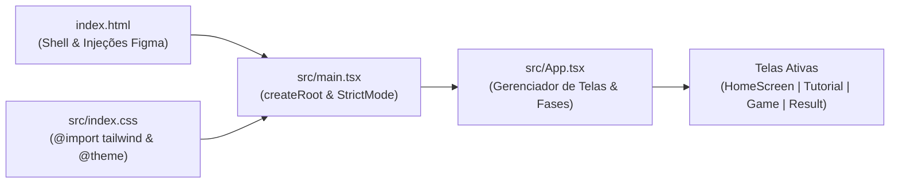
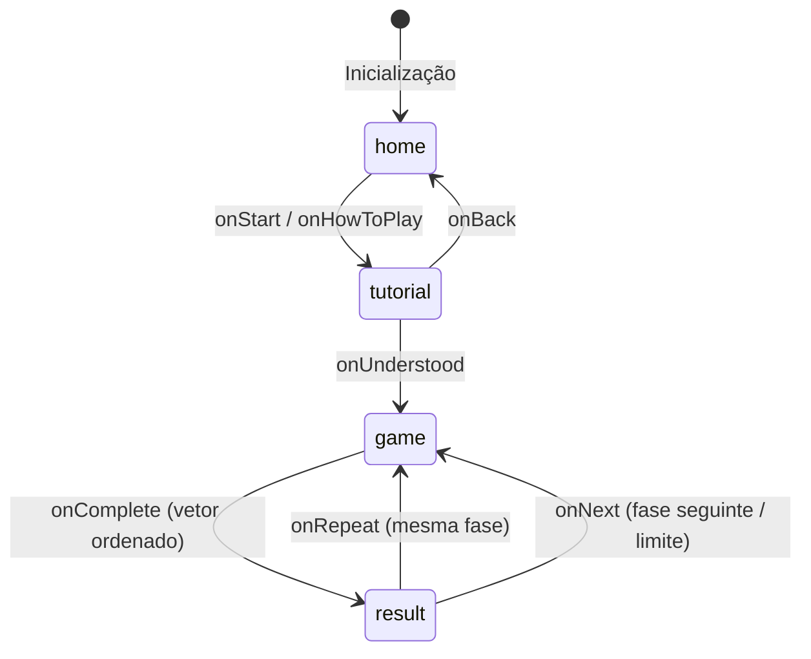

# 00 — Inventário Técnico do Repositório e Base de Verdade

> **Documento canônico:** Base de verdade e inventário técnico do projeto **Sorting Station** (registrado como `"Click&Order"` em [`package.json`](../../package.json)).  
> **Status:** Ativo / Base de Verdade  
> **Data:** 08/09/2026  
> **Escopo:** Mapeamento integral da arquitetura, stack, ferramentas, arquivos, estado atual, limitações observáveis e diretrizes de desenvolvimento.

---

## 1. Visão Geral

O **Click&Order** é um jogo educacional *point-and-click* para navegadores web cujo objetivo pedagógico é ensinar algoritmos de ordenação por meio de manipulação direta de dados. A ambientação narrativa é uma central logística futurista de alta tecnologia: caixas numeradas representam elementos de um vetor desordenado sobre esteiras transportadoras, e o jogador realiza comparações e trocas para organizar a carga.

O projeto foi inicializado e é executado sobre a plataforma **Figma Make** ([`AGENTS.md`](../../AGENTS.md), [`vite.config.ts`](../../vite.config.ts)), constituindo uma Single Page Application (SPA) client-side construída com React 19, TypeScript e Tailwind CSS v4.

Figma Make é usado para prototipação visual e experimentação de interface. O código-fonte do repositório é a fonte oficial de verdade do projeto.

No estado atual do código:
- O algoritmo implementado é o **Bubble Sort** (denominado "Protocolo Bubble"), dividido em 3 fases com vetores fixos ([`src/App.tsx`](../../src/App.tsx)).
- A aplicação é puramente executada no navegador do usuário, **sem backend, sem banco de dados, sem chamadas a APIs e sem persistência local**.
- O repositório **não possui testes automatizados** configurados.

---

## 2. Árvore Resumida do Projeto

Abaixo está o mapeamento exato da estrutura de arquivos e diretórios do repositório (excluindo pastas gerenciadas e temporárias como `node_modules` e `.git`):

```text
Sorting Station Interface Design/
├── .figma/
│   └── make/
│       ├── analyze-routes          # Shell script: executa figma-analyze routes
│       ├── deploy                  # Shell script: build e deploy de produção no Figma Make
│       ├── deploy-preview          # Shell script: build com sourcemaps e preview no Figma Make
│       ├── dev                     # Shell script: inicializa pnpm run dev
│       ├── dev.json                # Configuração de gatilhos de restart/install para Figma Make
│       ├── format                  # Shell script: executa pnpm run format
│       ├── install                 # Shell script: executa pnpm install --prefer-offline
│       ├── langserver              # Shell script: inicializa language server @vtsls/language-server
│       └── site.json               # Configurações de SEO (noindex), acessibilidade e metadados
├── .gitattributes                  # Atributos de controle de linha/fim de arquivo do Git
├── .gitignore                      # Regras de exclusão de arquivos e diretórios locais
├── .mise.toml                      # Definição canônica de versões da toolchain (Node.js e pnpm)
├── AGENTS.md                       # Regras mandatórias de desenvolvimento, estilo e convenções
├── CLAUDE.md                       # Ponte de contexto que referencia @AGENTS.md
├── docs/
│   ├── Sorting_Station_HARNESS_Wiki_Prompts.md # Especificação completa e matriz de prompts da Wiki
│   └── wiki/
│       └── 00-repository-inventory.md          # Este documento (inventário técnico e base de verdade)
├── index.html                      # Shell HTML com slots de injeção Figma Make e montagem do root
├── package.json                    # Dependências, metadados do projeto e scripts npm
├── package-lock.json               # Lockfile de dependências npm
├── pnpm-lock.yaml                  # Lockfile canônico de dependências pnpm
├── tsconfig.json                   # Configuração de compilação TypeScript (strict mode, alias @)
├── vite.config.ts                  # Configuração do Vite com plugins customizados Figma Make e Tailwind
└── src/
    ├── App.tsx                     # Orquestrador de estado global: tela ativa, fase e navegação
    ├── index.css                   # CSS global, import Tailwind v4, tokens @theme, webfonts e animações
    ├── main.tsx                    # Ponto de entrada React: ReactDOM.createRoot e StrictMode
    ├── vite-env.d.ts               # Tipos de ambiente de cliente do Vite
    ├── components/
    │   ├── GameButton.tsx          # Botão estilizado reutilizável com variantes visuais
    │   ├── InstructionPanel.tsx    # Painel de mensagens e feedback contextual ao usuário
    │   ├── NumberedBox.tsx         # Caixa numerada interativa da esteira com estados visuais
    │   ├── PhaseHeader.tsx         # Cabeçalho superior com protocolo, fase atual e status operacional
    │   └── StatsPanel.tsx          # Painel numérico de comparações e trocas efetuadas
    └── screens/
        ├── GameScreen.tsx          # Tela de gameplay: esteira, interação, troca e heurística
        ├── HomeScreen.tsx          # Tela inicial com apresentação temática e esteiras decorativas
        ├── ResultScreen.tsx        # Tela de conclusão da fase: relatório, eficiência e pseudocódigo
        └── TutorialScreen.tsx      # Tela de tutorial explicativo com simulação visual em loop
```

---

## 3. Stack Tecnológica e Versões Confirmadas

Todas as tecnologias e versões abaixo foram verificadas diretamente nos arquivos de configuração do projeto:

| Tecnologia | Versão Declarada | Arquivo de Origem | Função no Projeto |
| :--- | :--- | :--- | :--- |
| **Node.js** | `22` | [`.mise.toml`](../../.mise.toml) | Runtime do ambiente de desenvolvimento |
| **pnpm** | `10.34.3` | [`.mise.toml`](../../.mise.toml) | Gerenciador canônico de pacotes |
| **React** | `^19.0.0` | [`package.json`](../../package.json) | Biblioteca declarativa de UI |
| **React DOM** | `^19.0.0` | [`package.json`](../../package.json) | Adaptador de renderização no DOM do navegador |
| **TypeScript** | `^5.7.0` | [`package.json`](../../package.json) | Linguagem tipada (`target: ES2020`, `strict: true`) ([`tsconfig.json`](../../tsconfig.json)) |
| **Vite** | `^8.0.5` | [`package.json`](../../package.json) | Build tool e dev server de alta performance |
| **@vitejs/plugin-react**| `^6.0.0` | [`package.json`](../../package.json) | Integração do React Fast Refresh com Vite |
| **Tailwind CSS** | `^4.0.0` | [`package.json`](../../package.json) | Framework utilitário de CSS (v4 inline theme) |
| **@tailwindcss/vite** | `^4.0.0` | [`package.json`](../../package.json) | Plugin oficial do Tailwind v4 para Vite |
| **oxfmt** | `^0.2.0` | [`package.json`](../../package.json) | Formatador de código de alta velocidade |
| **Figma Make Kit** | Integrado via Vite | [`vite.config.ts`](../../vite.config.ts) | Ambiente de execução e renderização Figma Make |

### Observações importantes sobre a Stack
1. **Sem PostCSS ou Tailwind Config:** O projeto utiliza **Tailwind CSS v4** puro. Não existem nem devem ser criados arquivos `tailwind.config.js/ts` ou `postcss.config.js` ([`AGENTS.md`](../../AGENTS.md)).
2. **Fontes Web Globais:** As fontes Orbitron, Space Mono e Exo 2 são importadas via `@import url(...)` no topo de [`src/index.css`](../../src/index.css).
3. **Módulo ES puro:** O projeto está configurado como `"type": "module"` em [`package.json`](../../package.json).

---

## 4. Scripts Disponíveis

### Scripts declarados em `package.json` ([`package.json`](../../package.json))

```bash
pnpm run dev       # Inicia o servidor Vite em modo de desenvolvimento
pnpm run build     # Compila a aplicação para produção (saída no diretório dist/)
pnpm run preview   # Executa o servidor Vite para visualização da pasta dist/
pnpm run format    # Executa a formatação de código através do oxfmt
```

### Scripts de suporte Figma Make em `.figma/make/*`

- [`.figma/make/dev`](../../.figma/make/dev): Dispara `pnpm run dev`.
- [`.figma/make/install`](../../.figma/make/install): Executa `pnpm install --prefer-offline --no-frozen-lockfile`.
- [`.figma/make/format`](../../.figma/make/format): Repassa argumentos para `pnpm run format -- "$@"`.
- [`.figma/make/deploy`](../../.figma/make/deploy): Executa `pnpm run build` e em seguida `figma make deploy --build-dir dist`.
- [`.figma/make/deploy-preview`](../../.figma/make/deploy-preview): Executa `pnpm run build --mode development` (gerando sourcemaps inlined) e em seguida `figma make deploy-preview --build-dir dist`.
- [`.figma/make/analyze-routes`](../../.figma/make/analyze-routes): Executa `figma-analyze routes "$@"`.
- [`.figma/make/langserver`](../../.figma/make/langserver): Executa `pnpm dlx --package=@vtsls/language-server@^0.3.0 vtsls --stdio`.

---

## 5. Ponto de Entrada e Ciclo de Inicialização

O ciclo de carregamento e montagem da aplicação no navegador segue estritamente a seguinte cadeia:



1. **Documento Shell ([`index.html`](../../index.html)):**
   - Contém placeholders especiais comentados (`<!-- figma:lang -->`, `<!-- figma:head-start -->`, `<!-- figma:head-end -->`, `<!-- figma:body-start -->`, `<!-- figma:body-end -->`) que são processados em tempo de compilação pelo plugin `figmaSiteConfiguration` configurado em [`vite.config.ts`](../../vite.config.ts).
   - O elemento contêiner raiz é `<div id="root"></div>` ([`index.html`](../../index.html)).
   - O script principal é carregado como módulo: `<script type="module" src="/src/main.tsx"></script>` ([`index.html`](../../index.html)).

2. **Ponto de Entrada React ([`src/main.tsx`](../../src/main.tsx)):**
   - Importa o estilo global: `import './index.css'` ([`src/main.tsx`](../../src/main.tsx)).
   - Instancia o React Root e monta `<App />` dentro de `<React.StrictMode>` ([`src/main.tsx`](../../src/main.tsx)).

3. **Folha de Estilos e Tokens ([`src/index.css`](../../src/index.css)):**
   - Carrega as famílias tipográficas externas: Orbitron (títulos/display), Space Mono (código/dados) e Exo 2 (corpo).
   - Declara as variáveis temáticas inline através de `@theme inline` ([`src/index.css`](../../src/index.css)), como `--color-cyan: #00f5ff`, `--color-bg-deep: #060b1a`, etc.
   - Fornece utilitários visuais personalizados: scanlines (`.scanlines`), esteira transportadora (`.conveyor-track`), brilhos neon (`.glow-cyan`, `.glow-purple`), animações de troca (`animate-swap-left`, `animate-swap-right`) e malha quadriculada (`.bg-grid`).

---

## 6. Fluxo de Telas e Navegação

A navegação da aplicação é controlada **exclusivamente por estado local React** em [`src/App.tsx`](../../src/App.tsx), sem qualquer uso de biblioteca de roteamento (como React Router ou TanStack Router).



### Detalhamento dos Estados de Tela ([`src/App.tsx`](../../src/App.tsx))

1. **`home` ([`src/screens/HomeScreen.tsx`](../../src/screens/HomeScreen.tsx)):**
   - Apresenta a identidade visual da Central Logística, esteiras com pacotes passando em segundo plano e os botões "INICIAR TURNO" e "COMO JOGAR".
   - Ambos os botões atualmente direcionam para a tela `tutorial` ([`src/App.tsx`](../../src/App.tsx)).
   - No rodapé exibe indicadores de algoritmos: `BUBBLE SORT` ativo, com `INSERTION SORT` e `SELECTION SORT` inativos ([`src/screens/HomeScreen.tsx`](../../src/screens/HomeScreen.tsx)).

2. **`tutorial` ([`src/screens/TutorialScreen.tsx`](../../src/screens/TutorialScreen.tsx)):**
   - Explica o conceito do Bubble Sort ("Protocolo Bubble") com duas caixas simulando comparação e troca cíclica automática em `setInterval` de 3 segundos ([`src/screens/TutorialScreen.tsx`](../../src/screens/TutorialScreen.tsx)).
   - Botão "← VOLTAR" retorna para `home`.
   - Botão "✓ ENTENDI" avança para `game`.

3. **`game` ([`src/screens/GameScreen.tsx`](../../src/screens/GameScreen.tsx)):**
   - Recebe a fase (`phase`), o vetor inicial correspondente (`currentArray`) e o callback de finalização (`onComplete`).
   - Montado com chave única `key={'game-phase-${phase}'}` ([`src/App.tsx`](../../src/App.tsx)) para forçar o reset completo do estado interno do componente a cada fase.
   - Quando o vetor atinge o estado ordenado (`isSorted`), chama `onComplete(comparisons, swaps, finalArray)`.

4. **`result` ([`src/screens/ResultScreen.tsx`](../../src/screens/ResultScreen.tsx)):**
   - Exibe o vetor ordenado final, contagem de comparações e trocas, cálculo visual de eficiência e o pseudocódigo do Bubble Sort com linha em destaque.
   - Botão "↺ REPETIR FASE" chama `handleRepeat()` -> limpa resultado e reabre `game` na mesma fase.
   - Botão "PRÓXIMA FASE →" chama `handleNextPhase()` -> incrementa a fase até o limite de fases configuradas.

### Fases Configuradas ([`src/App.tsx`](../../src/App.tsx))

- **Fase 1:** `[5, 2, 4, 1]` (4 elementos)
- **Fase 2:** `[6, 3, 8, 2, 5]` (5 elementos)
- **Fase 3:** `[9, 1, 7, 4, 3, 6]` (6 elementos)

---

## 7. Componentes Principais

Todos os componentes seguem a convenção obrigatória de exportação por padrão (`export default`) especificada em [`AGENTS.md`](../../AGENTS.md).

| Componente | Caminho do Arquivo | Responsabilidade | Props Principais |
| :--- | :--- | :--- | :--- |
| **`NumberedBox`** | [`src/components/NumberedBox.tsx`](../../src/components/NumberedBox.tsx) | Renderiza a caixa com valor numérico, número de posição (`#index+1`), etiqueta (`SEL`, `OK`, `PKG`) e animações de troca ou seleção pulsante | `value`, `index`, `selected`, `disabled`, `sorted`, `onClick`, `animating`, `size` |
| **`GameButton`** | [`src/components/GameButton.tsx`](../../src/components/GameButton.tsx) | Botão reutilizável com tipografia Space Mono, estados desabilitados e variantes visuais (`primary`, `secondary`, `danger`, `ghost`) | `children`, `onClick`, `variant`, `size`, `disabled`, `className` |
| **`InstructionPanel`** | [`src/components/InstructionPanel.tsx`](../../src/components/InstructionPanel.tsx) | Faixa de comunicação contextual que apresenta mensagens de instrução, avisos e sucesso com ícones (`◈`, `⚠`, `✓`, `✕`) e cores específicas | `message`, `type` (`info`, `warning`, `success`, `error`) |
| **`PhaseHeader`** | [`src/components/PhaseHeader.tsx`](../../src/components/PhaseHeader.tsx) | Barra superior fixa exibindo o protocolo ativo (`BUBBLE`), barras de progresso de fase (`FASE X/3`) e badge de status (`SISTEMA ATIVO`) | `protocol`, `phase`, `totalPhases` (default: 3) |
| **`StatsPanel`** | [`src/components/StatsPanel.tsx`](../../src/components/StatsPanel.tsx) | Painel numérico de comparações e trocas efetuadas | `comparisons`, `swaps` |

---

## 8. Onde está a Lógica de Gameplay

A lógica de gameplay do protótipo reside integralmente em [`src/screens/GameScreen.tsx`](../../src/screens/GameScreen.tsx).

### Mecânica de Execução Passo a Passo no Código Atual:

1. **Estado das Caixas:** Inicializado como cópia do array da fase (`const [boxes, setBoxes] = useState<number[]>([...initialArray]);` em [`src/screens/GameScreen.tsx`](../../src/screens/GameScreen.tsx)).
2. **Seleção da Primeira Caixa:** O jogador clica em uma caixa (`selected === null`). O índice é salvo em `selected` ([`src/screens/GameScreen.tsx`](../../src/screens/GameScreen.tsx)).
3. **Cancelamento:** Clicar na mesma caixa cancela a seleção (`selected === index -> setSelected(null)`) ([`src/screens/GameScreen.tsx`](../../src/screens/GameScreen.tsx)).
4. **Validação de Adjacência:** Se o jogador clicar em uma caixa não vizinha (`Math.abs(selected - index) !== 1`), o jogo exibe aviso `"As caixas precisam ser vizinhas!"` e reseta a seleção ([`src/screens/GameScreen.tsx`](../../src/screens/GameScreen.tsx)).
5. **Comparação e Troca:**
   - Define o elemento da esquerda e da direita: `left = Math.min(selected, index)` e `right = left + 1` ([`src/screens/GameScreen.tsx`](../../src/screens/GameScreen.tsx)).
   - Incrementa o contador de comparações: `comparisons + 1` ([`src/screens/GameScreen.tsx`](../../src/screens/GameScreen.tsx)).
   - Se `boxes[left] > boxes[right]`:
     - Dispara estado de animação e agenda um `setTimeout` de 500ms ([`src/screens/GameScreen.tsx`](../../src/screens/GameScreen.tsx)).
     - Após o timeout, permuta os valores no array (`[newBoxes[left], newBoxes[right]] = [newBoxes[right], newBoxes[left]]`), incrementa `swaps` e atualiza `boxes` ([`src/screens/GameScreen.tsx`](../../src/screens/GameScreen.tsx)).
   - Se `boxes[left] <= boxes[right]`:
     - Emite mensagem informando que nenhuma troca foi necessária ([`src/screens/GameScreen.tsx`](../../src/screens/GameScreen.tsx)).
6. **Verificação de Ordenação:** Avaliada através de `isSorted(boxes)` com `arr.every((v, i) => i === 0 || arr[i - 1] <= v)` ([`src/screens/GameScreen.tsx`](../../src/screens/GameScreen.tsx)). Se verdadeiro, aguarda 400ms e chama `onComplete` ([`src/screens/GameScreen.tsx`](../../src/screens/GameScreen.tsx)).
7. **Sistema de Dicas:** `findNextSwap` realiza busca linear da primeira inversão adjacente encontrada da esquerda para a direita (`arr[i] > arr[i + 1]`) ([`src/screens/GameScreen.tsx`](../../src/screens/GameScreen.tsx)).
8. **Progresso da Fase:** Calculado de forma heurística aproximada:
   `Math.round((isSorted(boxes) ? 100 : (swaps / Math.max(swaps + 2, 4)) * 80))` ([`src/screens/GameScreen.tsx`](../../src/screens/GameScreen.tsx)).

---

## 9. Estado e Persistência Atual

- **Armazenamento:** 100% volátil em memória (React Component State / hooks).
- **Persistência local:** **Inexistente**. Não há chamadas para `localStorage`, `sessionStorage`, `IndexedDB` ou cookies em nenhum arquivo do projeto.
- **Comportamento em recarregamento:** Qualquer recarregamento da página (F5) reinicia o jogo imediatamente na tela inicial (`HomeScreen`), com a fase 1 resetada e todas as contagens zeradas.
- **Comunicação entre telas:** Ocorre exclusivamente por propriedades (props) e callbacks passados a partir de [`src/App.tsx`](../../src/App.tsx).

---

## 10. Integrações Figma Make

O projeto possui integração direta com o ecossistema Figma Make através de scripts e plugins dedicados:

### Configuração do Servidor Vite ([`vite.config.ts`](../../vite.config.ts))
- Host padrão: `FIGMA_DEV_SERVER_HOST` ou `0.0.0.0`.
- Porta padrão: `process.env.PORT` ou `8443`.
- `strictPort: true`: Impede que o Vite troque arbitrariamente de porta caso a porta alvo esteja ocupada.
- `base`: Respeita `process.env.FIGMA_PUBLIC_URL` para suportar roteamento em subdomínios do proxy do Figma Make.
- Alias configurado: `@` mapeado para `./src` ([`vite.config.ts`](../../vite.config.ts)).

### Plugins Injetados no Vite ([`vite.config.ts`](../../vite.config.ts))
1. `figmaSiteConfiguration(siteConfiguration)`: Lê [`.figma/make/site.json`](../../.figma/make/site.json) e injeta metatags no HTML, gera `robots.txt` e aplica políticas de noindex ([`vite.config.ts`](../../vite.config.ts)).
2. `figmaErrorOverlayReplay()`: Captura erros de build e reenvia via WebSocket para novos clientes conectados à visualização do iframe ([`vite.config.ts`](../../vite.config.ts)).
3. `figmaReactRefreshBoundaryFallback()`: Monitora limites de atualização do React Refresh e força reload completo quando um módulo deixa de registrar um boundary ([`vite.config.ts`](../../vite.config.ts)).
4. `figmaMakeKitPlugin`: Serve uma rota especial de desenvolvimento em `/.figma/make/kit.html` para visualização e isolamento de componentes (`storiesGlob: '/src/**/*.stories.{ts,tsx,js,jsx}'`) ([`vite.config.ts`](../../vite.config.ts)).

### Políticas de Watch em `.figma/make/dev.json` ([`.figma/make/dev.json`](../../.figma/make/dev.json))
- As alterações em `package.json` e `pnpm-lock.yaml` disparam reinstalação automática via `installOn`.
- O código da aplicação (`src/**/*`) é monitorado diretamente pelo HMR nativo do Vite, sem recarregar o servidor Node.

> [!CAUTION]
> **Regra de integridade do Figma Make:** Arquivos em `.figma/make/*` e os plugins correspondentes em `vite.config.ts` não devem ser modificados ou deletados sem necessidade técnica estrita e documentada.

---

## 11. Backend: Existente ou Inexistente

> **VEREDITO: INEXISTENTE**

- Não há código de servidor (`Node/Express`, `Fastify`, `Nest`, `Django`, `Go`, etc.).
- Não há endpoints de API REST, GraphQL, gRPC ou WebSocket de aplicação.
- Não há bancos de dados configurados (SQL, NoSQL ou embedded como SQLite).
- Não há modelos de ORM (Prisma, TypeORM, Drizzle) nem esquemas de migração.
- A aplicação é 100% estática / client-side.

---

## 12. Testes: Existentes ou Inexistentes

> **VEREDITO: INEXISTENTES**

- **Frameworks de teste:** Nenhum instalado. Não há `vitest`, `jest`, `playwright`, `cypress`, `mocha` ou `@testing-library/*` em `package.json`.
- **Scripts de teste:** Não existe o script `"test"` em [`package.json`](../../package.json).
- **Arquivos de teste:** Não existem arquivos com extensões `*.test.*` ou `*.spec.*`, nem pasta `__tests__` no repositório.

---

## 13. Riscos, Limitações e Pontos de Atenção

Classificação rigorosa das condições observadas no código:

### A. Implementado Agora
- Interface completa com tema futurista funcional e 4 telas: `HomeScreen`, `TutorialScreen`, `GameScreen` e `ResultScreen` ([`src/screens/*`](../../src/screens)).
- Mecânica de seleção e comparação de pares adjacentes com verificação de maior/menor ([`src/screens/GameScreen.tsx`](../../src/screens/GameScreen.tsx)).
- Contadores de comparações e trocas ([`src/components/StatsPanel.tsx`](../../src/components/StatsPanel.tsx)).
- Sistema de dicas encontrando a primeira inversão no vetor ([`src/screens/GameScreen.tsx`](../../src/screens/GameScreen.tsx)).
- Três fases predefinidas do Bubble Sort ([`src/App.tsx`](../../src/App.tsx)).
- Relatório de conclusão de fase com pseudocódigo do Bubble Sort ([`src/screens/ResultScreen.tsx`](../../src/screens/ResultScreen.tsx)).

### B. Limitações e Dívida Técnica Observável
1. **Ausência de Execução Estrita do Algoritmo (Problema Pedagógico Central):**  
   Em [`src/screens/GameScreen.tsx`](../../src/screens/GameScreen.tsx), o jogo apenas exige que o jogador selecione caixas *vizinhas*. O jogador pode clicar em qualquer par vizinho em qualquer ordem arbitrária (ex.: comparar caixas do final antes do início). Isso permite ordenar o vetor, mas **não ensina nem força a execução sistemática do Bubble Sort** (varredura esquerda -> direita, controle de passada e elementos fixados).
2. **Defeito Observável na Animação de Troca:**  
   Em [`src/screens/GameScreen.tsx`](../../src/screens/GameScreen.tsx), `setSelected(null)` é disparado de forma síncrona antes do `setTimeout(..., 500)`. Ao renderizar `NumberedBox` durante o intervalo de animação, a propriedade `animating` avalia `index === selected` ([`src/screens/GameScreen.tsx`](../../src/screens/GameScreen.tsx)), que resulta em falso para todos os elementos, aplicando `"left"` incorretamente e prejudicando a simetria da animação visual.
3. **Comportamento Inconclusivo da Última Fase:**  
   Em [`src/App.tsx`](../../src/App.tsx), `const next = Math.min(phase + 1, PHASES.length);` faz com que, ao clicar em "PRÓXIMA FASE" na fase 3, o jogo apenas recarregue a própria fase 3, pois não existe tela de encerramento da campanha ou vitória global.
4. **Cálculos Heurísticos e Empíricos:**  
   - O progresso em [`src/screens/GameScreen.tsx`](../../src/screens/GameScreen.tsx) não representa as etapas reais concluídas do algoritmo.
   - A métrica de eficiência em [`src/screens/ResultScreen.tsx`](../../src/screens/ResultScreen.tsx) (`100 - swaps * 8`) é uma fórmula empírica visual e não um indicador acadêmico validado de complexidade ou eficiência algorítmica.
5. **Pseudocódigo Estático:**  
   A exibição do pseudocódigo em [`src/screens/ResultScreen.tsx`](../../src/screens/ResultScreen.tsx) possui a linha de swap marcada estaticamente (`highlight: true`), não havendo conexão dinâmica entre o passo executado e o pseudocódigo durante o gameplay.
6. **Marcação Heurística de Elementos Ordenados (`OK`):**  
   O cálculo de `sortedCount` em [`src/screens/GameScreen.tsx`](../../src/screens/GameScreen.tsx) avalia sufixos ordenados no vetor atual, marcando elementos como `OK` antes mesmo que o algoritmo tenha formalmente completado a passada que garante a fixação daquele elemento.
7. **Ausência de Persistência e Recuperação:**  
   O estado é descartado no reload da página.
8. **Inexistência de Testes:**  
   Qualquer refatoração na lógica de ordenação não conta com salvaguardas automatizadas.

### C. Planejado (Conforme especificado no Harness do Projeto)
- **Máquina de Estados Pedagógica do Bubble Sort (Prioridade P0):**  
  Implementação de controle estrito com `passIndex`, `comparisonIndex`, destaque unicamente do par esperado, bloqueio de seleções fora da sequência, feedback contextual ("5 > 2 -> troca necessária", "2 <= 4 -> nenhuma troca"), marcação de elementos definitivamente posicionados ao final de cada passada e encerramento elegante da campanha ([`docs/Sorting_Station_HARNESS_Wiki_Prompts.md`](../../docs/Sorting_Station_HARNESS_Wiki_Prompts.md)).
- **Tutorial Interativo e Dica Contextual (Prioridade P1):**  
  Transformação do tutorial passivo em interativo, dicas apontando o próximo passo correto da execução e replay ao fim da fase ([`docs/Sorting_Station_HARNESS_Wiki_Prompts.md`](../../docs/Sorting_Station_HARNESS_Wiki_Prompts.md)).
- **Persistência Local Inicial:**  
  Uso de `localStorage` para registrar fases liberadas e melhores resultados sem adicionar complexidade de backend ([`docs/Sorting_Station_HARNESS_Wiki_Prompts.md`](../../docs/Sorting_Station_HARNESS_Wiki_Prompts.md)).
- **Estratégia de Testes com Vitest:**  
  Introdução de testes unitários isolados para as funções de domínio e transições da máquina de estados ([`docs/Sorting_Station_HARNESS_Wiki_Prompts.md`](../../docs/Sorting_Station_HARNESS_Wiki_Prompts.md)).

### D. Ideias Futuras (Direções Conceituais a Longo Prazo)
- **Novos Algoritmos com Mecânicas Dedicadas (Prioridade P2):**  
  Selection Sort (seleção do menor elemento na partição não ordenada) e Insertion Sort (encaixe do elemento na partição já ordenada), com interações visuais próprias para cada um ([`docs/Sorting_Station_HARNESS_Wiki_Prompts.md`](../../docs/Sorting_Station_HARNESS_Wiki_Prompts.md)).
- **Algoritmos Avançados (Prioridade P3):**  
  Merge Sort, Quick Sort, Heap Sort e visualização de complexidade assintótica ([`docs/Sorting_Station_HARNESS_Wiki_Prompts.md`](../../docs/Sorting_Station_HARNESS_Wiki_Prompts.md)).
- **Backend Centralizado Condicionado:**  
  Criação de backend apenas se houver demanda formal comprovada por autenticação de usuários, sincronização multi-dispositivo, rankings ou telemetria para turmas acadêmicas ([`docs/Sorting_Station_HARNESS_Wiki_Prompts.md`](../../docs/Sorting_Station_HARNESS_Wiki_Prompts.md)).
- **Avaliação Acadêmica:**  
  Planejamento de estudos de validação empírica com estudantes para coleta de dados pedagógicos para artigo científico ([`docs/Sorting_Station_HARNESS_Wiki_Prompts.md`](../../docs/Sorting_Station_HARNESS_Wiki_Prompts.md)).

### E. Pontos Não Confirmados no Repositório
- **Divergência de Nome do Produto:** O nome no pacote npm é `"Click&Order"` ([`package.json`](../../package.json)) e no `<title>` de [`index.html`](../../index.html), enquanto toda a identidade visual na tela e documentação adota `"Sorting Station"`. A consolidação da marca comercial ainda é *não confirmada no repositório*.
- **Telemetria / Google Analytics:** Há tipagem para `googleAnalyticsId` em [`vite.config.ts`](../../vite.config.ts), porém a chave não está presente em [`.figma/make/site.json`](../../.figma/make/site.json). Não há telemetria ativa.
- **Conformidade de Acessibilidade (a11y):** Em [`.figma/make/site.json`](../../.figma/make/site.json), `addBypassLinks` e `ignoreReducedMotion` estão setados como `false`. O suporte real para leitores de tela e navegação por teclado não é certificado no código atual.

---

## 14. Fonte de Verdade

Para qualquer tarefa de engenharia, refatoração ou expansão documental subsequente, os seguintes arquivos **devem ser consultados primeiro** antes de qualquer tomada de decisão:

1. **[`AGENTS.md`](../../AGENTS.md):**  
   *Por que consultar:* Contém as regras inegociáveis do ambiente Figma Make, padrões de estilo (Tailwind v4 direto no JSX, regras de apóstrofos em strings JSX) e convenções arquiteturais (como obrigatoriedade de `export default` nos componentes).
2. **[`docs/Sorting_Station_HARNESS_Wiki_Prompts.md`](../../docs/Sorting_Station_HARNESS_Wiki_Prompts.md):**  
   *Por que consultar:* Define o roteiro curricular, a visão pedagógica do produto e o planejamento estruturado das próximas páginas da Wiki e marcos de produto (P0 a P3).
3. **[`00-repository-inventory.md`](./00-repository-inventory.md) (Este arquivo):**  
   *Por que consultar:* É a base de verdade técnica factual sobre o que de fato existe, o que não existe e quais são as dívidas técnicas registradas do código.
4. **[`package.json`](../../package.json) e [`.mise.toml`](../../.mise.toml):**  
   *Por que consultar:* Referência estrita de dependências instaladas, scripts disponíveis e versões da toolchain (Node 22, pnpm 10.34.3).
5. **[`vite.config.ts`](../../vite.config.ts) e [`.figma/make/*`](../../.figma/make):**  
   *Por que consultar:* Mapeamento da infraestrutura de deploy, portas de execução, aliases (`@/*`) e injeções de runtime da plataforma Figma Make.
6. **[`src/App.tsx`](../../src/App.tsx):**  
   *Por que consultar:* Gerencia o ciclo de vida global da aplicação, o fluxo de transição entre telas e a definição das fases ativas.
7. **[`src/screens/GameScreen.tsx`](../../src/screens/GameScreen.tsx):**  
   *Por que consultar:* Contém a implementação real das interações de ordenação, validações de clique e cálculo de estado do jogo.
8. **[`src/index.css`](../../src/index.css):**  
   *Por que consultar:* Ponto central de todos os tokens de cor (`@theme inline`), fontes tipográficas, classes utilitárias personalizadas e animações de interface.
