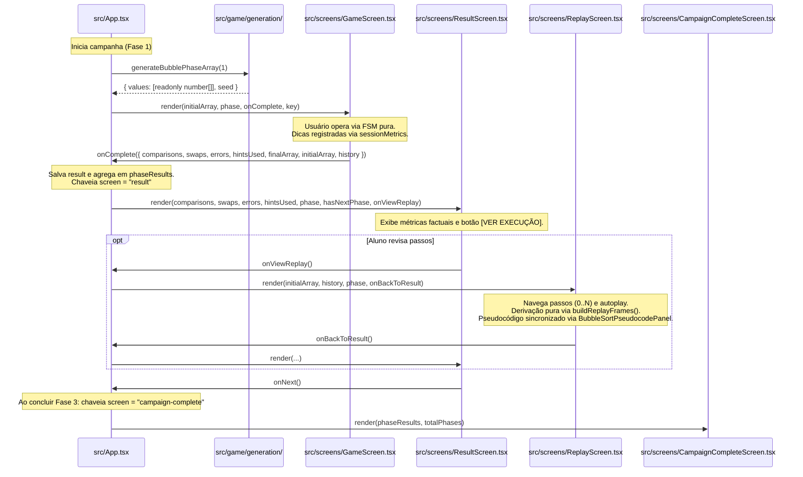
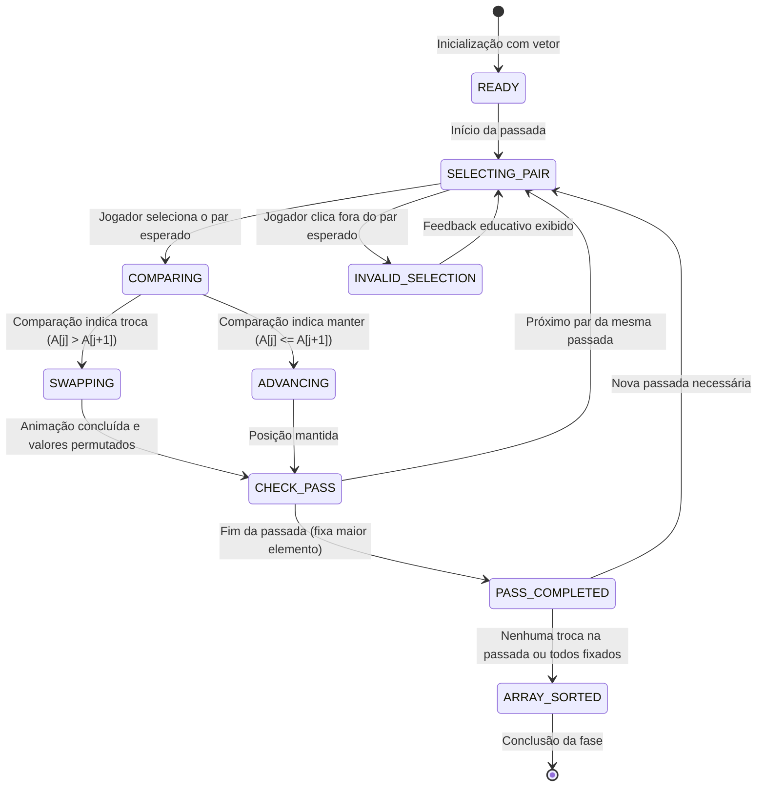

# 02 — Arquitetura do Sistema: Estado Atual e Arquitetura Alvo

> **Documento canônico:** Especificação arquitetural do software, fluxo de dados, estrutura de componentes e plano de desacoplamento do **Sorting Station**.  
> **Status:** Ativo / Base de Verdade da Wiki  
> **Data:** 08/09/2026  
> **Dependências:** [`AGENTS.md`](../../AGENTS.md), [`CLAUDE.md`](../../CLAUDE.md), [`00-repository-inventory.md`](./00-repository-inventory.md), [`01-product-vision.md`](./01-product-vision.md).

---

# PARTE I — ESTADO ATUAL DO SISTEMA

Esta seção documenta **rigorosamente a realidade fática do código existente no repositório**, sem inferir arquiteturas ideais não implementadas.

---

## 1. Diagrama Geral do Fluxo Atual do Front-End

Abaixo está o mapeamento completo do ciclo de renderização, transição de telas e circulação de dados na aplicação atual:

```mermaid
flowchart TD
    subgraph Bootstrap ["1. Bootstrap & Shell"]
        HTML["index.html\n(div#root + meta Figma)"] --> Main["src/main.tsx\n(createRoot + StrictMode)"]
        CSS["src/index.css\n(@theme, fonts, styles)"] --> Main
        Main --> App["src/App.tsx\n(Estado Central: screen, phase, result)"]
    end

    subgraph StateRouter ["2. Máquina de Telas (useState<Screen>)"]
        App -- "screen === 'home'" --> HomeScreen["src/screens/HomeScreen.tsx"]
        App -- "screen === 'briefing'" --> BriefingScreen["src/screens/ProtocolModeBriefingScreen.tsx"]
        App -- "screen === 'tutorial'" --> TutorialScreen["src/screens/TutorialScreen.tsx"]
        App -- "screen === 'selection-tutorial'" --> SelectionTutorialScreen["src/screens/SelectionTutorialScreen.tsx"]
        App -- "screen === 'game'" --> GameScreen["src/screens/GameScreen.tsx"]
        App -- "screen === 'result'" --> ResultScreen["src/screens/ResultScreen.tsx"]
        App -- "screen === 'replay'" --> ReplayScreen["src/screens/ReplayScreen.tsx"]
        App -- "screen === 'campaign-complete'" --> CampaignCompleteScreen["src/screens/CampaignCompleteScreen.tsx"]
    end

    subgraph ScreenEvents ["3. Ações e Callbacks de Transição"]
        HomeScreen -- "onStart() / onHowToPlay()" --> AppTutorial["setScreen('tutorial')"]
        HomeScreen -- "onStartChallenge()" --> AppBriefingChallenge["setBriefingModeId('bubble-early-exit')\nsetScreen('briefing')"]
        HomeScreen -- "onStartSelection()" --> AppBriefingSelection["setBriefingModeId('selection-canonical')\nsetScreen('briefing')"]
        BriefingScreen -- "onStart() [bubble-canonical]" --> AppGame["setScreen('game')"]
        BriefingScreen -- "onStart() [bubble-early-exit]" --> AppGameEarly["setScreen('game')"]
        BriefingScreen -- "onStart() [selection-canonical]" --> AppSelectionTut["setScreen('selection-tutorial')"]
        BriefingScreen -- "onBack()" --> AppHome["setScreen('home')"]
        SelectionTutorialScreen -- "onComplete() / onBack()" --> AppHome2["setScreen('home')"]
        TutorialScreen -- "onBack()" --> AppHome
        TutorialScreen -- "onUnderstood()" --> AppGame
        
        GameScreen -- "onComplete(comparisons, swaps, finalArray, ...)" --> AppResult["setResult({...})\nsetScreen('result')"]
        ResultScreen -- "onRepeat()" --> AppRepeat["setResult(null)\nsetScreen('game')"]
        ResultScreen -- "onNext()" --> AppNext["setPhase(min(phase+1, 3))\nsetResult(null)\nsetScreen('game')"]
        ResultScreen -- "onViewReplay()" --> AppReplay["setScreen('replay')"]
        ReplayScreen -- "onBackToResult()" --> AppResultBack["setScreen('result')"]
    end

    subgraph ComponentsHierarchy ["4. Componentes Reutilizáveis"]
        GameScreen --> PhaseHeader["PhaseHeader.tsx"]
        GameScreen --> StatsPanel["StatsPanel.tsx"]
        GameScreen --> InstructionPanel["InstructionPanel.tsx"]
        GameScreen --> NumberedBox["NumberedBox.tsx (x N caixas)"]
        GameScreen --> GameButton["GameButton.tsx (Dica / Reiniciar)"]
        
        HomeScreen --> GameButton
        BriefingScreen --> GameButton
        TutorialScreen --> GameButton
        SelectionTutorialScreen --> NumberedBox
        SelectionTutorialScreen --> GameButton
        ResultScreen --> GameButton
        ResultScreen --> NumberedBox
        ReplayScreen --> NumberedBox
        ReplayScreen --> GameButton
        ReplayScreen --> BubbleSortPseudocodePanel["BubbleSortPseudocodePanel.tsx"]
    end
```



---

## 2. Bootstrap React

O ciclo de inicialização da aplicação é direto e enxuto:

1. **Shell HTML ([`index.html`](../../index.html)):**
   - Declara o contêiner de montagem `<div id="root"></div>` ([`index.html`](../../index.html)).
   - Contém os slots de injeção da plataforma Figma Make (`<!-- figma:lang -->`, `<!-- figma:head-start -->`, `<!-- figma:head-end -->`, `<!-- figma:body-start -->`, `<!-- figma:body-end -->`), processados pelo plugin `figmaSiteConfiguration` em [`vite.config.ts`](../../vite.config.ts).
   - Carrega o módulo TypeScript principal: `<script type="module" src="/src/main.tsx"></script>` ([`index.html`](../../index.html)).

2. **Ponto de Entrada React ([`src/main.tsx`](../../src/main.tsx)):**
   - Importa os estilos globais: `import './index.css'` ([`src/main.tsx`](../../src/main.tsx)).
   - Invoca `ReactDOM.createRoot` sobre o elemento `#root` e renderiza `<App />` envolto em `<React.StrictMode>` ([`src/main.tsx`](../../src/main.tsx)).

3. **Orquestrador Raiz ([`src/App.tsx`](../../src/App.tsx)):**
   - Inicializa as variáveis fundamentais de estado através de `useState`:
     - `screen`: `"home"` ([`src/App.tsx`](../../src/App.tsx));
     - `phase`: `1` ([`src/App.tsx`](../../src/App.tsx));
     - `result`: `null` ([`src/App.tsx`](../../src/App.tsx));
     - `briefingModeId`: `"bubble-canonical"` ([`src/App.tsx`](../../src/App.tsx)).

---

## 3. Navegação por Estado em `App.tsx`

A navegação da aplicação **não utiliza rotas de URL**. Ela funciona como uma máquina de estados de interface implementada através de uma união de tipos literais e renderização condicional em [`src/App.tsx`](../../src/App.tsx):

```typescript
// src/App.tsx
type Screen =
  | "home"
  | "briefing"
  | "tutorial"
  | "selection-tutorial"
  | "game"
  | "result"
  | "replay"
  | "campaign-complete";
```

### Mecânica de Transição

| Tela de Origem | Ação / Callback | Novo Estado de `screen` | Efeito Colateral |
| :--- | :--- | :--- | :--- |
| `HomeScreen` | `onStart` | `"briefing"` | Prepara briefing do modo canônico (`briefingModeId = 'bubble-canonical'`) |
| `HomeScreen` | `onHowToPlay` | `"tutorial"` | Direciona o jogador para a explicação animada do Bubble Sort |
| `HomeScreen` | `onStartChallenge` | `"briefing"` | Prepara briefing do Modo Desafio Early Exit (`briefingModeId = 'bubble-early-exit'`) |
| `HomeScreen` | `onStartSelection` | `"briefing"` | Prepara briefing do Selection Sort (`briefingModeId = 'selection-canonical'`) |
| `ProtocolModeBriefingScreen` | `onStart` (Bubble) | `"game"` | Dispara geração procedural da fase 1 e inicia o jogo |
| `ProtocolModeBriefingScreen` | `onStart` (Selection) | `"selection-tutorial"` | Inicia o tutorial interativo do Selection Sort |
| `ProtocolModeBriefingScreen` | `onBack` | `"home"` | Retorna à home sem efeitos colaterais |
| `SelectionTutorialScreen` | `onBack` / `onComplete` | `"home"` | Retorna à home com segurança |
| `TutorialScreen` | `onBack` | `"home"` | Retorna para a tela inicial ([`src/App.tsx`](../../src/App.tsx)) |
| `TutorialScreen` | `onUnderstood` | `"game"` | Inicia o jogo na fase atual ([`src/App.tsx`](../../src/App.tsx)) |
| `GameScreen` | `onComplete` | `"result"` | Armazena métricas factuais em `result` e consolida em `phaseResults` |
| `ResultScreen` | `onViewReplay` | `"replay"` | Transita para `ReplayScreen` preservando histórico em memória |
| `ReplayScreen` | `onBackToResult` | `"result"` | Retorna para `ResultScreen` sem perdas |
| `ResultScreen` | `onRepeat` | `"game"` | Reinicia com mesmo vetor e semente |
| `ResultScreen` | `onNext` | `"game"` ou `"campaign-complete"` | Avança de fase ou encerra campanha |
| `CampaignCompleteScreen` | `onReturnHome` | `"home"` | Reseta sessão e retorna à home |
| `CampaignCompleteScreen` | `onRestartProtocol` | `"game"` | Reinicia nova campanha |

---

## 4. Fluxo de Dados entre App, GameScreen, ResultScreen, ReplayScreen e CampaignCompleteScreen

O tráfego de dados é unidirecional estrito descendente (via props) e ascendente (via callbacks):



### O Contrato de Dados `PhaseCompleteData` e `GameResult`
Definidos em [`src/screens/GameScreen.tsx`](../../src/screens/GameScreen.tsx) e [`src/App.tsx`](../../src/App.tsx):
```typescript
export interface PhaseCompleteData {
  comparisons: number;
  swaps: number;
  errors: number;
  hintsUsed: number;
  finalArray: number[];
  initialArray: number[];
  history: readonly StepRecord[];
}
```

A agregação global factual é realizada pela função pura `calculateCampaignSummary` em [`src/game/campaign/campaignSummary.ts`](../../src/game/campaign/campaignSummary.ts).
A camada de replay puro reside em [`src/game/replay/replayModel.ts`](../../src/game/replay/replayModel.ts).

### Chave de Remontagem (`key`)
Em [`src/App.tsx`](../../src/App.tsx), o componente `GameScreen` recebe:
```tsx
<GameScreen
  key={`game-phase-${phase}`}
  initialArray={currentArray}
  phase={phase}
  onComplete={handleGameComplete}
/>
```
O uso de `key={`game-phase-${phase}`}` força o React a **destruir e recriar completamente a instância** de `GameScreen` a cada troca de fase, garantindo que o estado interno do componente (caixas, seleção, animações) seja descartado e reiniciado com o novo vetor inicial.

---

## 5. Onde Vivem os Arrays de Fase e de Resultado

1. **Definição das Fases (`PHASES`):**
   - Declarada como constante imutável no topo de [`src/App.tsx`](../../src/App.tsx):
   ```typescript
   const PHASES = [
     [5, 2, 4, 1],          // Fase 1: 4 caixas
     [6, 3, 8, 2, 5],       // Fase 2: 5 caixas
     [9, 1, 7, 4, 3, 6],    // Fase 3: 6 caixas
   ];
   ```
2. **Vetor da Fase Ativa (`currentArray`):**
   - Calculado sob demanda a cada render de `App.tsx`: `const currentArray = PHASES[phase - 1] ?? PHASES[0];` ([`src/App.tsx`](../../src/App.tsx)).
3. **Estado de Trabalho da Esteira (`boxes`):**
   - Instanciado como cópia superficial do vetor inicial dentro de `GameScreen.tsx`:
   `const [boxes, setBoxes] = useState<number[]>([...initialArray]);` ([`src/screens/GameScreen.tsx`](../../src/screens/GameScreen.tsx)).
   - Durante a fase, os valores são permutados diretamente dentro deste estado local.
4. **Armazenamento do Resultado (`result`):**
   - Mantido no estado do componente raiz `App.tsx`: `const [result, setResult] = useState<GameResult | null>(null);` ([`src/App.tsx`](../../src/App.tsx)).

---

## 6. Onde Vive a Lógica Atual do Bubble Sort / Gameplay

A lógica algorítmica e a lógica de gameplay estão **fortemente acopladas à camada de apresentação React** dentro de [`src/screens/GameScreen.tsx`](../../src/screens/GameScreen.tsx). Não existe módulo isolado de domínio, classe de modelo ou hook desacoplado.

### Funções Inlined em `GameScreen.tsx`:
- **`isSorted(arr)` ([`src/screens/GameScreen.tsx`](../../src/screens/GameScreen.tsx)):**
  Verifica se todos os elementos satisfazem $A[i-1] \le A[i]$.
- **`findNextSwap(arr)` ([`src/screens/GameScreen.tsx`](../../src/screens/GameScreen.tsx)):**
  Varre o vetor da esquerda para a direita e retorna o índice $i$ do primeiro par onde $A[i] > A[i+1]$. Usado pela funcionalidade de Dica ([`src/screens/GameScreen.tsx`](../../src/screens/GameScreen.tsx)).
- **`handleBoxClick(index)` ([`src/screens/GameScreen.tsx`](../../src/screens/GameScreen.tsx)):**
  Gerencia o clique na caixa, seleção da primeira, validação de adjacência (`Math.abs(selected - index) === 1`), incremento de `comparisons`, disparo do `setTimeout(..., 500)` de animação, permuta em `boxes` e verificação assíncrona de vitória via `onComplete`.
- **`handleReset()` ([`src/screens/GameScreen.tsx`](../../src/screens/GameScreen.tsx)):**
  Restaura `boxes` para o `initialArray` e zera contadores e seleções.

---

## 7. Componentes Reutilizáveis

O projeto organiza seus elementos visuais modulares em `src/components/`, todos exportados via `export default` ([`AGENTS.md`](../../AGENTS.md)):

| Componente | Arquivo | Responsabilidade Visual e Funcional | Props Recebidas |
| :--- | :--- | :--- | :--- |
| **`NumberedBox`** | [`src/components/NumberedBox.tsx`](../../src/components/NumberedBox.tsx) | Representa a caixa de carga com valor numérico central em Orbitron, badge de índice `#index+1`, status (`SEL`, `OK`, `PKG`) e animações de deslocamento | `value: number`, `index: number`, `selected?: boolean`, `disabled?: boolean`, `sorted?: boolean`, `onClick?: () => void`, `animating?: "left" \| "right" \| null`, `size?: "sm" \| "md" \| "lg"` |
| **`GameButton`** | [`src/components/GameButton.tsx`](../../src/components/GameButton.tsx) | Botão sci-fi com tipografia Space Mono, suporte a variantes de cor e estados de clique | `children: ReactNode`, `onClick?: () => void`, `variant?: "primary" \| "secondary" \| "danger" \| "ghost"`, `size?: "sm" \| "md" \| "lg"`, `disabled?: boolean`, `className?: string` |
| **`InstructionPanel`**| [`src/components/InstructionPanel.tsx`](../../src/components/InstructionPanel.tsx) | Barra de comunicação com o jogador, com tipologia de mensagens e ícones temáticos (`◈`, `⚠`, `✓`, `✕`) | `message: string`, `type?: "info" \| "warning" \| "success" \| "error"` |
| **`PhaseHeader`** | [`src/components/PhaseHeader.tsx`](../../src/components/PhaseHeader.tsx) | Barra superior fixa exibindo o protocolo ativo (`BUBBLE`), indicadores de fase em pílula e status do sistema | `protocol: string`, `phase: number`, `totalPhases?: number` |
| **`StatsPanel`** | [`src/components/StatsPanel.tsx`](../../src/components/StatsPanel.tsx) | Painel duplo de telemetria exibindo comparações (ciano) e trocas (roxo) | `comparisons: number`, `swaps: number` |

---

## 8. CSS, Tema e Animações

O projeto adota a arquitetura de estilização do **Tailwind CSS v4** sem arquivos de configuração externos ([`AGENTS.md`](../../AGENTS.md)):

### Ponto Central de Estilos ([`src/index.css`](../../src/index.css))
1. **Fontes Web Importadas ([`src/index.css`](../../src/index.css)):**
   - `Orbitron`: Usada em títulos, cabeçalhos e números de destaque;
   - `Space Mono`: Usada em botões, métricas e rótulos de dados técnicos;
   - `Exo 2`: Usada no corpo do texto e parágrafos explicativos.
2. **Tokens do Tema Inline (`@theme inline`) ([`src/index.css`](../../src/index.css)):**
   - `--color-cyan`: `#00f5ff` (Acento primário);
   - `--color-purple`: `#8b5cf6` (Acento secundário);
   - `--color-amber`: `#f59e0b` (Avisos e seleções);
   - `--color-green`: `#10b981` (Sucesso e elementos ordenados);
   - `--color-bg-deep`: `#060b1a` (Fundo espacial escuro);
   - `--color-bg-card`: `#0d1635` (Painéis e superfícies translúcidas).
3. **Animações e Efeitos Principais:**
   - `.conveyor-track` ([`src/index.css`](../../src/index.css)): Cria a esteira rolante com textura geométrica repetida em movimento contínuo via `@keyframes conveyor`;
   - `animate-swap-left` / `animate-swap-right` ([`src/index.css`](../../src/index.css)): Translação horizontal de $100\%$ acompanhada de elevação vertical de $-12\text{px}$ para simular o erguimento e troca das caixas;
   - `.scanlines` ([`src/index.css`](../../src/index.css)): Textura semitransparente que simula a tela de um monitor CRT futurista;
   - `.glow-cyan` / `.glow-purple` ([`src/index.css`](../../src/index.css)): Efeitos de drop-shadow e box-shadow com difusão neon.

---

## 9. Ausência Atual de Backend (Confirmado)

- **Inexistência Total de Servidor:** Não há código de servidor (`Node`, `Express`, `Fastify`, `Python`, etc.) no repositório.
- **Inexistência de Comunicação de Rede de Aplicação:** O código não efetua requisições `fetch`, `axios` ou chamadas WebSocket para nenhuma API de aplicação.
- **Topologia de Implantação:** O projeto é uma Single Page Application (SPA) pura composta por artefatos estáticos (`HTML`, `JS`, `CSS`) distribuídos pelo servidor web do Figma Make.

---

## 10. Ausência Atual de Persistência (Confirmado)

- **Inexistência de Armazenamento Local:** Não há uso de `localStorage`, `sessionStorage`, `IndexedDB` ou cookies em nenhum ponto do código.
- **Volatilidade Total:** Todas as variáveis de estado (`screen`, `phase`, `boxes`, `comparisons`, `swaps`) existem estritamente na memória da aba do navegador.
- **Consequência Observada:** Qualquer recarregamento da página (F5), fechamento da aba ou queda do navegador apaga imediatamente todo o progresso do usuário, forçando o reinício na tela inicial e na fase 1.

---

## 11. Ausência Atual de Router (Confirmado)

- **Inexistência de Bibliotecas de Roteamento:** O projeto não inclui `react-router`, `@tanstack/react-router`, `wouter` ou bibliotecas similares em seu [`package.json`](../../package.json).
- **Sem Roteamento Baseado em Hash ou History API:** A URL do navegador permanece inalterada em toda a experiência. Não há suporte a rotas como `/`, `/tutorial`, `/fase/1` ou `/resultado`.

---

## 12. Ausência Atual de Testes (Confirmado)

- **Inexistência de Suíte de Testes:** Não há bibliotecas de teste instaladas (`vitest`, `jest`, `playwright`, `cypress`, `@testing-library/react`).
- **Inexistência de Arquivos de Teste:** O repositório não possui nenhum arquivo de especificação (`*.test.*`, `*.spec.*`) ou diretórios de teste (`__tests__`).
- **Inexistência de Script de Teste:** O arquivo [`package.json`](../../package.json) possui apenas scripts `dev`, `build`, `preview` e `format`, sem entrada `"test"`.

---

# PARTE II — ARQUITETURA ALVO / PLANEJADA

Esta seção detalha a **evolução técnica recomendada para o sistema**, projetada para resolver as dívidas técnicas e preparar o repositório para os próximos marcos do produto (P0 a P3), **sem implementar alterações de código nesta tarefa**.

Todos os elementos desta seção constituem propostas de design a serem implementadas em etapas futuras.

---

## 1. Visão Geral da Arquitetura Alvo Desacoplada `[PLANEJADO]`

A evolução arquitetural recomendada adota o princípio de **Separação de Responsabilidades (*Separation of Concerns*)**, desacoplando a lógica matemática dos algoritmos da camada de componentes visuais do React:

```mermaid
flowchart TD
    subgraph UI_Layer ["Camada de Apresentação (React UI) [PLANEJADO]"]
        App["App.tsx (Navegação & Telas)"]
        GameScreen["GameScreen.tsx (Esteira & Controles)"]
        Components["NumberedBox, StatsPanel, CodeViewer, etc."]
    end

    subgraph State_Binding ["Camada de Conexão (Custom Hook) [PLANEJADO]"]
        Hook["useSortingGame(strategy, initialArray)"]
    end

    subgraph Domain_Engine ["Camada de Domínio / Motor de Ordenação [PLANEJADO]"]
        Engine["SortingEngine (Máquina de Estados Finita)"]
        StrategyInterface["Interface: SortingStrategy"]
        BubbleSortModule["BubbleSortStrategy"]
        SelectionSortModule["SelectionSortStrategy [FUTURO]"]
        InsertionSortModule["InsertionSortStrategy [FUTURO]"]
    end

    subgraph Persistence_Port ["Camada de Armazenamento / Portas [PLANEJADO]"]
        StoragePort["StorageService (Interface)"]
        LocalStorageAdapter["LocalStorageAdapter (Implementação Offline)"]
        ApiAdapter["RemoteApiAdapter (Opcional / Futuro)"]
    end

    UI_Layer <--> State_Binding
    State_Binding <--> Domain_Engine
    StrategyInterface <|-- BubbleSortModule
    StrategyInterface <|-- SelectionSortModule
    StrategyInterface <|-- InsertionSortModule
    Engine --> StrategyInterface
    UI_Layer -.-> Persistence_Port
    StoragePort <|-- LocalStorageAdapter
    StoragePort <|-- ApiAdapter
```

---

## 2. Separação entre Domínio do Algoritmo e Camada Visual `[PLANEJADO]`

Atualmente, `GameScreen.tsx` mistura gerenciamento de estado React, temporizadores de animação, JSX da esteira e lógica de ordenação.

A evolução planejada extrai a lógica algorítmica para um pacote de domínio TypeScript puro (ex.: `src/domain/` ou `src/engine/`):
- **Código de Domínio Isento de Dependências:** Classes e funções puras que não importam `react`, `react-dom` ou elementos visuais;
- **Testabilidade Total:** O domínio pode ser exaustivamente testado em milissegundos via testes unitários isolados com Vitest, sem necessidade de emulação de DOM ou renderização de componentes;
- **Reusabilidade:** A mesma máquina de estados de ordenação pode alimentar a tela de jogo interativa, a tela de tutorial guiado ou uma futura tela de replay.

---

## 3. Motor de Ordenação como Máquina de Estados Finita (FSM) `[PLANEJADO]`

Para resolver o problema pedagógico de o aluno poder clicar em qualquer par em qualquer ordem, o domínio implementará uma **Máquina de Estados Finita** que gerencia os estados operacionais da ordenação:



### Estados Formais Planejados:
- `READY`: Vetor carregado, pronto para iniciar;
- `SELECTING_PAIR`: O sistema aguarda o clique do usuário no par delimitado pelos ponteiros da passada atual;
- `COMPARING`: O par está em avaliação comparativa;
- `SWAPPING`: Animação e permuta em andamento;
- `ADVANCING`: Ponteiro avança sem necessidade de troca;
- `PASS_COMPLETED`: Uma passada completa terminou; o elemento no final do subvetor é marcado como definitivamente ordenado (`LOCKED`);
- `ARRAY_SORTED`: Todos os elementos estão em suas posições canônicas.

---

## 4. Representação de Passos, Comparações e Trocas como Dados Puros `[PLANEJADO]`

Em vez de disparar efeitos colaterais imperativos (`setBoxes`, `setComparisons`), a engine deve gerar **estruturas de dados imutáveis** que descrevem cada operação:

```typescript
// [PLANEJADO] Exemplo de estrutura pura de passo algorítmico
interface AlgorithmStep {
  stepId: number;
  passIndex: number;
  comparisonIndex: number;
  type: "COMPARE" | "SWAP" | "NO_SWAP" | "LOCK_ELEMENT" | "COMPLETE";
  indices: [number, number];
  values: [number, number];
  requiresSwap: boolean;
  explanation: string;
  pseudocodeLine: number;
  arraySnapshot: number[];
}
```

### Benefícios Pedagógicos e Técnicos:
1. **Replay Determinístico:** Possibilidade de voltar e avançar passos sem reprocessar a lógica;
2. **Sincronização com o Pseudocódigo:** A linha do pseudocódigo a ser destacada na interface deriva diretamente de `step.pseudocodeLine`;
3. **Feedback Rico e Confiável:** A mensagem pedagógica em `InstructionPanel` é calculada deterministicamente a partir de `step.explanation`.

---

## 5. Arquitetura Extensível por Estratégias (Strategy Pattern) `[PLANEJADO]`

Para viabilizar a introdução futura de **Selection Sort** e **Insertion Sort** sem criar código duplicado ou componentes monolíticos com dezenas de `if/else`, a arquitetura adotará o padrão de projeto **Strategy**:

```typescript
// [PLANEJADO] Contrato unificado para algoritmos de ordenação
interface SortingStrategy {
  readonly id: "bubble" | "selection" | "insertion";
  readonly name: string;
  readonly pseudocode: string[];
  
  // Inicializa o gerador de passos para o vetor fornecido
  initialize(initialArray: number[]): SortingSession;
  
  // Avalia a ação do usuário contra o passo esperado pelo algoritmo
  validateAction(session: SortingSession, action: UserAction): ActionEvaluation;
  
  // Calcula quais elementos estão formalmente fixados na passada atual
  getSortedIndices(session: SortingSession): number[];
}
```

### Especializações Planejadas:
- **`BubbleSortStrategy` `[PLANEJADO - P0]`:** Controla comparações de vizinhos imediatos ($j, j+1$) e flutuação do maior elemento para a direita;
- **`SelectionSortStrategy` `[PLANEJADO - P2]`:** Controla ponteiro de partição ordenada, varredura de busca do menor elemento remanescente e troca pontual na cabeça não ordenada;
- **`InsertionSortStrategy` `[PLANEJADO - P2]`:** Controla seleção do elemento ativo e deslocamento sequencial para a esquerda até o ponto correto de encaixe.

---

## 6. Camada de UI Puramente Consumidora de Estado `[PLANEJADO]`

A tela de gameplay deixará de ter lógica algorítmica e passará a consumir um hook customizado (ex.: `useSortingGame`):

```tsx
// [PLANEJADO] Exemplo de consumo desacoplado na UI
export default function GameScreen({ initialArray, phase, onComplete }: GameScreenProps) {
  const {
    state,
    expectedPair,
    sortedIndices,
    currentStep,
    handleSelectBox,
    handleReset,
    handleHint,
  } = useSortingGame(bubbleSortStrategy, initialArray);

  // A UI apenas mapeia 'state' e 'expectedPair' para componentes visuais
  return (
    <div className="game-layout">
      <PhaseHeader protocol="BUBBLE" phase={phase} />
      <InstructionPanel message={currentStep.explanation} type={state.messageType} />
      <ConveyorBelt
        boxes={state.boxes}
        activePair={expectedPair}
        sortedIndices={sortedIndices}
        onBoxClick={handleSelectBox}
      />
      <PseudocodeViewer
        code={bubbleSortStrategy.pseudocode}
        activeLine={currentStep.pseudocodeLine}
      />
    </div>
  );
}
```

---

## 7. Persistência Desacoplada e Backend Opcional `[PLANEJADO]`

A persistência será introduzida em camadas progressivas, mantendo o backend estritamente opcional:

1. **Camada 1 — LocalStorageAdapter `[PLANEJADO - P1]`:**
   - Salva e recupera o progresso de fases concluídas e melhores pontuações localmente no navegador do usuário;
   - Não requer nenhum servidor, login ou conexão à internet;
   - Funciona imediatamente dentro do ambiente atual do Figma Make.
2. **Camada 2 — RemoteApiAdapter `[PLANEJADO - P3 / CONDICIONADO]`:**
   - Interface idêntica à do `LocalStorageAdapter`;
   - Implementada somente se for demandado sistema de turmas escolares, autenticação de estudantes ou telemetria para artigos científicos.
