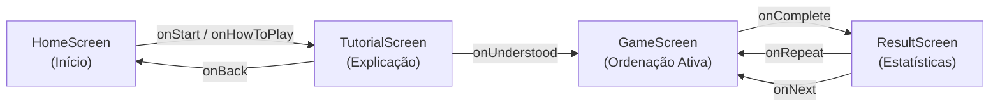

# 03 — Manual do Desenvolvedor Front-End

> **Documento canônico:** Guia técnico e manual prático de desenvolvimento da interface do **Sorting Station**.  
> **Status:** Ativo / Base de Verdade da Wiki  
> **Data:** 08/09/2026  
> **Dependências:** [`AGENTS.md`](../../AGENTS.md), [`CLAUDE.md`](../../CLAUDE.md), [`00-repository-inventory.md`](./00-repository-inventory.md), [`02-system-architecture.md`](./02-system-architecture.md).

---

## 1. Visão Geral da Stack Front-End

O front-end do **Sorting Station** opera como uma Single Page Application (SPA) client-side desenvolvida com as seguintes ferramentas e padrões:

- **React 19 (`^19.0.0`):** Utiliza componentes funcionais, hooks nativos (`useState`, `useEffect`, `useCallback`) e modo estrito de renderização (`React.StrictMode`).
- **TypeScript 5.7 (`^5.7.0`):** Compilação com checagem estrita de tipos (`"strict": true`, `"noFallthroughCasesInSwitch": true` em [`tsconfig.json`](../../tsconfig.json)).
- **Vite 8 (`^8.0.5`):** Servidor de desenvolvimento rápido com Hot Module Replacement (HMR) e suporte aos plugins de sandbox do Figma Make ([`vite.config.ts`](../../vite.config.ts)).
- **Tailwind CSS v4 (`^4.0.0`):** Configuração nativa via `@tailwindcss/vite`, sem arquivos legados `tailwind.config.js` ou `postcss.config.js`. Todo o tema é estendido via `@theme inline` dentro de [`src/index.css`](../../src/index.css).
- **Path Alias `@/`:** Configurado tanto no Vite ([`vite.config.ts`](../../vite.config.ts)) quanto no TypeScript ([`tsconfig.json`](../../tsconfig.json)), permitindo imports absolutos como `@/components/GameButton` a partir de qualquer arquivo.

---

## 2. Estrutura de Diretórios de `src/`

```text
src/
├── main.tsx             # Ponto de entrada React (createRoot, StrictMode e importação de index.css)
├── App.tsx              # Componente raiz: gerencia telas (screen), fases (phase) e resultado
├── index.css            # Folha de estilo global: fontes web, Tailwind v4, tokens @theme e animações
├── vite-env.d.ts        # Declarações de tipos do cliente Vite
├── screens/             # Telas completas da aplicação (orquestradas por App.tsx)
│   ├── HomeScreen.tsx   # Tela de boas-vindas e apresentação temática da Central Logística
│   ├── TutorialScreen.tsx # Tutorial explicativo com demonstração cíclica animada
│   ├── GameScreen.tsx   # Tela de jogo interativa: esteira, seleção e lógica de ordenação
│   └── ResultScreen.tsx # Relatório de término de fase: estatísticas e pseudocódigo
└── components/          # Componentes visuais atômicos e reutilizáveis
    ├── GameButton.tsx   # Botão estilizado com variantes sci-fi (primary, secondary, danger, ghost)
    ├── InstructionPanel.tsx # Faixa de feedback ao usuário com 4 tipos de severidade
    ├── NumberedBox.tsx  # Caixa de transporte com valor, etiquetas e animações de troca
    ├── PhaseHeader.tsx  # Cabeçalho fixo com protocolo, pílulas de fase e status do sistema
    └── StatsPanel.tsx   # Mostrador numérico duplo para comparações e trocas
```

---

## 3. Arquitetura de Telas e Navegação

A navegação da aplicação não utiliza rotas de URL, mas sim uma máquina de telas baseada no estado `screen` mantido em [`src/App.tsx`](../../src/App.tsx).



### 3.1. `src/App.tsx` (Componente Raiz)
- **Responsabilidades:**
  - Armazenar o estado global de navegação (`screen`: `"home" | "tutorial" | "game" | "result"`) ([`src/App.tsx`](../../src/App.tsx));
  - Armazenar o número da fase ativa (`phase`: `1 | 2 | 3`) ([`src/App.tsx`](../../src/App.tsx));
  - Armazenar o último resultado recebido (`result`: `GameResult | null`) ([`src/App.tsx`](../../src/App.tsx));
  - Definir a matriz de fases do Bubble Sort (`PHASES` em [`src/App.tsx`](../../src/App.tsx));
  - Forçar a remontagem de `GameScreen` através da prop `key={'game-phase-${phase}'}` ([`src/App.tsx`](../../src/App.tsx)).

### 3.2. `src/screens/HomeScreen.tsx`
- **Responsabilidades:** Recepção do jogador, ambientação narrativa na "Central Logística v2.0" e chamada para ação.
- **Destaques de Implementação:**
  - Exibe duas esteiras animadas decorativas de fundo com caixas em movimento contínuo (`conveyor-track`);
  - Botões "INICIAR TURNO" e "COMO JOGAR" ambos disparam `onStart()` / `onHowToPlay()`, levando ao tutorial;
  - Rodapé com tags de status dos protocolos: `BUBBLE SORT` (verde ativo), `INSERTION SORT` e `SELECTION SORT` (cinza inativo).
- **Callbacks:** `onStart: () => void`, `onHowToPlay: () => void`.

### 3.3. `src/screens/TutorialScreen.tsx`
- **Responsabilidades:** Explicar o funcionamento elementar do Bubble Sort de forma visual e intuitiva antes do início do turno.
- **Destaques de Implementação:**
  - Mantém um `setInterval` de 3 segundos alternando um ciclo demonstrativo entre 3 estados: `"before" → "comparing" → "after"` ([`src/screens/TutorialScreen.tsx`](../../src/screens/TutorialScreen.tsx));
  - Demonstra a comparação entre uma caixa de valor `8` e uma de valor `3`, ilustrando a necessidade de troca quando $8 > 3$;
  - Exibe cartões didáticos de regras operacionais ("1. Compare vizinhos", "2. Troque se fora de ordem", "3. Repita até estabilizar").
- **Callbacks:** `onBack: () => void`, `onUnderstood: () => void`.

### 3.4. `src/screens/GameScreen.tsx`
- **Responsabilidades:** Interface interativa de ordenação da fase atual.
- **Destaques de Implementação:**
  - Inicializa o vetor de caixas local a partir de `initialArray`: `useState<number[]>([...initialArray])`;
  - Rastreia a seleção da primeira caixa através do índice `selected: number | null`;
  - Permite desmarcar a caixa clicando nela novamente;
  - Exige adjacência para comparação (`Math.abs(selected - index) === 1`);
  - Dispara a animação de troca e agenda um `setTimeout` de 500ms para efetivar a permuta dos valores no array;
  - Integra a funcionalidade de Dica (`handleHint`) chamando `findNextSwap(boxes)`;
  - Monitora `isSorted(boxes)` e dispara `onComplete(comparisons, swaps, finalArray)`.
- **Callbacks:** `onComplete: (comparisons: number, swaps: number, finalArray: number[]) => void`.

### 3.5. `src/screens/ResultScreen.tsx`
- **Responsabilidades:** Apresentar a avaliação de desempenho após a conclusão da ordenação.
- **Destaques de Implementação:**
  - Renderiza o vetor final resultante utilizando caixas com a flag `sorted={true}`;
  - Apresenta contadores de comparações, trocas efetuadas e eficiência calculada (`swaps === 0 ? 100 : Math.max(20, Math.round(100 - swaps * 8))`);
  - Exibe o bloco de pseudocódigo do Bubble Sort com linha 19 destacada em ciano;
  - Botão "↺ REPETIR FASE" aciona `onRepeat()`; botão "PRÓXIMA FASE →" aciona `onNext()`.
- **Callbacks:** `onRepeat: () => void`, `onNext: () => void`.

---

## 4. Catálogo de Componentes Reutilizáveis (`src/components/`)

### 4.1. `NumberedBox` ([`src/components/NumberedBox.tsx`](../../src/components/NumberedBox.tsx))
Representação visual das caixas transportadas pela esteira.

```typescript
interface NumberedBoxProps {
  value: number;                  // Número inteiro contido na caixa
  index: number;                  // Índice 0-based no vetor (exibido como #index+1)
  selected?: boolean;             // Borda âmbar/pulsante indicando foco ativo
  disabled?: boolean;             // Reduz opacidade e remove cursor pointer
  sorted?: boolean;               // Borda verde e badge "OK" indicando elemento fixado
  onClick?: () => void;           // Callback de seleção
  animating?: "left" | "right" | null; // Dispara animate-swap-left ou animate-swap-right
  size?: "sm" | "md" | "lg";      // Dimensão da caixa (default: "md")
}
```

- **Classes visuais aplicadas dinamicamente:**
  - `selected`: `border-amber-400 bg-amber-950/40 shadow-[0_0_15px_rgba(245,158,11,0.4)] animate-pulse-border`;
  - `sorted`: `border-emerald-400 bg-emerald-950/30 shadow-[0_0_12px_rgba(16,185,129,0.3)]`;
  - `default`: `border-cyan-500/40 bg-[#0d1635]/90 hover:border-cyan-400 hover:shadow-[0_0_15px_rgba(0,245,255,0.25)]`.

### 4.2. `GameButton` ([`src/components/GameButton.tsx`](../../src/components/GameButton.tsx))
Botão com estética sci-fi e suporte a quatro variantes temáticas.

```typescript
interface GameButtonProps {
  children: React.ReactNode;
  onClick?: () => void;
  variant?: "primary" | "secondary" | "danger" | "ghost"; // Default: "primary"
  size?: "sm" | "md" | "lg";                             // Default: "md"
  disabled?: boolean;
  className?: string;
}
```

- **Variantes disponíveis:**
  - `"primary"`: Fundo ciano `#00f5ff`, texto `#060b1a`, brilho ciano em hover;
  - `"secondary"`: Fundo roxo translúcido com borda roxa `#8b5cf6`, texto `#c4b5fd`;
  - `"danger"`: Fundo vermelho translúcido `#ef4444`, texto `#fca5a5`;
  - `"ghost"`: Fundo transparente com borda translúcida ciano/branca.

### 4.3. `InstructionPanel` ([`src/components/InstructionPanel.tsx`](../../src/components/InstructionPanel.tsx))
Faixa horizontal de comunicação contextual com o usuário.

```typescript
interface InstructionPanelProps {
  message: string;
  type?: "info" | "warning" | "success" | "error"; // Default: "info"
}
```

- **Mapeamento de ícones e estilos:**
  - `"info"`: Ícone `◈`, borda ciano/40, texto `#a5f3fc`;
  - `"warning"`: Ícone `⚠`, borda âmbar/40, texto `#fde68a`;
  - `"success"`: Ícone `✓`, borda esmeralda/40, texto `#a7f3d0`;
  - `"error"`: Ícone `✕`, borda vermelha/40, texto `#fecaca`.

### 4.4. `PhaseHeader` ([`src/components/PhaseHeader.tsx`](../../src/components/PhaseHeader.tsx))
Barra superior fixa contendo metadados operacionais da rodada.

```typescript
interface PhaseHeaderProps {
  protocol: string;     // Ex.: "BUBBLE", "SELECTION"
  phase: number;        // Fase atual (1 a totalPhases)
  totalPhases?: number; // Total de fases (default: 3)
}
```

- **Elementos renderizados:** Nome do protocolo em Orbitron ciano, pílulas circulares de progresso das fases e distintivo pulsante `"SISTEMA ATIVO"`.

### 4.5. `StatsPanel` ([`src/components/StatsPanel.tsx`](../../src/components/StatsPanel.tsx))
Painel duplo de telemetria numérica.

```typescript
interface StatsPanelProps {
  comparisons: number; // Quantidade de pares comparados
  swaps: number;       // Quantidade de permutas executadas
}
```

---

## 5. Matriz de Componentes e Telas

| Componente / Tela | Caminho do Arquivo | Responsabilidade | Props Principais | Consumido Por |
| :--- | :--- | :--- | :--- | :--- |
| **`App`** | [`src/App.tsx`](../../src/App.tsx) | Gerencia a máquina de estados global (`screen`, `phase`, `result`) e as fases | Nenhuma (Root) | [`src/main.tsx`](../../src/main.tsx) |
| **`HomeScreen`** | [`src/screens/HomeScreen.tsx`](../../src/screens/HomeScreen.tsx) | Tela de apresentação temática e ponto de partida | `onStart`, `onHowToPlay` | [`src/App.tsx`](../../src/App.tsx) |
| **`TutorialScreen`** | [`src/screens/TutorialScreen.tsx`](../../src/screens/TutorialScreen.tsx) | Demonstração animada e regras do Bubble Sort | `onBack`, `onUnderstood` | [`src/App.tsx`](../../src/App.tsx) |
| **`GameScreen`** | [`src/screens/GameScreen.tsx`](../../src/screens/GameScreen.tsx) | Gameplay interativo, seleção e lógica de ordenação | `initialArray`, `phase`, `onComplete` | [`src/App.tsx`](../../src/App.tsx) |
| **`ResultScreen`** | [`src/screens/ResultScreen.tsx`](../../src/screens/ResultScreen.tsx) | Exibe pontuação, eficiência e pseudocódigo | `result`, `phase`, `totalPhases`, `onRepeat`, `onNext` | [`src/App.tsx`](../../src/App.tsx) |
| **`NumberedBox`** | [`src/components/NumberedBox.tsx`](../../src/components/NumberedBox.tsx) | Caixa de carga numerada com estados visuais e animações | `value`, `index`, `selected`, `sorted`, `animating`, `onClick` | `GameScreen`, `TutorialScreen`, `ResultScreen` |
| **`GameButton`** | [`src/components/GameButton.tsx`](../../src/components/GameButton.tsx) | Botão sci-fi estilizado com 4 variantes visuais | `children`, `variant`, `size`, `disabled`, `onClick` | Todas as telas (`Home`, `Tutorial`, `Game`, `Result`) |
| **`InstructionPanel`**| [`src/components/InstructionPanel.tsx`](../../src/components/InstructionPanel.tsx) | Painel informativo com tipologia e ícones | `message`, `type` | `GameScreen`, `TutorialScreen` |
| **`PhaseHeader`** | [`src/components/PhaseHeader.tsx`](../../src/components/PhaseHeader.tsx) | Barra de topo com protocolo, fase e status | `protocol`, `phase`, `totalPhases` | `GameScreen`, `ResultScreen` |
| **`StatsPanel`** | [`src/components/StatsPanel.tsx`](../../src/components/StatsPanel.tsx) | Painel numérico de comparações e trocas | `comparisons`, `swaps` | `GameScreen` |

---

## 6. Convenções de Código e Regras Obrigatórias

O projeto está inserido no ambiente Figma Make e impõe diretrizes estritas documentadas em [`AGENTS.md`](../../AGENTS.md):

### 6.1. Exportação Obrigatória por Padrão (`export default`)
Todos os componentes React em `src/components/` e `src/screens/` **devem obrigatoriamente utilizar `export default`** ([`AGENTS.md`](../../AGENTS.md)):
```tsx
// CORRETO:
export default function NumberedBox(props: NumberedBoxProps) { ... }

// INCORRETO (quebra convenção):
export function NumberedBox(props: NumberedBoxProps) { ... }
```

### 6.2. Regra de Strings e Apóstrofos em JSX
Para strings literais em JSX contendo apóstrofos (ex.: `"We're ready"`, `"Don't"`), **deve-se usar aspas duplas** ou a entidade HTML `&apos;` ([`AGENTS.md`](../../AGENTS.md)). O uso de aspas simples com apóstrofo não escapado quebra a compilação do Vite:
```tsx
// CORRETO:
<p>"Don't touch that"</p>
<p>{'Don\'t touch that'}</p>

// INCORRETO (erro no build):
<p>'Don't touch that'</p>
```

### 6.3. Fechamento Estrito de Tags e Chaves
Todos os elementos JSX devem ter fechamento explícito (`<Component />` ou `<Component></Component>`) e chaves `{}` perfeitamente balanceadas ([`AGENTS.md`](../../AGENTS.md)).

---

## 7. Estilização: Tailwind CSS v4, Tema e Animações

### 7.1. Uso do Tailwind CSS v4
- O projeto usa Tailwind CSS v4 via plugin oficial `@tailwindcss/vite` ([`AGENTS.md`](../../AGENTS.md)).
- Todas as classes utilitárias devem ser aplicadas **diretamente nos atributos `className` do JSX**.
- **Não crie** arquivos `tailwind.config.js` ou `postcss.config.js`.

### 7.2. Quando Usar `src/index.css`
O arquivo [`src/index.css`](../../src/index.css) deve ser editado **apenas** para:
1. Importação de fontes web (`@import url(...)`);
2. Importação do Tailwind (`@import 'tailwindcss';`);
3. Declaração de tokens de tema com `@theme inline`;
4. Regras `@keyframes` e classes utilitárias complexas com múltiplos pseudo-elementos (como `.scanlines`, `.conveyor-track`).

### 7.3. Tipografia do Projeto
Definida no topo de [`src/index.css`](../../src/index.css):
- **`'Orbitron', sans-serif`:** Títulos de tela, cabeçalhos de protocolos, números gigantes nas caixas e pontuações.
- **`'Space Mono', monospace`:** Rótulos de métricas, etiquetas técnicas (`PKG`, `SEL`, `OK`), botões operacionais e pseudocódigo.
- **`'Exo 2', sans-serif`:** Textos descritivos, instruções didáticas, regras de tutorial e diálogos informativos.

### 7.4. Tokens de Cor e Utilitários Customizados

| Token / Classe | Valor / Definição | Aplicação Principal |
| :--- | :--- | :--- |
| `--color-cyan` | `#00f5ff` | Acento primário sci-fi, bordas ativas, botões primários |
| `--color-purple` | `#8b5cf6` | Acento secundário, contador de trocas, botões secundários |
| `--color-amber` | `#f59e0b` | Avisos, caixas selecionadas em foco |
| `--color-green` | `#10b981` | Sucesso, caixas ordenadas definitivamente (`OK`) |
| `--color-bg-deep` | `#060b1a` | Fundo principal da aplicação |
| `--color-bg-card` | `#0d1635` | Painéis, cartões de tutorial e caixas numeradas |
| `.glow-cyan` | `drop-shadow(0 0 8px rgba(0,245,255,0.7))` | Brilho neon intenso para textos e números em ciano |
| `.glow-purple` | `drop-shadow(0 0 8px rgba(139,92,246,0.7))` | Brilho neon para contadores e destaques em roxo |
| `.scanlines` | Linhas horizontais semi-transparentes | Efeito retrô-futurista de tela CRT sobre toda a viewport |
| `.bg-grid` | Grid sutil de $40\times 40\text{px}$ | Textura de fundo estilo planta arquitetônica espacial |
| `.panel-border` | `border border-cyan-500/20 shadow-[0_0_15px_...]` | Borda padrão translúcida para painéis da central |

### 7.5. Animações Customizadas
- **`@keyframes conveyor` ([`src/index.css`](../../src/index.css)):** Desloca o `background-position-x` em $-32\text{px}$ em loop contínuo de $2\text{s}$, simulando a esteira rolante mecânica.
- **`@keyframes swap-left` / `@keyframes swap-right` ([`src/index.css`](../../src/index.css)):** Translação horizontal de $100\%$ acompanhada de arco vertical de elevação de $-12\text{px}$ na metade da animação ($50\%$), executada em $0.5\text{s}$ com curva `ease-in-out`.
- **`@keyframes pulse-border` ([`src/index.css`](../../src/index.css)):** Variação suave de opacidade de borda entre $0.4$ e $1.0$ para chamar a atenção para o elemento selecionado.

---

## 8. Responsividade e Limites de Layout

### 8.1. Estado Atual
- A interface foi construída tendo como alvo prioritário **resoluções desktop (largura $\ge 1024\text{px}$)**.
- O layout centraliza a esteira transportadora com `flex gap-4 items-center justify-center` ([`src/screens/GameScreen.tsx`](../../src/screens/GameScreen.tsx)).

### 8.2. Riscos de Quebra de Layout e Escalabilidade com Vetores Maiores
- **Estouro Horizontal (*Horizontal Overflow*):** Na Fase 3 (6 caixas), a esteira ocupa aproximadamente $6 \times 80\text{px} + 5 \times 16\text{px} = 560\text{px}$ de largura líquida.
- **Comportamento em Mobile (< 768px):** Telas de smartphones ou visualizadores estreitos de iframe sofrem corte lateral das caixas das extremidades, pois o contêiner não possui rolagem horizontal explícita (`overflow-x-auto`).
- **Escala para Algoritmos Futuros:** Quando o Selection Sort ou Insertion Sort forem adicionados com vetores didáticos maiores ($8$ a $10$ elementos), as caixas no tamanho padrão (`size="md"`, $80\times 112\text{px}$) forçarão quebra de linha indesejada ou extrapolação da largura da janela, a menos que se utilize dinamicamente a propriedade `size="sm"` ($56\times 72\text{px}$) ou um contêiner com rolagem horizontal controlada.

---

## 9. Acessibilidade (a11y) Observável e Lacunas Reais

Em estrita consonância com a base de verdade do repositório, esta seção detalha o que de fato existe e as lacunas observadas, **sem alegar certificações WCAG não implementadas**:

### 9.1. O que Existe Atualmente
- **Contraste de Cores:** Alto contraste cromático entre textos (ciano claro `#a5f3fc`, verde `#a7f3d0`, branco) e o fundo escuro (`#060b1a`).
- **Tags Semânticas Básicas:** Uso de elementos `<button>` nativos em `GameButton.tsx`, permitindo foco por `Tab` e acionamento por teclado nativo nos botões principais.
- **Hierarquia Visual de Títulos:** Uso estruturado de tags `<h1>`, `<h2>`, `<h3>` nas telas.

### 9.2. Lacunas Críticas Identificadas
1. **Caixas Numeradas não são Elementos Focáveis:**  
   Em [`src/components/NumberedBox.tsx`](../../src/components/NumberedBox.tsx), cada caixa é renderizada como uma `<div>` com evento `onClick`. Não possui `tabIndex={0}`, `role="button"` nem listener para teclas `Enter` ou `Space`. Usuários que navegam exclusivamente por teclado não conseguem selecionar as caixas na esteira.
2. **Ausência de Região Dinâmica (`aria-live`):**  
   O componente [`InstructionPanel.tsx`](../../src/components/InstructionPanel.tsx) atualiza mensagens de orientação dinamicamente, mas não possui o atributo `aria-live="polite"`. Leitores de tela não anunciam aos usuários deficientes visuais as mudanças de instrução decorrentes dos cliques.
3. **Dependência Cromática de Estado:**  
   O estado de caixa ordenada (`sorted`) é transmitido primariamente pela cor verde da borda e badge "OK". Usuários com daltonismo severo podem ter dificuldade em diferenciar a borda verde (`sorted`) da borda ciano (`default`).
4. **Preferência de Movimento Reduzido:**  
   O arquivo [`.figma/make/site.json`](../../.figma/make/site.json) possui `"ignoreReducedMotion": false`, porém o código CSS em `src/index.css` não encapsula as animações de esteira (`conveyor`) e de troca (`animate-swap-*`) dentro de uma media query `@media (prefers-reduced-motion: reduce)`.

---

## 10. Guia de Padrões para Novas Telas e Componentes

Ao criar novas telas ou componentes no projeto, siga estritamente o roteiro abaixo:

### 10.1. Padrão para Criar uma Nova Tela (`src/screens/NovaTela.tsx`)
```tsx
import GameButton from "@/components/GameButton";

interface NovaTelaProps {
  onBack: () => void;
  onConfirm: () => void;
}

export default function NovaTela({ onBack, onConfirm }: NovaTelaProps) {
  return (
    <div className="min-h-screen bg-[#060b1a] text-white flex flex-col items-center justify-center p-6 relative">
      <div className="scanlines" />
      <h1
        className="text-3xl font-bold text-cyan-400 glow-cyan mb-6"
        style={{ fontFamily: "'Orbitron', sans-serif" }}
      >
        TÍTULO DA TELA
      </h1>
      <p
        className="text-white/70 max-w-md text-center mb-8"
        style={{ fontFamily: "'Exo 2', sans-serif" }}
      >
        "Descrição contextual da tela respeitando a regra de aspas duplas em strings."
      </p>
      <div className="flex gap-4">
        <GameButton variant="ghost" onClick={onBack}>
          ← VOLTAR
        </GameButton>
        <GameButton variant="primary" onClick={onConfirm}>
          CONFIRMAR →
        </GameButton>
      </div>
    </div>
  );
}
```

### 10.2. Padrão para Criar um Novo Componente (`src/components/NovoComponente.tsx`)
```tsx
interface NovoComponenteProps {
  titulo: string;
  ativo?: boolean;
}

export default function NovoComponente({ titulo, ativo = false }: NovoComponenteProps) {
  return (
    <div
      className={`p-4 rounded panel-border transition-colors ${
        ativo ? "border-cyan-400 bg-cyan-950/30" : "bg-[#0d1635]/80"
      }`}
    >
      <span
        className="text-xs uppercase tracking-widest text-white/50"
        style={{ fontFamily: "'Space Mono', monospace" }}
      >
        {titulo}
      </span>
    </div>
  );
}
```

---

## 11. Anti-Padrões a Evitar

1. ❌ **Exportações Nomeadas em Componentes:** Nunca use `export function Componente()`. Use sempre `export default function Componente()` ([`AGENTS.md`](../../AGENTS.md)).
2. ❌ **Criação de `tailwind.config.*` ou `postcss.config.*`:** O projeto usa Tailwind v4 através do Vite. Customizações de tema devem ir exclusivamente em `src/index.css` via `@theme inline`.
3. ❌ **Strings em JSX com Apóstrofos Não Escapados:** Escrever `<p>'Don't do this'</p>` quebra a compilação do Vite. Use sempre `<p>"Don't do this"</p>`.
4. ❌ **Acoplar Lógica Algorítmica em Manipuladores de Clique:** Novas regras ou algoritmos não devem ser escritos dentro de funções de clique do JSX; devem ser isolados em módulos ou funções puras.
5. ❌ **Uso do Tipo `any` em TypeScript:** Mantenha a tipagem estrita com interfaces claras para todas as props e estados.
6. ❌ **Manipulação Direta do DOM:** Nunca use `document.getElementById` ou `document.querySelector` dentro de componentes React; utilize refs ou o ciclo declarativo do React.
