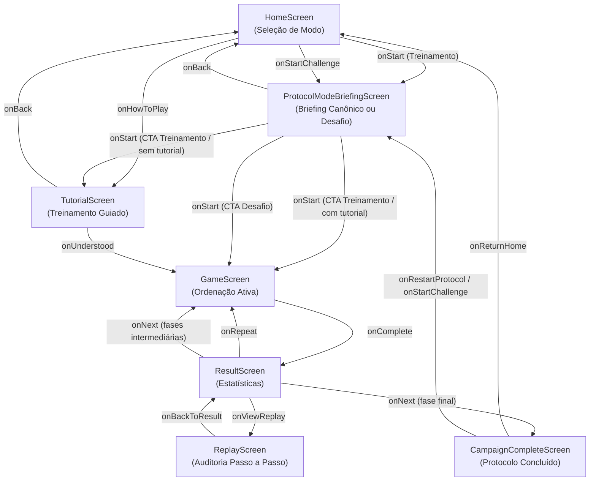

# 03 — Manual do Desenvolvedor Front-End

> **Documento canônico:** Guia técnico e manual prático de desenvolvimento da interface do **Sorting Station**.  
> **Status:** Ativo / Base de Verdade da Wiki  
> **Data:** 08/09/2026  
> **Dependências:** [`AGENTS.md`](../../AGENTS.md), [`CLAUDE.md`](../../CLAUDE.md), [`00-repository-inventory.md`](./00-repository-inventory.md), [`02-system-architecture.md`](./02-system-architecture.md).

---

## 1. Visão Geral da Stack Front-End

O front-end do **Sorting Station** opera como uma Single Page Application (SPA) client-side desenvolvida com as seguintes ferramentas e padrões:

- **React 19 (`^19.0.0`):** Utiliza componentes funcionais, hooks nativos (`useState`, `useEffect`, `useCallback`) e modo estrito de renderização (`React.StrictMode`).
- **TypeScript 5.7 (`^5.7.0`):** Compilação com checagem estrita de tipos (`"strict": true`, `"noFallthroughCasesInSwitch": true` em [`tsconfig.json`](../../tsconfig.json)).
- **Vite 8 (`^8.0.5`):** Servidor de desenvolvimento rápido com Hot Module Replacement (HMR) e suporte aos plugins de sandbox do Figma Make ([`vite.config.ts`](../../vite.config.ts)).
- **Tailwind CSS v4 (`^4.0.0`):** Configuração nativa via `@tailwindcss/vite`, sem arquivos legados `tailwind.config.js` ou `postcss.config.js`. Todo o tema é estendido via `@theme inline` dentro de [`src/index.css`](../../src/index.css).
- **Path Alias `@/`:** Configurado tanto no Vite ([`vite.config.ts`](../../vite.config.ts)) quanto no TypeScript ([`tsconfig.json`](../../tsconfig.json)), permitindo imports absolutos como `@/components/GameButton` a partir de qualquer arquivo.

---

## 2. Estrutura de Diretórios de `src/`

```text
src/
├── main.tsx             # Ponto de entrada React (createRoot, StrictMode e importação de index.css)
├── App.tsx              # Componente raiz: gerencia telas (screen), fases (phase) e resultado
├── index.css            # Folha de estilo global: fontes web, Tailwind v4, tokens @theme e animações
├── vite-env.d.ts        # Declarações de tipos do cliente Vite
├── screens/             # Telas completas da aplicação (orquestradas por App.tsx)
│   ├── HomeScreen.tsx   # Tela de boas-vindas e apresentação temática da Central Logística
│   ├── ProtocolModeBriefingScreen.tsx # Briefing intermediário orientado a dados (Canônico / Desafio)
│   ├── TutorialScreen.tsx # Tutorial explicativo com demonstração cíclica animada
│   ├── GameScreen.tsx   # Tela de jogo interativa: esteira, seleção e lógica de ordenação
│   ├── ResultScreen.tsx # Relatório de término de fase: estatísticas e pseudocódigo
│   ├── ReplayScreen.tsx # Reprodução retrospectiva passo a passo com pseudocódigo sincronizado
│   └── CampaignCompleteScreen.tsx # Relatório final de homologação do protocolo com resumo global
├── game/
│   ├── briefing/        # Catálogo e tipos de dados para briefings orientados a dados (P1.10 / ADR 0010)
│   ├── campaign/        # Agregação pura de métricas da campanha (PhaseResult, calculateCampaignSummary)
│   ├── generation/      # Geração procedural global e determinística de vetores (P1.9 / ADR 0009)
│   ├── persistence/     # Armazenamento local via localStorage (Schema v2 / ADR 0006 e 0007)
│   ├── replay/          # Modelo de quadros de replay e sincronização de pseudocódigo
│   ├── session/         # Métricas de telemetria descritiva e pontuação do protocolo
│   ├── sorting/         # Engine pedagógica pura de Bubble Sort (FSM Canônica e Early Exit)
│   └── tutorial/        # Guia pedagógico e definições do tutorial interativo
└── components/          # Componentes visuais atômicos e reutilizáveis
    ├── GameButton.tsx   # Botão estilizado com variantes sci-fi (primary, secondary, danger, ghost)
    ├── InstructionPanel.tsx # Faixa de feedback ao usuário com 4 tipos de severidade
    ├── NumberedBox.tsx  # Caixa de transporte com valor, etiquetas e animações de troca
    ├── PhaseHeader.tsx  # Cabeçalho fixo com protocolo, pílulas de fase e status do sistema
    └── StatsPanel.tsx   # Mostrador numérico duplo para comparações e trocas
```

---

## 3. Arquitetura de Telas e Navegação

A navegação da aplicação não utiliza rotas de URL, mas sim uma máquina de telas baseada no estado `screen` mantido em [`src/App.tsx`](../../src/App.tsx) (`"home" | "briefing" | "tutorial" | "game" | "result" | "replay" | "campaign-complete"`).



### 3.1. `src/App.tsx` (Componente Raiz)
- **Responsabilidades:**
  - Armazenar o estado global de navegação (`screen`: `"home" | "tutorial" | "game" | "result" | "campaign-complete"`) ([`src/App.tsx`](../../src/App.tsx));
  - Armazenar o número da fase ativa (`phase`: `1 | 2 | 3`) ([`src/App.tsx`](../../src/App.tsx));
  - Armazenar o último resultado recebido (`result`: `GameResult | null`) ([`src/App.tsx`](../../src/App.tsx));
  - Armazenar em memória os resultados acumulados de cada fase concluída (`phaseResults`: `PhaseResult[]`) para o relatório de encerramento;
  - Definir a matriz de fases do Bubble Sort (`PHASES` em [`src/App.tsx`](../../src/App.tsx));
  - Determinar semanticamente se há próxima fase (`hasNextPhase = phase < PHASES.length`), eliminando condicionais hardcoded;
  - Orquestrar a transição para `CampaignCompleteScreen` ao finalizar a última fase (`PHASES.length`), eliminando o bug de repetição em loop;
  - Forçar a remontagem de `GameScreen` através da prop `key={'game-phase-${phase}'}` ([`src/App.tsx`](../../src/App.tsx)).

### 3.2. `src/screens/HomeScreen.tsx`
- **Responsabilidades:** Recepção do jogador, ambientação narrativa na "Central Logística v2.0" e pontos de entrada para o treinamento regular e para o Modo Desafio.
- **Destaques de Implementação:**
  - Exibe duas esteiras animadas decorativas de fundo com caixas em movimento contínuo (`conveyor-track`);
  - Botão "INICIAR TURNO" inicia um novo turno da campanha sempre na Fase 1 (ou direciona para o tutorial caso o operador ainda não o tenha concluído); o botão "COMO JOGAR" abre o tutorial interativo a qualquer momento;
  - **Ponto de Acesso ao Modo Desafio (P1.8):** Exibe o botão destacado `[ ⚡ MODO DESAFIO (EARLY EXIT) ]` quando `isChallengeUnlocked === true`, ou o badge informativo com cadeado e requisito (`BLOQUEADO — CONCLUA AS 3 FASES CANÔNICAS`) quando bloqueado;
  - Rodapé com tags de status dos protocolos: `BUBBLE SORT` (verde ativo), `INSERTION SORT` e `SELECTION SORT` (cinza inativo).
- **Callbacks e Props:** `onStart: () => void`, `onHowToPlay: () => void`, `isChallengeUnlocked?: boolean`, `onStartChallenge?: () => void`.

### 3.3. `src/screens/ProtocolModeBriefingScreen.tsx`
- **Responsabilidades:** Tela intermediária orientada a dados e 100% agnóstica a motores específicos, responsável pelo alinhamento pedagógico prévio e preparação cognitiva do operador antes de qualquer interação motora na esteira.
- **Destaques de Implementação:**
  - **Arquitetura Orientada a Dados (P1.10 / ADR 0010):** Não possui strings nem condicionais hardcoded de Bubble Sort. Recebe um contrato estrito `ProtocolModeBriefing` (definido em `src/game/briefing/types.ts`) e o renderiza visualmente de forma determinística;
  - **Pílula Superior de Status:** Exibe crachá luminoso temático (`badgeText`) com suporte a variantes visuais sci-fi (`cyan`, `amber`, `emerald`, `purple`);
  - **Painel de Objetivo Operacional:** Seção em destaque delimitando claramente a meta daquele modo de jogo;
  - **Procedimento na Esteira (Grid 2x2):** Quatro cartões concisos com ícones estilizados, títulos em fonte mono e descrições curtas e didáticas sobre a operação mecânica;
  - **Particularidades do Modo:** Caixa opcional estilizada em tons quentes ou ciano detalhando sutilezas teóricas (ex.: ausência de economia no pior caso para Early Exit, neutralidade de pontuação para comparações evitadas);
  - **Destaques de Telemetria:** Faixa horizontal inferior com 3 cartões apresentando as variáveis e restrições formais da rodada (ex.: Comparações Previstas, Critério de Término, Complexidade Temporal);
  - **Navegação Segura e Geração Tardia:**
    - Botão `[ ← VOLTAR ]`: Retorna à tela de seleção (`home` ou `campaign-complete`) sem gerar vetor, sem consumir sementes procedurais e sem mutação de progresso/storage;
    - Botão `[ ▶ ${briefing.startLabel} ]`: Botão de ação primário único que efetivamente dispara a geração procedural (`generateBubblePhaseArray(1)`) e inicia a rodada.
- **Callbacks e Props:** `briefing: ProtocolModeBriefing`, `onStart: () => void`, `onBack: () => void`.

### 3.4. `src/screens/TutorialScreen.tsx`
- **Responsabilidades:** Mini-treinamento interativo guiado que ensina fazendo a lógica elementar do Bubble Sort antes do início do turno real na Fase 1.
- **Destaques de Implementação:**
  - **Integração com a Sorting Engine:** Não possui código duplicado de Bubble Sort; utiliza diretamente `createBubbleSortState([3, 1, 2])`, `executeUserStep`, `getExpectedComparison` e `getSortedIndices`;
  - **Cenário Pedagógico Determinístico `[3, 1, 2]`:**
    - **Etapa 1:** Compara par 3 e 1. Decisão correta: `[⇄ TROCAR]`. Gera vetor `[1, 3, 2]` após animação simétrica de troca;
    - **Etapa 2:** Compara par 3 e 2. Decisão correta: `[⇄ TROCAR]`. Gera vetor `[1, 2, 3]`. Conclui a Passada 1, exibindo o elemento 3 consolidado (`OK`);
    - **Explicação de Passada:** Callout didático explicando que uma passada é a varredura da esquerda para a direita pela parte ainda desordenada da esteira, estabilizando a maior carga restante na posição definitiva;
    - **Etapa 3:** Compara par 1 e 2. Decisão correta: `[= MANTER]`. Demonstra que o algoritmo didático continua até a verificação formal de todos os pares previstos;
  - **Tratamento Formativo de Erro:** Se o operador escolher uma ação incorreta, o estado algorítmico NÃO avança, o vetor permanece inalterado e o `InstructionPanel` exibe explicação formativa orientando nova tentativa;
  - **Conclusão Explícita:** Painel comemorativo de encerramento destacando as competências praticadas, com CTA "INICIAR FASE 1 →" e opção "↺ REPETIR TREINAMENTO";
  - **Guarda Síncrona e Animações:** Utiliza `isActionLockedRef` e `animatingPair` com duração de 500ms, idêntica à esteira do `GameScreen`.
- **Callbacks:** `onBack: () => void`, `onUnderstood: () => void`.

### 3.5. `src/screens/GameScreen.tsx`
- **Responsabilidades:** Interface interativa de ordenação da fase atual integrada deterministicamente à Bubble Sort Engine.
- **Destaques de Implementação:**
  - Inicializa e mantém o estado algorítmico através de `createBubbleSortState(initialArray)`, tornando a engine a única fonte de verdade;
  - Rastreia o par obrigatório sob comparação através de `getExpectedComparison(gameState)`, eliminando seleções arbitrárias de caixas;
  - Mecânica pedagógica de decisão: oferece botões `[⇄ TROCAR]` e `[= MANTER]` validados via `executeUserStep(gameState, decision)`;
  - Cliques informativos nas caixas (`handleBoxClick`): orientam o jogador sem violar a sequência algorítmica;
  - Animação de troca física desacoplada (`animatingPair: { left, right }`): a caixa esquerda translada para a direita (`animate-swap-right`) e a direita para a esquerda (`animate-swap-left`) durante 500ms com bloqueio total de controles;
  - Guarda síncrona com `isActionLockedRef`: protege contra condições de corrida por múltiplos cliques ultra-rápidos antes do ciclo de renderização do React;
  - Feedback formativo contextualizado: exibe explicações conceituais claras sem antecipar a resposta antes da tomada de decisão;
  - Dica pedagógica (`handleHint`): instrui exclusivamente sobre o par atual em foco sem avançar o ponteiro; uso intencional é contabilizado de forma isolada via `sessionMetrics.hintsUsed` (ADR 0003);
  - Progresso real: calculado via `calculateBubbleSortProgress(gameState)` ($\frac{\text{passos}}{\text{total teórico}} \times 100\%$);
  - Consolidação formal: elementos fixados (`OK`) são derivados diretamente de `getSortedIndices(gameState)`;
  - **Esteira Contínua em Telas Estreitas (P1.5):** Layout com contêiner rolável horizontalmente (`overflow-x-auto min-w-max`) sem `flex-wrap`, mantendo a metáfora linear contínua da esteira com 4, 5 e 6 caixas sem quebras de linha em dispositivos móveis;
  - **Avaliação de Carga Cognitiva e Pseudocódigo no Gameplay (P1.5):** O painel de pseudocódigo sincronizado é intencionalmente restrito ao `ReplayScreen`. No `GameScreen`, o operador necessita de foco perceptivo-motor na tríade `Ação Atual` $\rightarrow$ `Consequência Imediata` $\rightarrow$ `Contexto Algorítmico`. Exibir 9 linhas de pseudocódigo em tempo real durante o jogo geraria divisão de atenção (*split-attention effect*), forçaria rolagem vertical contínua e aumentaria a carga cognitiva extrínseca sem benefício pedagógico comprovado;
  - Conclusão segura: monitora `gameState.completed` e dispara `onComplete(data: PhaseCompleteData)` após temporizador calibrado de 1200ms de feedback comemorativo;
  - **Suporte a Variantes (P1.8):** Recebe `variant?: BubbleSortVariant` e instancia `createBubbleSortState(initialArray, { variant })`. Sob `EARLY_EXIT`, exibe notificação comemorativa de término antecipado quando a esteira estabiliza sem trocas e despacha `variant`, `earlyExitTriggered` e `terminationPass` em `onComplete`.
- **Callbacks e Props:** `onComplete: (data: PhaseCompleteData) => void`, `initialArray: number[]`, `phase: number`, `totalPhases?: number`, `variant?: BubbleSortVariant`, `modeTitle?: string`.

### 3.6. `src/screens/ResultScreen.tsx`
- **Responsabilidades:** Apresentar a avaliação de desempenho descritiva após a conclusão da ordenação da fase corrente ou cenário do Modo Desafio.
- **Destaques de Implementação:**
  - Renderiza o vetor final resultante consolidado com suporte a rolagem horizontal segura em mobile;
  - Apresenta contadores puramente factuais sob o título "MÉTRICAS DA FASE": Comparações (`comparisons`), Trocas (`swaps`), Decisões Incorretas (`errors`), Dicas Utilizadas (`hintsUsed`), Tempo de Operação e Pontuação do Protocolo;
  - **Painel Comparativo do Modo Desafio (P1.8):** No modo `EARLY_EXIT`, exibe Comparações Executadas, Comparações Máximas Canônicas de Referência ($n(n-1)/2$), Comparações Evitadas ($\max(0, \text{canônicas} - \text{executadas})$) e Status de Early Exit (SIM/NÃO com passada de término);
  - **Nota Pedagógica de Otimização:** Esclarece a economia de passos ou explica o motivo de não haver economia em casos de pior caso (ex.: inversão de cauda / elemento tartaruga);
  - **Pseudocódigo Contextual:** Renderiza `BUBBLE_SORT_EARLY_EXIT_PSEUDOCODE` quando em Modo Desafio, ou `BUBBLE_SORT_PSEUDOCODE` no modo canônico;
  - **Eliminação de Heurística:** Remoção definitiva da antiga métrica arbitrária de "Eficiência (%)", substituída integralmente pela telemetria factual descritiva (ADR 0003);
  - **Responsividade e Scroll Seguro:** Layout com contêiner rolável verticalmente (`overflow-y-auto min-h-full`) e grid responsivo `grid-cols-1 md:grid-cols-2`, impedindo cortes em telas de baixa altura;
  - Suporta a prop semântica `hasNextPhase`: exibe "PRÓXIMA FASE →" ou "PRÓXIMO CENÁRIO →", e "CONCLUIR PROTOCOLO →" ou "CONCLUIR DESAFIOS →";
  - Botão "▶ VER EXECUÇÃO" aciona `onViewReplay()` para transição ao modo replay sem perda de dados (ADR 0004);
  - Botão "↺ REPETIR FASE" / "↺ REPETIR CENÁRIO" aciona `onRepeat()`; botão principal aciona `onNext()`.
- **Callbacks e Props:** `onRepeat: () => void`, `onNext: () => void`, `onViewReplay?: () => void`, `variant?: BubbleSortVariant`, `earlyExitTriggered?: boolean`, `terminationPass?: number`, `canonicalComparisons?: number`, `comparisonsAvoided?: number`.

### 3.7. `src/screens/CampaignCompleteScreen.tsx`
- **Responsabilidades:** Tela de homologação técnica e encerramento do Protocolo Bubble ao término de todas as fases da campanha.
- **Destaques de Implementação:**
  - Apresenta o fechamento narrativo do setor de triagem ("Protocolo Bubble Concluído", sem falsas afirmações de aprendizado absoluto antes de pesquisas empíricas);
  - Painel de 5 métricas factuais globais calculadas via `calculateCampaignSummary`:
    - Fases Concluídas ($3 / 3$);
    - Comparações Totais acumuladas ($6 + 10 + 15 = 31$);
    - Trocas Totais acumuladas ($5 + 6 + 9 = 20$);
    - Decisões Incorretas Totais (`totalErrors`);
    - Dicas Utilizadas Totais (`totalHintsUsed`).
  - Relatório discriminado por etapa em grid responsivo com os contadores (`comparisons`, `swaps`, `errors`, `hintsUsed`, `score`, `elapsedTimeMs`) e miniatura dos vetores ordenados finais;
  - **Acesso ao Modo Desafio (P1.8):** Botão rápido `[ ⚡ EXPERIMENTAR MODO DESAFIO: EARLY EXIT → ]` exibido quando `onStartChallenge` está disponível;
  - Botão "⌂ VOLTAR AO INÍCIO" (`onReturnHome`): reseta todos os resultados em memória, reseta para Fase 1 e retorna para `HomeScreen`;
  - Botão "↺ REJOGAR PROTOCOLO" (`onRestartProtocol`): direciona para o briefing do Treinamento Regular com retorno seguro para `campaign-complete`.
- **Callbacks:** `onReturnHome: () => void`, `onRestartProtocol?: () => void`, `onStartChallenge?: () => void`.

### 3.8. `src/screens/ReplayScreen.tsx`
- **Responsabilidades:** Reprodução visual somente-leitura da execução de qualquer fase concluída do Protocolo Bubble Sort (P1.3, ADR 0004), com pseudocódigo sincronizado em tempo real (P1.4, ADR 0005) e suporte à variante otimizada (P1.8, ADR 0008).
- **Destaques de Implementação:**
  - Consome os quadros puros imutáveis derivados por `buildReplayFrames(initialArray, history, { variant, earlyExitTriggered })`;
  - Exibe o **Quadro 0 (Estado Inicial)** com a carga antes do primeiro passo, seguido pelos quadros sequenciais (1..N);
  - Mostra em cada passo: número do passo (`PASSO X / Y`), badge de ação (`INITIAL`, `SWAP`, `KEEP`), valores comparados, passada, comparação da passada e explicação factual concisa;
  - **Quadro Final com Término Antecipado (P1.8):** Quando `earlyExitTriggered === true`, o quadro final consolida todos os elementos (`sortedIndices = [0..n-1]`) e anexa nota factual destacando que a ausência de trocas comprovou a ordenação do vetor, sem criação de frames fantasmas;
  - Destaque cinestésico do par ativo através de `NumberedBox` com prop `selected={true}` e consolidação de caixas ordenadas com `sorted={true}`;
  - **Pseudocódigo Sincronizado Dinâmico (P1.8):** Utiliza `BUBBLE_SORT_EARLY_EXIT_PSEUDOCODE` quando em Modo Desafio, iluminando `CHECK_EARLY_EXIT` e `BREAK_STATEMENT` quando a interrupção precoce ocorre;
  - Painel de controles completo: `[↺ REINICIAR]`, `[← ANTERIOR]`, `[▶ REPRODUZIR]` / `[⏸ PAUSAR]` e `[PRÓXIMO →]`;
  - Botão "← VOLTAR AO RESULTADO" (`onBackToResult`): retorna para `ResultScreen` preservando 100% das métricas em memória.
- **Props:** `initialArray: number[]`, `history: readonly StepRecord[]`, `phase: number`, `variant?: BubbleSortVariant`, `earlyExitTriggered?: boolean`, `onBackToResult: () => void`.

---

## 4. Catálogo de Componentes Reutilizáveis (`src/components/`)

### 4.1. `NumberedBox` ([`src/components/NumberedBox.tsx`](../../src/components/NumberedBox.tsx))
Representação visual das caixas transportadas pela esteira.

```typescript
interface NumberedBoxProps {
  value: number;                  // Número inteiro contido na caixa
  index: number;                  // Índice 0-based no vetor (exibido como #index+1)
  selected: boolean;              // Borda ciano e badge "PAR" indicando foco ativo
  disabled: boolean;              // Reduz opacidade e remove cursor pointer
  sorted?: boolean;               // Borda verde e badge "OK" indicando elemento fixado
  badge?: string;                 // Etiqueta personalizada opcional (default: "PAR" | "OK" | "PKG")
  onClick: (index: number) => void; // Callback de interação
  animating?: "left" | "right" | null; // Dispara animate-swap-left ou animate-swap-right
  size?: "sm" | "md" | "lg";      // Dimensão da caixa (default: "lg")
}
```

- **Classes visuais aplicadas dinamicamente:**
  - `selected`: `border-[#00f5ff] bg-cyan-950 animate-pulse-border text-cyan-300`;
  - `sorted`: `border-emerald-500/30 bg-emerald-950 box-glow-idle text-emerald-400`;
  - `default`: `border-[rgba(42,74,158,0.8)] bg-[#0f1e4a] box-glow-idle text-white hover:bg-[#162460]`.
- **Acessibilidade (P1.5):**
  - Botão nativo `<button>` com anel de foco de alto contraste: `focus:outline-none focus-visible:ring-2 focus-visible:ring-cyan-400 focus-visible:ring-offset-2 focus-visible:ring-offset-[#060b1a]`;
  - Atributo descritivo dinâmico `aria-label`: `Caixa #{index + 1}, valor {value}, [selecionada no par ativo / consolidada]`, permitindo operação precisa via leitores de tela;
  - Dupla codificação: badges de texto (`PAR`, `OK`, `PKG`) e ícones operam conjuntamente com as cores de borda para evitar dependência exclusiva de cor.

### 4.2. `GameButton` ([`src/components/GameButton.tsx`](../../src/components/GameButton.tsx))
Botão com estética sci-fi e suporte a quatro variantes temáticas.

```typescript
interface GameButtonProps {
  children: React.ReactNode;
  onClick?: () => void;
  variant?: "primary" | "secondary" | "danger" | "ghost"; // Default: "primary"
  size?: "sm" | "md" | "lg";                             // Default: "md"
  disabled?: boolean;
  className?: string;
}
```

- **Variantes disponíveis:**
  - `"primary"`: Fundo ciano `#00f5ff`, texto `#060b1a`, brilho ciano em hover;
  - `"secondary"`: Fundo roxo translúcido com borda roxa `#8b5cf6`, texto `#c4b5fd`;
  - `"danger"`: Fundo vermelho translúcido `#ef4444`, texto `#fca5a5`;
  - `"ghost"`: Fundo transparente com borda translúcida ciano/branca.
- **Acessibilidade (P1.5):**
  - Anel de foco acessível: `focus-visible:ring-2 focus-visible:ring-cyan-400 focus-visible:ring-offset-2 focus-visible:ring-offset-[#060b1a]`;
  - Estados `disabled` utilizam atributos HTML padrão com `disabled:opacity-40 disabled:cursor-not-allowed` e inibição de eventos de clique.

### 4.3. `InstructionPanel` ([`src/components/InstructionPanel.tsx`](../../src/components/InstructionPanel.tsx))
Faixa horizontal de comunicação contextual com o usuário.

```typescript
interface InstructionPanelProps {
  message: string;
  type?: "info" | "warning" | "success" | "error"; // Default: "info"
}
```

- **Mapeamento de ícones e estilos:**
  - `"info"`: Ícone `◈`, borda ciano/40, texto `#a5f3fc`;
  - `"warning"`: Ícone `⚠`, borda âmbar/40, texto `#fde68a`;
  - `"success"`: Ícone `✓`, borda esmeralda/40, texto `#a7f3d0`;
  - `"error"`: Ícone `✕`, borda vermelha/40, texto `#fecaca`.
- **Acessibilidade (P1.5):**
  - Equipado com `role="status"` e `aria-live="polite"` para anúncio não-intrusivo de mensagens de estado e validação por tecnologias assistivas.

### 4.4. `PhaseHeader` ([`src/components/PhaseHeader.tsx`](../../src/components/PhaseHeader.tsx))
Barra superior fixa contendo metadados operacionais da rodada.

```typescript
interface PhaseHeaderProps {
  protocol: string;     // Ex.: "BUBBLE", "SELECTION"
  phase: number;        // Fase atual (1 a totalPhases)
  totalPhases?: number; // Total de fases (default: 3)
}
```

- **Elementos renderizados:** Nome do protocolo em Orbitron ciano, pílulas circulares de progresso das fases e distintivo pulsante `"SISTEMA ATIVO"`.

### 4.5. `StatsPanel` ([`src/components/StatsPanel.tsx`](../../src/components/StatsPanel.tsx))
Painel duplo de telemetria numérica.

```typescript
interface StatsPanelProps {
  comparisons: number; // Quantidade de pares comparados
  swaps: number;       // Quantidade de permutas executadas
}
```

### 4.6. `BubbleSortPseudocodePanel` ([`src/components/BubbleSortPseudocodePanel.tsx`](../../src/components/BubbleSortPseudocodePanel.tsx))
Painel de pseudocódigo canônico de Bubble Sort com sincronização pura e contextualização separada de valores concretos (P1.4, ADR 0005).

```typescript
interface BubbleSortPseudocodePanelProps {
  frame: ReplayFrame; // Quadro de replay corrente (fonte única e pura de verdade)
  className?: string; // Classes utilitárias opcionais de estilização
}
```

- **Funcionalidades:**
  - Renderiza a representação canônica imutável de 9 instruções do Bubble Sort (`BUBBLE_SORT_PSEUDOCODE`);
  - Destaque primário e secundário de instruções ativas via `getPseudocodeHighlight(frame)`:
    - `INITIAL`: Destaque neutro no cabeçalho `procedimento bubbleSort(A)`;
    - `KEEP`: Destaque na condição `se A[j] > A[j + 1] então` com badge `[FALSO]` e indicação de manutenção de ordem;
    - `SWAP`: Destaque na instrução `trocar A[j] e A[j + 1]` com badge `[⇄ EXECUTADO]` e indicação de condição `[VERDADEIRO]`;
  - Painel contextual inferior exibindo os valores concretos avaliados no frame ($A[j] = X, A[j+1] = Y$, $X > Y \rightarrow \text{VERDADEIRO/FALSO}$) preservando a formulação genérica do código.

---

## 5. Matriz de Componentes e Telas

| Componente / Tela | Caminho do Arquivo | Responsabilidade | Props Principais | Consumido Por |
| :--- | :--- | :--- | :--- | :--- |
| **`App`** | [`src/App.tsx`](../../src/App.tsx) | Gerencia a máquina de estados global (`screen`, `phase`, `result`) e as fases | Nenhuma (Root) | [`src/main.tsx`](../../src/main.tsx) |
| **`HomeScreen`** | [`src/screens/HomeScreen.tsx`](../../src/screens/HomeScreen.tsx) | Tela de apresentação temática e ponto de partida | `onStart`, `onHowToPlay` | [`src/App.tsx`](../../src/App.tsx) |
| **`TutorialScreen`** | [`src/screens/TutorialScreen.tsx`](../../src/screens/TutorialScreen.tsx) | Demonstração animada e regras do Bubble Sort | `onBack`, `onUnderstood` | [`src/App.tsx`](../../src/App.tsx) |
| **`GameScreen`** | [`src/screens/GameScreen.tsx`](../../src/screens/GameScreen.tsx) | Gameplay interativo, seleção e lógica de ordenação | `initialArray`, `phase`, `onComplete` | [`src/App.tsx`](../../src/App.tsx) |
| **`ResultScreen`** | [`src/screens/ResultScreen.tsx`](../../src/screens/ResultScreen.tsx) | Exibe métricas factuais (comparações, trocas, erros, dicas) e pseudocódigo | `finalArray`, `comparisons`, `swaps`, `errors`, `hintsUsed`, `phase`, `hasNextPhase`, `onRepeat`, `onNext`, `onViewReplay` | [`src/App.tsx`](../../src/App.tsx) |
| **`ReplayScreen`** | [`src/screens/ReplayScreen.tsx`](../../src/screens/ReplayScreen.tsx) | Reprodução visual e temporal passo a passo dos registros do histórico | `initialArray`, `history`, `phase`, `onBackToResult` | [`src/App.tsx`](../../src/App.tsx) |
| **`CampaignCompleteScreen`** | [`src/screens/CampaignCompleteScreen.tsx`](../../src/screens/CampaignCompleteScreen.tsx) | Encerramento da campanha e resumo factual global | `results`, `totalPhases`, `onReturnHome`, `onRestartProtocol` | [`src/App.tsx`](../../src/App.tsx) |
| **`NumberedBox`** | [`src/components/NumberedBox.tsx`](../../src/components/NumberedBox.tsx) | Caixa de carga numerada com estados visuais e animações | `value`, `index`, `selected`, `sorted`, `animating`, `onClick` | `GameScreen`, `TutorialScreen`, `ResultScreen`, `ReplayScreen` |
| **`GameButton`** | [`src/components/GameButton.tsx`](../../src/components/GameButton.tsx) | Botão sci-fi estilizado com 4 variantes visuais | `children`, `variant`, `size`, `disabled`, `onClick` | Todas as telas (`Home`, `Tutorial`, `Game`, `Result`, `CampaignComplete`) |
| **`InstructionPanel`**| [`src/components/InstructionPanel.tsx`](../../src/components/InstructionPanel.tsx) | Painel informativo com tipologia e ícones | `message`, `type` | `GameScreen`, `TutorialScreen` |
| **`PhaseHeader`** | [`src/components/PhaseHeader.tsx`](../../src/components/PhaseHeader.tsx) | Barra de topo com protocolo, fase e status | `protocol`, `phase`, `totalPhases` | `GameScreen`, `ResultScreen` |
| **`StatsPanel`** | [`src/components/StatsPanel.tsx`](../../src/components/StatsPanel.tsx) | Painel numérico de comparações e trocas | `comparisons`, `swaps` | `GameScreen` |
| **`BubbleSortPseudocodePanel`** | [`src/components/BubbleSortPseudocodePanel.tsx`](../../src/components/BubbleSortPseudocodePanel.tsx) | Painel de pseudocódigo sincronizado com destaque de linha e contexto concreto | `frame`, `className` | `ReplayScreen` |

---

## 6. Convenções de Código e Regras Obrigatórias

O projeto está inserido no ambiente Figma Make e impõe diretrizes estritas documentadas em [`AGENTS.md`](../../AGENTS.md):

### 6.1. Exportação Obrigatória por Padrão (`export default`)
Todos os componentes React em `src/components/` e `src/screens/` **devem obrigatoriamente utilizar `export default`** ([`AGENTS.md`](../../AGENTS.md)):
```tsx
// CORRETO:
export default function NumberedBox(props: NumberedBoxProps) { ... }

// INCORRETO (quebra convenção):
export function NumberedBox(props: NumberedBoxProps) { ... }
```

### 6.2. Regra de Strings e Apóstrofos em JSX
Para strings literais em JSX contendo apóstrofos (ex.: `"We're ready"`, `"Don't"`), **deve-se usar aspas duplas** ou a entidade HTML `&apos;` ([`AGENTS.md`](../../AGENTS.md)). O uso de aspas simples com apóstrofo não escapado quebra a compilação do Vite:
```tsx
// CORRETO:
<p>"Don't touch that"</p>
<p>{'Don\'t touch that'}</p>

// INCORRETO (erro no build):
<p>'Don't touch that'</p>
```

### 6.3. Fechamento Estrito de Tags e Chaves
Todos os elementos JSX devem ter fechamento explícito (`<Component />` ou `<Component></Component>`) e chaves `{}` perfeitamente balanceadas ([`AGENTS.md`](../../AGENTS.md)).

---

## 7. Estilização: Tailwind CSS v4, Tema e Animações

### 7.1. Uso do Tailwind CSS v4
- O projeto usa Tailwind CSS v4 via plugin oficial `@tailwindcss/vite` ([`AGENTS.md`](../../AGENTS.md)).
- Todas as classes utilitárias devem ser aplicadas **diretamente nos atributos `className` do JSX**.
- **Não crie** arquivos `tailwind.config.js` ou `postcss.config.js`.

### 7.2. Quando Usar `src/index.css`
O arquivo [`src/index.css`](../../src/index.css) deve ser editado **apenas** para:
1. Importação de fontes web (`@import url(...)`);
2. Importação do Tailwind (`@import 'tailwindcss';`);
3. Declaração de tokens de tema com `@theme inline`;
4. Regras `@keyframes` e classes utilitárias complexas com múltiplos pseudo-elementos (como `.scanlines`, `.conveyor-track`).

### 7.3. Tipografia do Projeto
Definida no topo de [`src/index.css`](../../src/index.css):
- **`'Orbitron', sans-serif`:** Títulos de tela, cabeçalhos de protocolos, números gigantes nas caixas e pontuações.
- **`'Space Mono', monospace`:** Rótulos de métricas, etiquetas técnicas (`PKG`, `SEL`, `OK`), botões operacionais e pseudocódigo.
- **`'Exo 2', sans-serif`:** Textos descritivos, instruções didáticas, regras de tutorial e diálogos informativos.

### 7.4. Tokens de Cor e Utilitários Customizados

| Token / Classe | Valor / Definição | Aplicação Principal |
| :--- | :--- | :--- |
| `--color-cyan` | `#00f5ff` | Acento primário sci-fi, bordas ativas, botões primários |
| `--color-purple` | `#8b5cf6` | Acento secundário, contador de trocas, botões secundários |
| `--color-amber` | `#f59e0b` | Avisos, caixas selecionadas em foco |
| `--color-green` | `#10b981` | Sucesso, caixas ordenadas definitivamente (`OK`) |
| `--color-bg-deep` | `#060b1a` | Fundo principal da aplicação |
| `--color-bg-card` | `#0d1635` | Painéis, cartões de tutorial e caixas numeradas |
| `.glow-cyan` | `drop-shadow(0 0 8px rgba(0,245,255,0.7))` | Brilho neon intenso para textos e números em ciano |
| `.glow-purple` | `drop-shadow(0 0 8px rgba(139,92,246,0.7))` | Brilho neon para contadores e destaques em roxo |
| `.scanlines` | Linhas horizontais semi-transparentes | Efeito retrô-futurista de tela CRT sobre toda a viewport |
| `.bg-grid` | Grid sutil de $40\times 40\text{px}$ | Textura de fundo estilo planta arquitetônica espacial |
| `.panel-border` | `border border-cyan-500/20 shadow-[0_0_15px_...]` | Borda padrão translúcida para painéis da central |

### 7.5. Animações Customizadas
- **`@keyframes conveyor` ([`src/index.css`](../../src/index.css)):** Desloca o `background-position-x` em $-32\text{px}$ em loop contínuo de $2\text{s}$, simulando a esteira rolante mecânica.
- **`@keyframes swap-left` / `@keyframes swap-right` ([`src/index.css`](../../src/index.css)):** Translação horizontal de $100\%$ acompanhada de arco vertical de elevação de $-12\text{px}$ na metade da animação ($50\%$), executada em $0.5\text{s}$ com curva `ease-in-out`.
- **`@keyframes pulse-border` ([`src/index.css`](../../src/index.css)):** Variação suave de opacidade de borda entre $0.4$ e $1.0$ para chamar a atenção para o elemento selecionado.

---

## 8. Responsividade e Limites de Layout

### 8.1. Estado Atual
- A interface foi construída tendo como alvo prioritário **resoluções desktop (largura $\ge 1024\text{px}$)**.
- O layout centraliza a esteira transportadora com `flex gap-4 items-center justify-center` ([`src/screens/GameScreen.tsx`](../../src/screens/GameScreen.tsx)).

### 8.2. Riscos de Quebra de Layout e Escalabilidade com Vetores Maiores
- **Estouro Horizontal (*Horizontal Overflow*):** Na Fase 3 (6 caixas), a esteira ocupa aproximadamente $6 \times 80\text{px} + 5 \times 16\text{px} = 560\text{px}$ de largura líquida.
- **Comportamento em Mobile (< 768px):** Telas de smartphones ou visualizadores estreitos de iframe sofrem corte lateral das caixas das extremidades, pois o contêiner não possui rolagem horizontal explícita (`overflow-x-auto`).
- **Escala para Algoritmos Futuros:** Quando o Selection Sort ou Insertion Sort forem adicionados com vetores didáticos maiores ($8$ a $10$ elementos), as caixas no tamanho padrão (`size="md"`, $80\times 112\text{px}$) forçarão quebra de linha indesejada ou extrapolação da largura da janela, a menos que se utilize dinamicamente a propriedade `size="sm"` ($56\times 72\text{px}$) ou um contêiner com rolagem horizontal controlada.

---

## 9. Acessibilidade (a11y) Observável e Lacunas Reais

Em estrita consonância com a base de verdade do repositório, esta seção detalha o que de fato existe e as lacunas observadas, **sem alegar certificações WCAG não implementadas**:

### 9.1. O que Existe Atualmente
- **Contraste de Cores:** Alto contraste cromático entre textos (ciano claro `#a5f3fc`, verde `#a7f3d0`, branco) e o fundo escuro (`#060b1a`).
- **Tags Semânticas Básicas:** Uso de elementos `<button>` nativos em `GameButton.tsx`, permitindo foco por `Tab` e acionamento por teclado nativo nos botões principais.
- **Hierarquia Visual de Títulos:** Uso estruturado de tags `<h1>`, `<h2>`, `<h3>` nas telas.

### 9.2. Lacunas Críticas Identificadas
1. **Caixas Numeradas não são Elementos Focáveis:**  
   Em [`src/components/NumberedBox.tsx`](../../src/components/NumberedBox.tsx), cada caixa é renderizada como uma `<div>` com evento `onClick`. Não possui `tabIndex={0}`, `role="button"` nem listener para teclas `Enter` ou `Space`. Usuários que navegam exclusivamente por teclado não conseguem selecionar as caixas na esteira.
2. **Ausência de Região Dinâmica (`aria-live`):**  
   O componente [`InstructionPanel.tsx`](../../src/components/InstructionPanel.tsx) atualiza mensagens de orientação dinamicamente, mas não possui o atributo `aria-live="polite"`. Leitores de tela não anunciam aos usuários deficientes visuais as mudanças de instrução decorrentes dos cliques.
3. **Dependência Cromática de Estado:**  
   O estado de caixa ordenada (`sorted`) é transmitido primariamente pela cor verde da borda e badge "OK". Usuários com daltonismo severo podem ter dificuldade em diferenciar a borda verde (`sorted`) da borda ciano (`default`).
4. **Preferência de Movimento Reduzido:**  
   O arquivo [`.figma/make/site.json`](../../.figma/make/site.json) possui `"ignoreReducedMotion": false`, porém o código CSS em `src/index.css` não encapsula as animações de esteira (`conveyor`) e de troca (`animate-swap-*`) dentro de uma media query `@media (prefers-reduced-motion: reduce)`.

---

## 10. Guia de Padrões para Novas Telas e Componentes

Ao criar novas telas ou componentes no projeto, siga estritamente o roteiro abaixo:

### 10.1. Padrão para Criar uma Nova Tela (`src/screens/NovaTela.tsx`)
```tsx
import GameButton from "@/components/GameButton";

interface NovaTelaProps {
  onBack: () => void;
  onConfirm: () => void;
}

export default function NovaTela({ onBack, onConfirm }: NovaTelaProps) {
  return (
    <div className="min-h-screen bg-[#060b1a] text-white flex flex-col items-center justify-center p-6 relative">
      <div className="scanlines" />
      <h1
        className="text-3xl font-bold text-cyan-400 glow-cyan mb-6"
        style={{ fontFamily: "'Orbitron', sans-serif" }}
      >
        TÍTULO DA TELA
      </h1>
      <p
        className="text-white/70 max-w-md text-center mb-8"
        style={{ fontFamily: "'Exo 2', sans-serif" }}
      >
        "Descrição contextual da tela respeitando a regra de aspas duplas em strings."
      </p>
      <div className="flex gap-4">
        <GameButton variant="ghost" onClick={onBack}>
          ← VOLTAR
        </GameButton>
        <GameButton variant="primary" onClick={onConfirm}>
          CONFIRMAR →
        </GameButton>
      </div>
    </div>
  );
}
```

### 10.2. Padrão para Criar um Novo Componente (`src/components/NovoComponente.tsx`)
```tsx
interface NovoComponenteProps {
  titulo: string;
  ativo?: boolean;
}

export default function NovoComponente({ titulo, ativo = false }: NovoComponenteProps) {
  return (
    <div
      className={`p-4 rounded panel-border transition-colors ${
        ativo ? "border-cyan-400 bg-cyan-950/30" : "bg-[#0d1635]/80"
      }`}
    >
      <span
        className="text-xs uppercase tracking-widest text-white/50"
        style={{ fontFamily: "'Space Mono', monospace" }}
      >
        {titulo}
      </span>
    </div>
  );
}
```

---

## 11. Anti-Padrões a Evitar

1. ❌ **Exportações Nomeadas em Componentes:** Nunca use `export function Componente()`. Use sempre `export default function Componente()` ([`AGENTS.md`](../../AGENTS.md)).
2. ❌ **Criação de `tailwind.config.*` ou `postcss.config.*`:** O projeto usa Tailwind v4 através do Vite. Customizações de tema devem ir exclusivamente em `src/index.css` via `@theme inline`.
3. ❌ **Strings em JSX com Apóstrofos Não Escapados:** Escrever `<p>'Don't do this'</p>` quebra a compilação do Vite. Use sempre `<p>"Don't do this"</p>`.
4. ❌ **Acoplar Lógica Algorítmica em Manipuladores de Clique:** Novas regras ou algoritmos não devem ser escritos dentro de funções de clique do JSX; devem ser isolados em módulos ou funções puras.
5. ❌ **Uso do Tipo `any` em TypeScript:** Mantenha a tipagem estrita com interfaces claras para todas as props e estados.
6. ❌ **Manipulação Direta do DOM:** Nunca use `document.getElementById` ou `document.querySelector` dentro de componentes React; utilize refs ou o ciclo declarativo do React.
