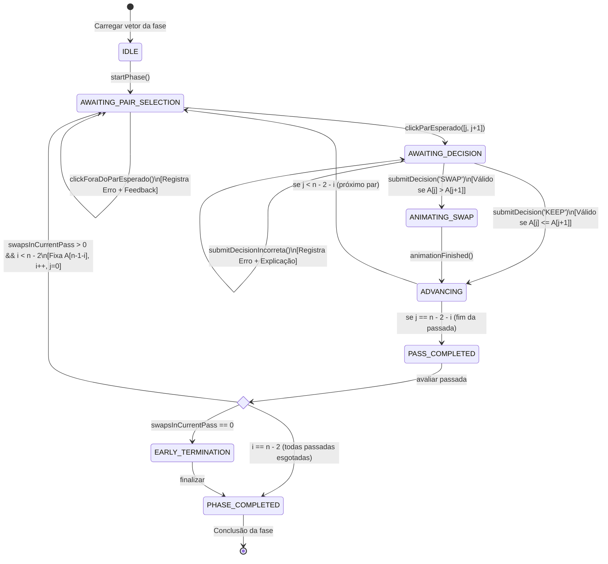

# 04 — Motor de Ordenação: Lógica Atual e Engine Pedagógica Planejada

> **Documento canônico:** Especificação técnica e formal da lógica algorítmica, análise da engine atual de Bubble Sort, modelo formal da máquina de estados pedagógica e plano de expansão do **Sorting Station**.  
> **Status:** Ativo / Base de Verdade da Wiki  
> **Data:** 08/09/2026  
> **Dependências:** [`AGENTS.md`](../../AGENTS.md), [`CLAUDE.md`](../../CLAUDE.md), [`00-repository-inventory.md`](./00-repository-inventory.md), [`02-system-architecture.md`](./02-system-architecture.md), [`03-frontend.md`](./03-frontend.md).

---

# PARTE A — ESTADO ATUAL (ANÁLISE DO PROTÓTIPO)

Esta parte documenta a implementação fática da lógica de ordenação que se encontra atualmente no código-fonte, concentrada em [`src/screens/GameScreen.tsx`](../../src/screens/GameScreen.tsx), [`src/App.tsx`](../../src/App.tsx) e [`src/components/NumberedBox.tsx`](../../src/components/NumberedBox.tsx).

---

## 1. Funcionamento Passo a Passo da Lógica Atual

### 1.1. Seleção da Primeira Caixa
- Quando o jogador clica em uma caixa da esteira e nenhuma caixa está selecionada (`selected === null`), a função `handleBoxClick(index)` salva o índice no estado `selected` ([`src/screens/GameScreen.tsx`](../../src/screens/GameScreen.tsx)).
- A mensagem em `InstructionPanel` é atualizada para `"Caixa #X selecionada. Clique em uma caixa vizinha para comparar."` com tipo `"info"`.
- A caixa ganha a classe visual de seleção (`border-amber-400` e animação `pulse-border`) via prop `selected={selected === index}` ([`src/screens/GameScreen.tsx`](../../src/screens/GameScreen.tsx)).

### 1.2. Cancelamento da Seleção
- Se o usuário clicar novamente na mesma caixa já selecionada (`selected === index`), o manipulador cancela o foco, redefinindo `selected` para `null` e emitindo `"Seleção cancelada."` ([`src/screens/GameScreen.tsx`](../../src/screens/GameScreen.tsx)).

### 1.3. Validação de Adjacência
- Ao clicar em uma segunda caixa com índice diferente (`selected !== null && selected !== index`), o código verifica se a distância absoluta entre os índices é igual a $1$:
  ```typescript
  // src/screens/GameScreen.tsx:L58-L62
  if (Math.abs(selected - index) !== 1) {
    setSelected(null);
    setInstruction({
      text: "As caixas precisam ser vizinhas para serem comparadas!",
      type: "warning",
    });
    return;
  }
  ```
- Caso a distância seja diferente de $1$ (ex.: índices 0 e 2), a seleção é cancelada imediatamente com aviso de severidade `"warning"`.

### 1.4. Incremento do Contador de Comparações
- Estando validada a adjacência, o par é normalizado em índices de esquerda e direita:
  `left = Math.min(selected, index)` e `right = left + 1` ([`src/screens/GameScreen.tsx`](../../src/screens/GameScreen.tsx)).
- O contador de comparações é incrementado incondicionalmente: `setComparisons(comparisons + 1)` ([`src/screens/GameScreen.tsx`](../../src/screens/GameScreen.tsx)).

### 1.5. Troca Condicional (`boxes[left] > boxes[right]`)
- **Se `boxes[left] > boxes[right]` ([`src/screens/GameScreen.tsx`](../../src/screens/GameScreen.tsx)):**
  - O estado `animating` é setado para `true`;
  - A mensagem exibe `"Trocando: X > Y — colocando em ordem crescente..."` com tipo `"success"`;
  - Dispara-se um `setTimeout` de $500\text{ms}$;
  - Após $500\text{ms}$, os valores são permutados em uma cópia imutável do array: `[newBoxes[left], newBoxes[right]] = [newBoxes[right], newBoxes[left]]`;
  - O contador de trocas é incrementado: `setSwaps(swaps + 1)`;
  - `setBoxes(newBoxes)` e `setAnimating(false)` são executados;
  - Se `isSorted(newBoxes)` for verdadeiro, agenda-se a finalização da fase via callback `onComplete` após $400\text{ms}$.
- **Se `boxes[left] <= boxes[right]` ([`src/screens/GameScreen.tsx`](../../src/screens/GameScreen.tsx)):**
  - Nenhuma permuta é executada;
  - Exibe `"X ≤ Y — já estão na ordem correta!"` com tipo `"info"`;
  - Se `isSorted(boxes)` for verdadeiro, agenda-se `onComplete` após $400\text{ms}$.

### 1.6. Detecção de Vetor Ordenado
- Avaliada pela função inlined `isSorted(arr)` ([`src/screens/GameScreen.tsx`](../../src/screens/GameScreen.tsx)):
  ```typescript
  function isSorted(arr: number[]): boolean {
    return arr.every((v, i) => i === 0 || arr[i - 1] <= v);
  }
  ```
- Essa função simplesmente varre o vetor verificando monotonicidade não decrescente.

### 1.7. Sistema de Dica Atual
- Implementado pela função `findNextSwap(arr)` ([`src/screens/GameScreen.tsx`](../../src/screens/GameScreen.tsx)):
  ```typescript
  function findNextSwap(arr: number[]): number | null {
    for (let i = 0; i < arr.length - 1; i++) {
      if (arr[i] > arr[i + 1]) return i;
    }
    return null;
  }
  ```
- Ao clicar no botão "DICA" ([`src/screens/GameScreen.tsx`](../../src/screens/GameScreen.tsx)), a busca encontra a **primeira inversão adjacente** da esquerda para a direita e preenche `hintPair = [idx, idx + 1]`. As caixas correspondentes recebem borda âmbar tracejada.

### 1.8. Reinício da Fase (`handleReset`)
- Limpa o estado local e restaura o array a partir da prop: `setBoxes([...initialArray])` ([`src/screens/GameScreen.tsx`](../../src/screens/GameScreen.tsx)). Zera `comparisons`, `swaps`, `selected` e `hintPair`.

### 1.9. Cálculo de Progresso Atual
- Exibido na barra de progresso da esteira ([`src/screens/GameScreen.tsx`](../../src/screens/GameScreen.tsx)):
  ```typescript
  const progressPercent = Math.round(
    isSorted(boxes) ? 100 : (swaps / Math.max(swaps + 2, 4)) * 80
  );
  ```
- **Limitação:** Trata-se de uma aproximação visual arbitrária que varia com a quantidade de trocas feitas, e não com o número de comparações completadas do algoritmo.

### 1.10. Marcação de Caixas Ordenadas (`OK`)
- Calculada através de uma contagem de sufixo ordenado ([`src/screens/GameScreen.tsx`](../../src/screens/GameScreen.tsx)):
  ```typescript
  let sortedCount = 0;
  for (let i = boxes.length - 1; i >= 0; i--) {
    if (i === boxes.length - 1 || boxes[i] <= boxes[i + 1]) {
      sortedCount++;
    } else {
      break;
    }
  }
  ```
- Cada caixa recebe `sorted={index >= boxes.length - sortedCount && isSorted(boxes.slice(index))}` ([`src/screens/GameScreen.tsx`](../../src/screens/GameScreen.tsx)).
- **Limitação:** Se o vetor for `[2, 4, 1, 5]`, o sufixo `[5]` é marcado como `OK`, mas se o vetor for acidentalmente `[1, 2, 4, 3]`, nenhum elemento é marcado mesmo que as primeiras posições já estivessem estáveis. A heurística não se baseia nas passadas reais do Bubble Sort.

### 1.11. Animação de Troca e Defeito Observado
- Em [`src/screens/GameScreen.tsx`](../../src/screens/GameScreen.tsx), `setSelected(null)` é invocado **antes** do `setTimeout` de $500\text{ms}$.
- Como consequência, na linha 199:
  ```typescript
  animating={animating ? (index === selected ? "right" : "left") : null}
  ```
  `index === selected` compara `index` com `null` (sempre `false`), fazendo com que **todas as caixas em animação recebam a classe `"left"`**, quebrando a simetria da animação visual (`animate-swap-left` em uma e `animate-swap-right` na outra).

---

## 2. A Dívida Técnica Pedagógica Central

> [!WARNING]
> **O usuário atualmente pode escolher qualquer par adjacente em qualquer ordem.**  
> Por exemplo, no vetor `[5, 2, 4, 1]`, o jogador pode comparar as caixas dos índices 2 e 3 (`4` e `1`) antes de sequer tocar nos índices 0 e 1 (`5` e `2`).  
> **Portanto, o protótipo atual NÃO constitui uma simulação estrita da sequência do Bubble Sort.** Trata-se de um puzzle de ordenação por pares vizinhos, e não da execução de um algoritmo determinístico.

---

---

# PARTE B — ENGINE PEDAGÓGICA (BUBBLE SORT)

Esta seção documenta a **camada de domínio puro da Engine de Bubble Sort** implementada em [`src/game/sorting/`](../../src/game/sorting/) e a **integração planejada com a interface gráfica** de [`src/screens/GameScreen.tsx`](../../src/screens/GameScreen.tsx).

> **Status de Implementação da Engine:**  
> - **Camada de Domínio Puro (`src/game/sorting/`):** `IMPLEMENTADA` (P0.1 concluído com 100% de cobertura de tipos e imutabilidade).  
> - **Testes Automatizados (`src/game/sorting/bubbleSortEngine.test.ts`):** `IMPLEMENTADA` (P0.2 concluído com 31 testes unitários e de integração passando).  
> - **Integração com a Interface (`GameScreen.tsx`):** `IMPLEMENTADA` (P0.3 concluído com rastreamento estrito de passada/par e modelo decisório TROCAR/MANTER).

---

## 1. Modelo de Dados da Sessão (`BubbleSortState`) `[IMPLEMENTADO]`

A engine pedagógica encapsula todas as variáveis de estado algorítmico em estruturas imutáveis e puras ([`src/game/sorting/types.ts`](../../src/game/sorting/types.ts)):

```typescript
// [IMPLEMENTADO] Tipos e contratos de domínio em src/game/sorting/types.ts
export type UserDecision = "SWAP" | "KEEP";

export type BubbleSortStatus =
  | "IN_PROGRESS"
  | "PASS_COMPLETED"
  | "COMPLETED";

export interface StepRecord {
  readonly stepNumber: number;
  readonly passIndex: number;
  readonly comparisonIndex: number;
  readonly indices: readonly [number, number];
  readonly valuesBefore: readonly number[];
  readonly valuesAfter: readonly number[];
  readonly leftValue: number;
  readonly rightValue: number;
  readonly swapped: boolean;
  readonly explanation: string;
}

export interface ExpectedComparison {
  readonly passIndex: number;
  readonly comparisonIndex: number;
  readonly leftIndex: number;
  readonly rightIndex: number;
  readonly leftValue: number;
  readonly rightValue: number;
  readonly shouldSwap: boolean;
  readonly explanation: string;
}

export interface UserStepResult {
  readonly valid: boolean;
  readonly state: BubbleSortState;
  readonly expectedDecision: UserDecision;
  readonly actualDecision: UserDecision;
  readonly explanation: string;
  readonly stepRecord?: StepRecord;
}

export interface BubbleSortState {
  readonly initialValues: readonly number[];
  readonly currentValues: readonly number[];
  readonly arrayLength: number;
  readonly passIndex: number;          // i: passada atual (0 <= i <= n - 2)
  readonly comparisonIndex: number;    // j: par corrente (0 <= j <= n - 2 - i)
  readonly comparisons: number;        // total de comparações formais
  readonly swaps: number;              // total de trocas físicas
  readonly swapsInCurrentPass: number; // trocas na passada ativa
  readonly errors: number;             // decisões ou passos incorretos
  readonly status: BubbleSortStatus;
  readonly completed: boolean;
  readonly sortedBoundary: number;     // índice a partir do qual caixas estão travadas
  readonly history: readonly StepRecord[];
}
```

### 1.1. API Pública Disponível (`src/game/sorting/bubbleSortEngine.ts`) `[IMPLEMENTADA]`

1. **`createBubbleSortState(values: readonly number[]): BubbleSortState`**  
   Instancia a sessão com estado inicial imutável. Trata vetores vazios ou com 1 elemento como concluídos (`completed: true`, `sortedBoundary: 0`).
2. **`getExpectedComparison(state: BubbleSortState): ExpectedComparison | null`**  
   Calcula o par mandatório corrente $[j, j+1]$ e a expectativa algorítmica (`shouldSwap = leftValue > rightValue`). Retorna `null` se concluído.
3. **`executeBubbleSortStep(state: BubbleSortState): BubbleSortState`**  
   Executa deterministicamente o passo do algoritmo, permutando se necessário, registrando no histórico e atualizando os ponteiros e a fronteira `sortedBoundary`.
4. **`executeUserStep(state: BubbleSortState, decision: UserDecision): UserStepResult`**  
   Valida se a decisão do jogador (`SWAP` ou `KEEP`) corresponde à invariante do algoritmo. Se correta, avança a esteira; se incorreta, incrementa `state.errors` (fonte única canônica de decisões incorretas) sem desviar o ponteiro algorítmico.
5. **`isBubbleSortComplete(state: BubbleSortState): boolean`**  
   Informa se todas as passadas foram finalizadas.
6. **`getSortedIndices(state: BubbleSortState): number[]`**  
   Retorna a lista de índices das caixas já consolidadas (`LOCKED`).
7. **`isIndexPermanentlySorted(state: BubbleSortState, index: number): boolean`**  
   Verifica se um índice específico já atingiu sua posição definitiva.
8. **`calculateTotalExpectedComparisons(arrayLength: number): number`**  
   Retorna a soma de comparações da progressão aritmética $\frac{n(n-1)}{2}$.
9. **`calculateBubbleSortProgress(state: BubbleSortState): number`**  
   Calcula a porcentagem inteira de progresso real da sessão didática de Bubble Sort (0 a 100), com base no total de micro-passos concluídos sobre o total teórico.

> [!NOTE]
> **Separação Canônica entre Engine e Telemetria de Sessão (ADR 0003):**  
> Enquanto `errors` pertence ao estado da engine (`BubbleSortState.errors`) por representar violações diretas da invariante de ordenação em `executeUserStep`, a contagem de dicas (`hintsUsed`) foi deliberadamente alocada na camada pura de sessão [`src/game/session/sessionMetrics.ts`](../../src/game/session/sessionMetrics.ts). Pedir dica é um evento de scaffolding didático/interface, não uma operação do Bubble Sort.
>
> **Consumo Canônico de `history` pelo Replay (ADR 0004):**  
> O histórico imutável `BubbleSortState.history` (`readonly StepRecord[]`) acumulado deterministicamente por `executeBubbleSortStep` é a fonte única e exclusiva de verdade consumida por [`src/game/replay/replayModel.ts`](../../src/game/replay/replayModel.ts). O replay deriva os quadros visualizáveis (incluindo o Quadro 0 inicial) sem reexecutar o algoritmo e sem alterar o estado da engine ou da sessão.
>
> **Sincronização Pura de Pseudocódigo no Replay (ADR 0005):**  
> A representação canônica imutável do pseudocódigo (`BUBBLE_SORT_PSEUDOCODE`) e sua função de mapeamento determinístico `getPseudocodeHighlight(frame)` em [`src/game/replay/replayPseudocode.ts`](../../src/game/replay/replayPseudocode.ts) consomem diretamente os quadros de replay sem acoplar regras de ordenação adicionais, garantindo a correspondência 1:1 entre a instrução algorítmica textual e a ação observada nas caixas.

### 1.2. Decisão de Design: Variante Didática Previsível vs. Early Exit `[DECISÃO CANÔNICA]`

A engine foi implementada intencionalmente sob a **variante canônica determinística de $n-1$ passadas completas**, sem término antecipado (*early exit*) silencioso.  
- **Justificativa Pedagógica:** Assegura que o estudante compreenda plenamente o laço externo ($i$) e experimente o pior caso analítico sem variações ocultas de execução.
- **Evolução Futura:** A inclusão de encerramento antecipado quando `swapsInCurrentPass === 0` está registrada como candidata a ADR formal para fases avançadas ou modos de desafio.

---

## 2. Diagrama de Transições da FSM `[IMPLEMENTADO NO GAMESCREEN]`



---

## 3. Especificação das Transições de Estado `[PLANEJADO]`

| Transição / Evento | Pré-condição | Ações e Mutações de Estado | Pós-condição / Próximo Estado |
| :--- | :--- | :--- | :--- |
| **`START_PHASE`** | `status === 'IDLE'` | Inicializa `passIndex = 0`, `comparisonIndex = 0`, `currentPair = [0, 1]`, `sortedBoundary = n`, contadores zerados. | `status = 'AWAITING_PAIR_SELECTION'` |
| **`SELECT_PAIR([p1, p2])`** | `status === 'AWAITING_PAIR_SELECTION'` | Se `[p1, p2] === currentPair`: ativa foco no par. Se diferente: incrementa `errors`, emite aviso: *"Protocolo exige avaliar caixas #j e #(j+1)!"*. | Se válido: `AWAITING_DECISION`. Se inválido: permanece em `AWAITING_PAIR_SELECTION`. |
| **`DECIDE_SWAP`** | `status === 'AWAITING_DECISION'` | Se $A[j] > A[j+1]$: correto! Incrementa `swaps` e `swapsInCurrentPass`, dispara animação. Se $A[j] \le A[j+1]$: incorreto! Incrementa `errors`, explica: *"Elemento não é maior, não deve trocar"*. | Se correto: `ANIMATING_SWAP`. Se incorreto: permanece em `AWAITING_DECISION`. |
| **`DECIDE_KEEP`** | `status === 'AWAITING_DECISION'` | Se $A[j] \le A[j+1]$: correto! Posição mantida. Se $A[j] > A[j+1]$: incorreto! Incrementa `errors`, explica: *"X > Y: na passada do Bubble Sort, o maior deve avançar"*. | Se correto: vai para avaliação de avanço. Se incorreto: permanece em `AWAITING_DECISION`. |
| **`ADVANCE_STEP`** | Pós-comparação/troca | Incrementa `comparisonsCompleted`. Se $j < n - 2 - i$: $j \leftarrow j + 1$, `currentPair = [j, j+1]`. | Se houver mais pares na passada: `AWAITING_PAIR_SELECTION`. Se acabou a passada: `PASS_COMPLETED`. |
| **`END_PASS`** | Fim da passada ($j = n - 1 - i$) | Fixa o elemento na posição $n - 1 - i$ como `LOCKED` (`sortedBoundary = n - 1 - i`). Se `swapsInCurrentPass === 0`: dispara `EARLY_TERMINATION`. Caso contrário: $i \leftarrow i + 1$, $j \leftarrow 0$, `swapsInCurrentPass = 0`. | `EARLY_TERMINATION` ou `AWAITING_PAIR_SELECTION` (nova passada) ou `PHASE_COMPLETED`. |
| **`REQUEST_HINT`** | Qualquer estado interativo | Incrementa `hintsUsed`. Destaca visualmente `currentPair` e exibe a decisão correta: *"Compare #j e #(j+1): como X > Y, realize a troca."* | Estado inalterado. |
| **`RESET_PHASE`** | Qualquer estado | Restaura o vetor para `initialArray` e reinicia a FSM. | `AWAITING_PAIR_SELECTION` com contadores zerados. |

---

## 4. Pseudocódigo Formal de Referência

O pseudocódigo abaixo reflete tanto o algoritmo convencional quanto a variante com detecção antecipada de ordenação (*early termination*):

```python
# Algoritmo Bubble Sort Pedagógico (com flag de troca)
def bubble_sort(A):
    n = len(A)
    for i from 0 to n - 2:              # passIndex: passada de 0 até n-2
        trocou = False
        for j from 0 to n - 2 - i:      # comparisonIndex: pares da passada
            destacar_par(j, j + 1)
            comparar(A[j], A[j + 1])
            if A[j] > A[j + 1]:
                trocar(A[j], A[j + 1])
                trocou = True
            avancar_ponteiro()
        fixar_elemento_definitivo(n - 1 - i) # Maior elemento da passada está no lugar
        if not trocou:
            encerrar_antecipadamente()  # Vetor já está estável; interrompe
            break
```

---

## 5. Exemplo Completo Passo a Passo com `[5, 2, 4, 1]`

Demonstração exata de como a engine pedagógica processa o vetor da **Fase 1** ($n = 4$, Total de Comparações teóricas no pior caso: $3 + 2 + 1 = 6$):

```text
Vetor Inicial: [ 5,  2,  4,  1 ]
Indices:         0   1   2   3
```

### PASSADA 0 ($i = 0$) — Meta: Levar o maior elemento até o índice 3 ($n - 1 - 0 = 3$)
1. **Passo 1 ($j = 0$):**
   - Par sob teste: `currentPair = [0, 1]` $\rightarrow$ Valores: $(5, 2)$.
   - Comparação: $5 > 2$ ? **Sim, troca necessária**.
   - Ação: Troca $A[0]$ com $A[1]$.
   - Vetor após passo: `[ 2,  5,  4,  1 ]`.
   - Métricas: Comparações = 1, Trocas = 1.
2. **Passo 2 ($j = 1$):**
   - Par sob teste: `currentPair = [1, 2]` $\rightarrow$ Valores: $(5, 4)$.
   - Comparação: $5 > 4$ ? **Sim, troca necessária**.
   - Ação: Troca $A[1]$ com $A[2]$.
   - Vetor após passo: `[ 2,  4,  5,  1 ]`.
   - Métricas: Comparações = 2, Trocas = 2.
3. **Passo 3 ($j = 2$):**
   - Par sob teste: `currentPair = [2, 3]` $\rightarrow$ Valores: $(5, 1)$.
   - Comparação: $5 > 1$ ? **Sim, troca necessária**.
   - Ação: Troca $A[2]$ com $A[3]$.
   - Vetor após passo: `[ 2,  4,  1,  5 ]`.
   - Métricas: Comparações = 3, Trocas = 3.
4. **Fim da Passada 0:**
   - O elemento `5` no índice 3 é marcado como **DEFINITIVAMENTE ORDENADO (`LOCKED`)** (`sortedBoundary = 3`).
   - Houve trocas nesta passada (`swapsInCurrentPass = 3 > 0`), logo o algoritmo avança para a Passada 1.

---

### PASSADA 1 ($i = 1$) — Meta: Levar o segundo maior elemento até o índice 2 ($n - 1 - 1 = 2$)
5. **Passo 4 ($j = 0$):**
   - Par sob teste: `currentPair = [0, 1]` $\rightarrow$ Valores: $(2, 4)$.
   - Comparação: $2 > 4$ ? **Não, manter ordem ($2 \le 4$)**.
   - Ação: Nenhuma troca efetuada.
   - Vetor após passo: `[ 2,  4,  1,  5 ]`.
   - Métricas: Comparações = 4, Trocas = 3.
6. **Passo 5 ($j = 1$):**
   - Par sob teste: `currentPair = [1, 2]` $\rightarrow$ Valores: $(4, 1)$.
   - Comparação: $4 > 1$ ? **Sim, troca necessária**.
   - Ação: Troca $A[1]$ com $A[2]$.
   - Vetor após passo: `[ 2,  1,  4,  5 ]`.
   - Métricas: Comparações = 5, Trocas = 4.
7. **Fim da Passada 1:**
   - O elemento `4` no índice 2 é marcado como **DEFINITIVAMENTE ORDENADO (`LOCKED`)** (`sortedBoundary = 2`).
   - Houve trocas nesta passada (`swapsInCurrentPass = 1 > 0`), avança para a Passada 2.

---

### PASSADA 2 ($i = 2$) — Meta: Levar o elemento até o índice 1 ($n - 1 - 2 = 1$)
8. **Passo 6 ($j = 0$):**
   - Par sob teste: `currentPair = [0, 1]` $\rightarrow$ Valores: $(2, 1)$.
   - Comparação: $2 > 1$ ? **Sim, troca necessária**.
   - Ação: Troca $A[0]$ com $A[1]$.
   - Vetor após passo: `[ 1,  2,  4,  5 ]`.
   - Métricas: Comparações = 6, Trocas = 5.
9. **Fim da Passada 2:**
   - O elemento `2` no índice 1 é marcado como `LOCKED`.
   - Como resta apenas o elemento no índice 0, ele é automaticamente considerado fixado.
   - Todas as passadas possíveis foram concluídas.
   - **Status final:** `PHASE_COMPLETED`.
   - **Resultado:** Vetor perfeitamente ordenado `[1, 2, 4, 5]` com exatamente 6 comparações e 5 trocas.

---

## 6. Variantes do Bubble Sort: Didático (CANONICAL) vs Modo Desafio (EARLY_EXIT) `[IMPLEMENTADO - P1.8]`

No marco P1.8, o **Sorting Station** introduziu suporte a duas variantes formais do Bubble Sort executadas pelo mesmo motor unificado (`src/game/sorting/bubbleSortEngine.ts`), preservando retrocompatibilidade total:

### 6.1. Contrato de Tipagem
```typescript
export type BubbleSortVariant = "CANONICAL" | "EARLY_EXIT";

export interface BubbleSortOptions {
  readonly variant?: BubbleSortVariant;
}
```
- **`CANONICAL` (Padrão):** Modo didático da campanha principal. Executa invariavelmente todas as $n(n-1)/2$ comparações teóricas. O campo `earlyExitTriggered` permanece invariavelmente `false`.
- **`EARLY_EXIT` (Modo Desafio):** Variante otimizada. Avalia `swapsInCurrentPass === 0` no encerramento de cada passada completa. Se nenhuma troca ocorreu, ativa o término antecipado.

### 6.2. Condição Formal de Interrupção Antecipada
Na função pura `executeBubbleSortStep`:
```typescript
const isEndOfPass = nextComparisonIndex >= currentValues.length - 1 - currentPassIndex;
const isEarlyExitConditionMet =
  isEndOfPass && state.variant === "EARLY_EXIT" && newSwapsInPass === 0;
```
Quando satisfeita:
- `completed: true` e `status: "COMPLETED"`;
- `earlyExitTriggered: true`;
- `terminationPass: state.passIndex + 1`;
- `sortedBoundary: 0` (todos os elementos consolidados como ordenados);
- Nenhuma passada futura é executada e `history` mantém apenas comparações reais (zero passos fantasmas).

### 6.3. Cenários Canônicos do Modo Desafio
Definidos em `src/game/sorting/challengeScenarios.ts`:
1. **Cenário 1 — Vetor Já Ordenado (`[12, 25, 47, 63, 88]`):**
   - Executa 4 comparações na Passada 1 (0 trocas) $\rightarrow$ Early Exit imediato!
   - Economia: 6 comparações evitadas em relação ao limite canônico de 10 (60% de redução).
2. **Cenário 2 — Quase Ordenado (`[15, 8, 23, 42, 60]`):**
   - Passada 1 (4 comps, 1 swap) $\rightarrow$ Passada 2 (3 comps, 0 swaps) $\rightarrow$ Early Exit após 7 comparações.
   - Economia: 3 comparações evitadas em relação ao limite canônico de 10 (30% de redução).
3. **Cenário 3 — Pior Caso para a Otimização (`[30, 45, 60, 75, 10]`):**
   - Inversão na cauda ("elemento tartaruga" que avança apenas 1 posição à esquerda por passada).
   - Executa todas as 10 comparações canônicas sem acionar Early Exit. Demonstra pedagogicamente que vetores desfavoráveis não obtêm ganho com a flag de troca.

---

## 4. Integração com a Geração Procedural de Vetores (`src/game/generation/`)

Conforme estabelecido no **ADR 0009**, o motor de ordenação é rigorosamente desacoplado da criação de vetores:
1. **Agnosticismo Total:** `src/game/generation/` não importa `BubbleSortEngine` nem qualquer arquivo de ordenação. O motor apenas consome o array resultante (`readonly number[]`).
2. **Determinismo:** Dada uma mesma semente e configuração de constraints (`BUBBLE_CAMPAIGN_CONSTRAINTS`), o gerador produz deterministicamente a mesma entrada para o algoritmo.
3. **Imutabilidade:** O vetor de entrada é congelado (`Object.freeze`), assegurando que nem a engine nem as telas possam mutá-lo indevidamente.
4. **Replay:** O modo de reprodução consome estritamente o `initialArray` e o `history: readonly StepRecord[]` gerados durante a partida, sem jamais reexecutar o PRNG ou regenerar vetores via seed.

---

# PARTE C — EXPANSÃO PARA NOVOS ALGORITMOS

> [!IMPORTANT]
> **Princípio Obrigatório de Design:**  
> **Algoritmos diferentes NÃO devem ser o mesmo gameplay renomeado.**  
> Cada algoritmo de ordenação possui invariantes de laço, estratégias de divisão de partições e custos operacionais próprios. Portanto, cada um exige mecânicas de interação, feedbacks e representações visuais dedicadas.

---

## 1. Selection Sort (Protocolo Selection): Domínio Puro, Constraints e Tutorial `[NÚCLEO P2.1-B; PEDAGOGIA P2.1-C IMPLEMENTADOS; CAMPANHA P2.1-D PLANEJADA]`

### 1.1. Fundamento Algorítmico e Pedagógico
O Selection Sort opera dividindo o vetor em duas partições: uma **sublista já ordenada** à esquerda ($0 \dots i-1$) e uma **sublista não ordenada** à direita ($i \dots n-1$). Em cada passada $i$, o algoritmo varre toda a partição não ordenada ($j = i+1 \dots n-1$) para localizar o menor elemento (*minimum element* no índice `minIndex`) e, ao final da varredura, realiza **no máximo uma única troca pontual** com o primeiro elemento da partição não ordenada ($A[i] \leftrightarrow A[minIndex]$). Caso o menor elemento já esteja na posição $i$ (`minIndex === i`), nenhuma troca física é realizada ($swaps$ permanece inalterado).

### 1.2. Arquitetura da Engine Pura (`src/game/sorting/selection/`) — P2.1-B / ADR 0011
A engine é puramente funcional, imutável e desacoplada de React, DOM, estilos e persistência:
- **`types.ts`:** Define `SelectionSortState`, `SelectionPhase` (`"INSPECT" | "COMMIT" | "COMPLETED"`), `SelectionStatus`, `SelectionInspectionDecision` (`"SELECT_NEW_MIN" | "KEEP_MIN"`), `SelectionStepRecord` (união discriminada de `INSPECTION` e `COMMIT`), `ExpectedSelectionInspection`, `ExpectedSelectionCommit`, etc.;
- **`selectionSortEngine.ts`:** Implementa a FSM determinística com funções puras:
  - `createSelectionSortState(values)`: inicializa o estado imutável congelado (`Object.freeze`), tratando arrays vazios ou unitários com término seguro imediato;
  - `executeSelectionInspection(state, decision)`: processa decisões de varredura. Valida o critério estrito $A[j] < A[minIndex]$. Em decisões incorretas, penaliza `errors += 1` sem avançar $j$, sem alterar $minIndex$, sem alterar o vetor e sem registrar no histórico algorítmico;
  - `commitSelectionPass(state)`: executa a consolidação procedimental da passada. Se $minIndex \neq i$, permuta fisicamente os valores e incrementa $swaps$; se $minIndex === i$, consolida sem troca física. Atualiza `sortedBoundary` e avança para a próxima passada ou conclui o algoritmo;
  - Bloqueio mútuo: impede chamadas de inspeção durante `COMMIT` e de commit durante `INSPECT`;
- **`index.ts`:** Ponto de entrada e reexportação pública do módulo;
- **`selectionSortEngine.test.ts`:** Suíte com 18 testes automatizados no Vitest cobrindo vetores vazios, unitários, 2 elementos, exemplo canônico `[4, 1, 3]`, duplicados, negativos, imutabilidade e determinismo.

### 1.3. Constraints Procedurais e Camada Pedagógica — P2.1-C / ADR 0012
- **`selectionConstraints.ts`:** Módulo desacoplado de predicados matemáticos puros para validação de lotes didáticos sem acoplamento à engine:
  - `isGlobalMinNotInFirstPosition`: impede vetores onde o menor elemento já inicia na posição $0$ (o que tornaria a primeira passada trivial);
  - `hasAtLeastOneKeepMin`: assegura ao menos uma decisão `KEEP_MIN` na varredura;
  - `hasMultipleMinUpdatesInAtLeastOnePass`: favorece em fases maiores ao menos uma passada com múltiplas atualizações de candidato a mínimo;
  - `generateSelectionPhaseArray(phase, seed)`: gera vetores para as 3 fases normais (F1: 4, F2: 5, F3: 6 elementos) no intervalo 1..99 sem duplicados, consumindo deterministicamente o gerador universal `generateSortingArray`;
- **Briefing Oficial (`SELECTION_CANONICAL_BRIEFING`):** Integrado ao catálogo em `src/game/briefing/` com badge temático âmbar, 4 procedimentos operacionais (Posição Alvo, Scanner de Varredura, Decisão do Candidato e Transferência Única), destaques de telemetria e CTA `INICIAR SELECTION SORT`;
- **Tutorial Interativo com Engine Real (`SelectionTutorialScreen.tsx` e `selectionTutorialGuide.ts`):**
  - Consome o vetor canônico `[4, 1, 3]` operando com a `SelectionSortEngine` pura como única fonte de verdade;
  - Botoeira contextual orientada pela fase da FSM (`INSPECT`: `[ ✦ NOVO MÍNIMO ]` e `[ = MANTER CANDIDATO ]`; `COMMIT`: `[ ⇄ TRANSFERIR MENOR CARGA ]` ou `[ ✓ CONSOLIDAR POSIÇÃO ]`);
  - Feedback formativo não punitivo explicando a desigualdade $A[j] < A[minIndex]$;
  - Animação de transferência executada exclusivamente após a conclusão da varredura, consolidando `[1, 3, 4]`;
  - 13 novos testes Vitest (10 de constraints e 3 de tutorial), totalizando 210 testes no projeto.

### 1.4. Rigor nos Limites Matemáticos e Comparabilidade
- **Comparações Formais:** Estritamente $n(n-1)/2$ comparações em qualquer vetor de tamanho $n$;
- **Trocas Físicas:** **No máximo $n-1$ trocas** por execução completa (passadas com $minIndex === i$ possuem zero trocas);
- **Comparabilidade com o Bubble Sort:**
  - Para entradas aleatórias distintas distribuídas uniformemente, o Bubble Sort nas três fases da campanha (4, 5 e 6 elementos) possui número máximo total de 31 trocas ($6 + 10 + 15$) no pior caso e valor esperado teórico de 15,5 inversões/trocas ($3 + 5 + 7,5$), sem tratar isso como alegação empírica;
  - O Selection Sort, por sua vez, realiza no máximo 12 trocas nas três fases ($3 + 4 + 5 = 12$) e frequentemente menos devido a passadas onde o menor elemento já ocupa a posição correta.

### 1.5. Próximo Passo: Campanha Principal e Persistência (P2.1-D)
- Implementação de `SelectionGameScreen.tsx` consumindo `generateSelectionPhaseArray` para as 3 fases;
- Evolução da persistência em `src/game/persistence/` para o Schema v3 registrando recordes de Selection Sort;
- Replay com pseudocódigo sincronizado de Selection Sort;
- Integração da campanha à navegação e telas de conclusão.

---

## 2. Insertion Sort (Protocolo Insertion) `[PLANEJADO - P2]`

### 1.1. Fundamento Algorítmico e Pedagógico
O Insertion Sort constrói a ordenação de forma incremental: ele retira o primeiro elemento da partição não ordenada (o elemento *pivot* ou chave) e o insere em sua posição relativa correta dentro da partição que **já está ordenada**, deslocando os elementos maiores uma posição para a direita para abrir espaço.

### 1.2. Mecânica de Gameplay Dedicada
- **Metáfora Diegética:** *"Desvio e Encaixe de Carga em Trânsito"*.
- **O Pacote Flutuante (*Key Element*):** O elemento a ser inserido é elevado verticalmente da esteira principal para um trilho superior suspenso.
- **Mecânica de Deslocamento para a Esquerda:** O jogador compara o pacote suspenso com os elementos da sub-esteira ordenada da direita para a esquerda. Cada elemento que for maior que o pacote em trânsito é empurrado um passo à frente (para a direita) para abrir a vaga.
- **Ação de Encaixe (*Drop*):** Quando o jogador encontra um elemento menor ou atinge a cabeceira da esteira, ele aciona o botão de pouso para encaixar a carga na lacuna aberta.
- **Valor Didático:** Ensina de forma cinestésica e inesquecível a diferença entre permutar pares locais (Bubble) e deslocar uma sequência para abrir uma vaga de inserção (Insertion).

---

## 3. Matriz Comparativa de Mecânicas

| Algoritmo | Complexidade Média | Comparações no MVP | Trocas / Deslocamentos | Mecânica Interativa de Gameplay |
| :--- | :--- | :--- | :--- | :--- |
| **Bubble Sort** | $O(n^2)$ | Adjacentes estritas $(j, j+1)$ | Trocas imediatas entre vizinhos | Clicar no par vizinho mandatório e validar se troca ou mantém |
| **Selection Sort** | $O(n^2)$ | Varredura de busca do mínimo | $1$ troca por passada ao final | Escanear com sensor, marcar o menor valor e transferir para a fronteira |
| **Insertion Sort** | $O(n^2)$ | Regressivas na sublista ordenada | Deslocamentos sucessivos para a direita | Elevar pacote chave, deslocar cargas maiores e encaixar na vaga |
