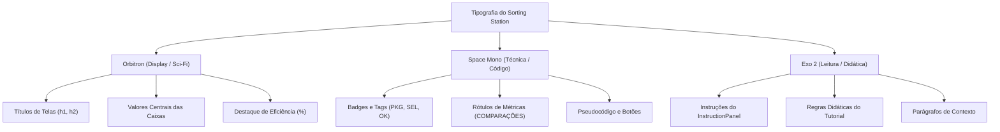

# 05 — Sistema de Design, UX e Identidade Visual

> **Documento canônico:** Especificação completa do Design System, identidade visual, linguagem de interação, catálogo de estilos e diretrizes de experiência do usuário (UX) do **Sorting Station**.  
> **Status:** Ativo / Base de Verdade da Wiki  
> **Data:** 08/09/2026  
> **Dependências:** [`AGENTS.md`](file:///C:/Users/marcos.mendes/Downloads/Sorting%20Station%20Interface%20Design/AGENTS.md), [`CLAUDE.md`](file:///C:/Users/marcos.mendes/Downloads/Sorting%20Station%20Interface%20Design/CLAUDE.md), [`docs/wiki/00-repository-inventory.md`](file:///C:/Users/marcos.mendes/Downloads/Sorting%20Station%20Interface%20Design/docs/wiki/00-repository-inventory.md), [`docs/wiki/01-product-vision.md`](file:///C:/Users/marcos.mendes/Downloads/Sorting%20Station%20Interface%20Design/docs/wiki/01-product-vision.md), [`docs/wiki/03-frontend.md`](file:///C:/Users/marcos.mendes/Downloads/Sorting%20Station%20Interface%20Design/docs/wiki/03-frontend.md).

---

## 1. O Universo Visual do Sorting Station

O **Sorting Station** adota a estética **retrô-futurista de ficção científica industrial**, inspirada em centrais espaciais de transporte e terminais automatizados de logística pesada. Essa escolha visa transformar o aprendizado de algoritmos em uma experiência imersiva e lúdica, afastando o usuário tanto da aridez de testes acadêmicos em papel quanto da frieza de painéis analíticos corporativos.

### 1.1. A Metáfora Diegética: A "Central Logística v2.0"
- **O Jogador como Operador Técnico:** O usuário assume o papel de operador de triagem em uma instalação de alta tecnologia responsável pelo roteamento de dados e pacotes energéticos ([`src/screens/HomeScreen.tsx:L70-L88`](file:///C:/Users/marcos.mendes/Downloads/Sorting%20Station%20Interface%20Design/src/screens/HomeScreen.tsx#L70-L88)).
- **Cargas e Pacotes:** Os elementos do vetor matemático são representados como **caixas tecnológicas de carga** (`NumberedBox`), cada qual com seu número identificador em destaque e chaves secundárias de rastreamento.
- **A Esteira Transportadora:** O meio físico por onde os dados trafegam é uma **esteira de roletes com trilhos energizados** (`.conveyor-track`), reforçando o senso cinético de movimento contínuo, proximidade física e ordem sequencial.
- **A Linguagem de Terminal:** A comunicação do jogo adota o jargão de centros de controle industrial:
  - `PROTOCOLO`: O algoritmo de ordenação em execução (ex.: `PROTOCOLO: BUBBLE` em [`src/components/PhaseHeader.tsx:L16`](file:///C:/Users/marcos.mendes/Downloads/Sorting%20Station%20Interface%20Design/src/components/PhaseHeader.tsx#L16));
  - `FASE`: O lote de cargas a ser organizado (Fase 1 de 3, Fase 2 de 3, etc.);
  - `SISTEMA ATIVO`: A confirmação de telemetria operacional com badge pulsante verde ([`src/components/PhaseHeader.tsx:L32`](file:///C:/Users/marcos.mendes/Downloads/Sorting%20Station%20Interface%20Design/src/components/PhaseHeader.tsx#L32));
  - `INICIAR TURNO`: O comando para dar início à jornada de trabalho de triagem ([`src/screens/HomeScreen.tsx:L97`](file:///C:/Users/marcos.mendes/Downloads/Sorting%20Station%20Interface%20Design/src/screens/HomeScreen.tsx#L97)).

---

## 2. Paleta Cromática e Tokens do Tema

O sistema visual é estruturado sobre uma base escura profunda enriquecida por focos de iluminação neon em ciano, roxo, âmbar e esmeralda.

### 2.1. Tokens `@theme inline` ([`src/index.css:L14-L25`](file:///C:/Users/marcos.mendes/Downloads/Sorting%20Station%20Interface%20Design/src/index.css#L14-L25))

```css
@theme inline {
  --color-cyan-glow: #00f5ff;
  --color-purple-glow: #8b5cf6;
  --color-amber-glow: #f59e0b;
  --color-bg-deep: #060b1a;
  --color-bg-card: #0d1635;
  --color-bg-panel: #111e47;
  --font-orbitron: 'Orbitron', sans-serif;
  --font-mono-sci: 'Space Mono', monospace;
  --font-exo: 'Exo 2', sans-serif;
}
```

### 2.2. Guia de Aplicação de Cores

| Cor / Token | Valor Hex | Significado Semântico | Onde é Utilizado |
| :--- | :--- | :--- | :--- |
| **Ciano Neon** | `#00f5ff` | Acento primário, eletricidade, foco ativo | Títulos principais, caixas sob foco padrão, botões primários, destaque de código |
| **Roxo Neon** | `#8b5cf6` | Acento secundário, métricas secundárias | Contador de trocas efetuadas, botões secundários, caixas decorativas de fundo |
| **Âmbar Industrial** | `#f59e0b` | Atenção, aviso, seleção manual em aberto | Borda de caixa selecionada (`selected`), avisos de regras e caixas apontadas por dicas |
| **Esmeralda Estável** | `#10b981` | Conclusão, sucesso, elemento ordenado | Caixa definitivamente ordenada (`sorted`), badge "OK", badge "SISTEMA ATIVO" |
| **Vermelho Alerta** | `#ef4444` | Falha operacional, erro, ação destrutiva | Botões de perigo, ícones de erro no painel de instruções, cancelamento |
| **Deep Space** | `#060b1a` | Fundo infinito da viewport | Plano de fundo de todas as telas |
| **Card Blue** | `#0d1635` | Superfície base para painéis e caixas | Corpo de `NumberedBox`, cartões de tutoriais e painéis de resultado |

---

## 3. Tipografia do Sistema

O projeto consome três famílias tipográficas importadas via Google Fonts ([`src/index.css:L1-L3`](file:///C:/Users/marcos.mendes/Downloads/Sorting%20Station%20Interface%20Design/src/index.css#L1-L3)), cada uma com função semântica rigorosa:



1. **`Orbitron` (Display & Grandezas Numéricas):**
   - Transmite a alta tecnologia e a presença de máquinas futuristas.
   - Usado nos títulos das telas (ex.: `text-3xl font-bold tracking-widest`), nos números internos de cada caixa e nas grandezas numéricas dos contadores.
2. **`Space Mono` (Dados Técnicos & Controles):**
   - Fonte monoespaçada que simula leitores de telemetria e terminais CRT.
   - Usada no texto de todos os botões (`GameButton`), nos badges `#1`, `#2` e no bloco de pseudocódigo em `ResultScreen.tsx`.
3. **`Exo 2` (Leitura Contínua & Compreensão Textual):**
   - Tipografia geométrica humanista com excelente legibilidade para blocos de texto.
   - Usada para explicar regras de algoritmos, mensagens informativas do jogo e parágrafos de ajuda.

---

## 4. Efeitos Atmosféricos, Texturas e Animações

O visual sci-fi repousa sobre uma camada de utilitários CSS implementados em [`src/index.css`](file:///C:/Users/marcos.mendes/Downloads/Sorting%20Station%20Interface%20Design/src/index.css):

### 4.1. `.scanlines` ([`src/index.css:L46-L56`](file:///C:/Users/marcos.mendes/Downloads/Sorting%20Station%20Interface%20Design/src/index.css#L46-L56))
Gera uma camada fixa semi-transparente que sobrepõe linhas horizontais alternadas de $2\text{px}$ sobre a tela (`linear-gradient(rgba(18,16,16,0) 50%, rgba(0,0,0,0.25) 50%)`), simulando monitores antigos de tubo de raios catódicos (CRT) de bases espaciais. Possui `pointer-events: none` para não bloquear cliques.

### 4.2. `.bg-grid` ([`src/index.css:L58-L69`](file:///C:/Users/marcos.mendes/Downloads/Sorting%20Station%20Interface%20Design/src/index.css#L58-L69))
Desenha uma malha sutil quadriculada de $40\times 40\text{px}$ com cor `rgba(0, 245, 255, 0.04)`, conferindo a sensação de piso técnico ou planta de engenharia.

### 4.3. `.panel-border` ([`src/index.css:L97-L104`](file:///C:/Users/marcos.mendes/Downloads/Sorting%20Station%20Interface%20Design/src/index.css#L97-L104))
Aplica borda translúcida ciano com cantos chanfrados e sombra difusa (`border border-cyan-500/20 shadow-[0_0_15px_rgba(0,245,255,0.05)]`), servindo de moldura para painéis de instrução e telemetria.

### 4.4. A Esteira Mecânica (`.conveyor-track`) ([`src/index.css:L114-L125`](file:///C:/Users/marcos.mendes/Downloads/Sorting%20Station%20Interface%20Design/src/index.css#L114-L125))
A esteira usa uma imagem SVG embutida em base64 (`repeating-linear-gradient` com chevrons de roletes mecânicos) que desliza em loop contínuo através da animação `@keyframes conveyor`:
```css
@keyframes conveyor {
  from { background-position-x: 0px; }
  to { background-position-x: -32px; }
}
```

### 4.5. Animações de Permuta (`animate-swap-left` e `animate-swap-right`) ([`src/index.css:L127-L145`](file:///C:/Users/marcos.mendes/Downloads/Sorting%20Station%20Interface%20Design/src/index.css#L127-L145))
Simulam o levantamento mecânico da caixa com translação horizontal e elevação vertical em arco:
- **`swap-left`:** Move a caixa para a esquerda ($-100\%$) com ápice de $-12\text{px}$ em $50\%$ do tempo;
- **`swap-right`:** Move a caixa para a direita ($+100\%$) com ápice de $-12\text{px}$ em $50\%$ do tempo.

### 4.6. Pulsação de Foco (`animate-pulse-border`) ([`src/index.css:L147-L157`](file:///C:/Users/marcos.mendes/Downloads/Sorting%20Station%20Interface%20Design/src/index.css#L147-L157))
Oscila suavemente a opacidade da borda entre $0.4$ e $1.0$ e expande o brilho difuso para guiar o olhar do jogador até a caixa sob foco.

---

## 5. Catálogo de Componentes e Estados Visuais

### 5.1. `NumberedBox` ([`src/components/NumberedBox.tsx`](file:///C:/Users/marcos.mendes/Downloads/Sorting%20Station%20Interface%20Design/src/components/NumberedBox.tsx))

A caixa possui cinco estados visuais claramente distintos:

```text
[ PADRÃO ]                [ SELECIONADA ]            [ DEFINITIVA (OK) ]
┌────────────────┐        ┌────────────────┐        ┌────────────────┐
│#1          PKG │        │#1          SEL │        │#1           OK │
│                │        │                │        │                │
│       5        │        │       5        │        │       1        │
│                │        │                │        │                │
└────────────────┘        └────────────────┘        └────────────────┘
Borda ciano/40            Borda âmbar pulsante      Borda esmeralda
Fundo card blue           Fundo âmbar translúcido   Fundo esmeralda translúcido
```

1. **Estado Padrão (Neutro na Esteira):** Borda ciano translúcida (`border-cyan-500/40`), fundo `#0d1635`, badge superior direito `PKG`.
2. **Estado Selecionado (`selected={true}`):** Borda âmbar brilhante (`border-amber-400`), fundo `bg-amber-950/40`, badge superior direito `SEL`, animação `animate-pulse-border`.
3. **Estado Ordenado/Definitivo (`sorted={true}`):** Borda esmeralda (`border-emerald-400`), fundo `bg-emerald-950/30`, badge superior direito `OK` com texto verde luminoso.
4. **Estado Desabilitado (`disabled={true}`):** Redução de opacidade (`opacity-40`) e cursor `not-allowed`.
5. **Estado em Animação (`animating="left" | "right"`):** Aplicação de `animate-swap-left` ou `animate-swap-right` com elevação na camada (`z-20`).

### 5.2. `GameButton` ([`src/components/GameButton.tsx`](file:///C:/Users/marcos.mendes/Downloads/Sorting%20Station%20Interface%20Design/src/components/GameButton.tsx))

| Variante | Aparência Normal | Efeito Hover / Foco | Uso Recomendado |
| :--- | :--- | :--- | :--- |
| **`primary`** | Fundo ciano `#00f5ff`, texto `#060b1a` escuro, peso bold | Sombra difusa ciano intensa (`shadow-[0_0_20px_#00f5ff]`), leve brilho | Avançar de tela, confirmar ação positiva principal |
| **`secondary`** | Borda roxa `#8b5cf6`, fundo roxo translúcido, texto `#c4b5fd` | Borda roxa iluminada, fundo roxo mais opaco | Ações secundárias, regras, dicas da esteira |
| **`danger`** | Borda vermelha `#ef4444`, fundo vermelho translúcido | Borda vermelha vibrante, sombra avermelhada | Reiniciar fase, abortar turno |
| **`ghost`** | Fundo transparente, borda translúcida sutil | Borda ciano/branca nítida, fundo ciano/10 | Navegação para trás ("← VOLTAR") |

### 5.3. `InstructionPanel` ([`src/components/InstructionPanel.tsx`](file:///C:/Users/marcos.mendes/Downloads/Sorting%20Station%20Interface%20Design/src/components/InstructionPanel.tsx))

| Tipo | Ícone | Esquema Cromático | Cenário de Uso |
| :--- | :--- | :--- | :--- |
| **`info`** | `◈` | Borda ciano/40, fundo ciano/10, texto `#a5f3fc` | Instruções padrão de seleção (ex.: *"Clique em uma caixa vizinha"*) |
| **`warning`** | `⚠` | Borda âmbar/40, fundo âmbar/10, texto `#fde68a` | Ação incorreta sem penalidade (ex.: *"As caixas precisam ser vizinhas"*) |
| **`success`** | `✓` | Borda esmeralda/40, fundo esmeralda/10, texto `#a7f3d0` | Troca realizada com sucesso ou ordenação concluída |
| **`error`** | `✕` | Borda vermelha/40, fundo vermelho/10, texto `#fecaca` | Violação de protocolo ou falha crítica |

---

## 6. Princípios Futuros de UX e Design de Interação

Para orientar a evolução das próximas telas e novos algoritmos, as decisões de design devem obrigatoriamente respeitar os seguintes princípios:

### 1. Jogo Deve Parecer Jogo, Não Dashboard Corporativo
A imersão estética e a identidade sci-fi (sonoridade visual, esteiras dinâmicas, luzes neon e linguagem de operadores espaciais) são fundamentais para manter a motivação intrínseca do estudante. O jogo não deve regredir para formulários cinzentos ou dashboards corporativos estéreis.

### 2. Interação Principal Sempre Compreensível por Clique (*Zero Sintaxe*)
A mecânica fundamental deve ser imediata e táctil. O aluno deve interagir clicando nos elementos físicos da tela, sem precisar memorizar atalhos de teclado ou comandos de terminal.

### 3. O Par sob Escrutínio Deve Ser Visualmente Evidente
Na futura máquina de estados pedagógica, a interface deve iluminar como um "holofote" (*spotlight*) o par exato de caixas que o algoritmo exige que sejam comparadas, deixando evidente a fronteira de varredura.

### 4. A Partição já Ordenada Deve Ter Codificação Consistente
Conforme elementos atingem suas posições finais (como os maiores elementos fixados no final da esteira no Bubble Sort), eles devem receber um tratamento visual consistente de travamento (`LOCKED`), indicando ao estudante que aquela sublista não sofrerá novas permutas.

### 5. Feedback Deve Explicar o Motivo da Operação
A interface não deve emitir validações secas ("Correto" ou "Errado"). Toda mensagem deve conter o fundamento lógico: *"Elemento 5 > 2: troca necessária porque o maior deve flutuar à direita"*.

### 6. Pseudocódigo Sincronizado Visualmente
O bloco de pseudocódigo não deve ser uma imagem estática na tela final; ele deve residir ao lado ou abaixo da esteira, iluminando a linha exata que está sendo executada pela ação do jogador.

### 7. Estratégia Responsiva para Vetores Maiores
Para suportar fases futuras com vetores de 8 a 10 caixas sem quebrar o layout, o contêiner da esteira deve adotar escalonamento automático de tamanho (`size="sm"` para vetores longos) ou permitir rolagem horizontal suave com trilho retrátil.

### 8. Respeito Obrigatório a `prefers-reduced-motion`
Usuários com sensibilidade vestibular devem ter animações de esteira e translações bruscas desativadas automaticamente através de regras CSS condicionadas por `@media (prefers-reduced-motion: reduce)`.

### 9. Acessibilidade Cromática e Redundância Sensorial
Nenhum estado crítico do sistema pode depender exclusivamente de variações de cor. Todo estado (selecionado, ordenado, erro) deve ser corroborado por um **ícone específico**, uma **etiqueta textual explícita** e uma **textura ou borda diferenciada**.

---

## 7. Vocabulário Padronizado da Interface

Para garantir uniformidade e consistência narrativa em todas as mensagens, botões e telas, os desenvolvedores devem utilizar a tabela canônica de redação UX abaixo:

| Conceito do Jogo | Termo Obrigatório Recomendado | Termos Proibidos / Evitar | Justificativa Pedagógica e Diegética |
| :--- | :--- | :--- | :--- |
| **O Algoritmo** | `Protocolo` (ex.: *Protocolo Bubble*) | Método, Rotina, Função | Reforça a narrativa de procedimento operacional homologado |
| **O Vetor / Dados** | `Cargas`, `Pacotes` ou `Caixas` | Array, Vetor, Itens | Conecta a abstração matemática a objetos físicos manipuláveis |
| **A Rodada de Jogo** | `Fase` ou `Turno` | Nível, Level, Missão | Mantém consistência com o vocabulário da estação |
| **A Ação de Início** | `Iniciar Turno` | Jogar, Play, Start | Linguagem imersiva da estação de triagem |
| **O Passo de Troca** | `Trocar` / `Permutar` | Inverter, Mover, Swapar | Termo em português vernáculo claro e preciso |
| **O Passo de Manter** | `Manter Ordem` | Ignorar, Pular, Passar | Enfatiza que não trocar é uma decisão deliberada do algoritmo |
| **O Elemento Fixado** | `Ordenado` ou `Fixado` | Bloqueado, Travado, Seguro | Indica matematicamente que a posição canônica foi atingida |
| **A Verificação Local** | `Comparar Vizinhos` | Testar, Checar, Olhar | Reforça a restrição da adjacência física do Bubble Sort |
| **As Métricas** | `Comparações` e `Trocas` | Clicks, Pontos, Movimentos | Alinha o vocabulário diretamente com a análise de complexidade |
