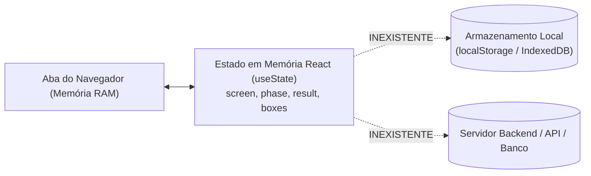
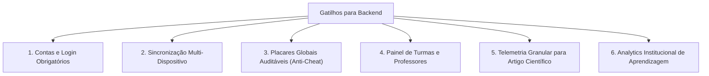
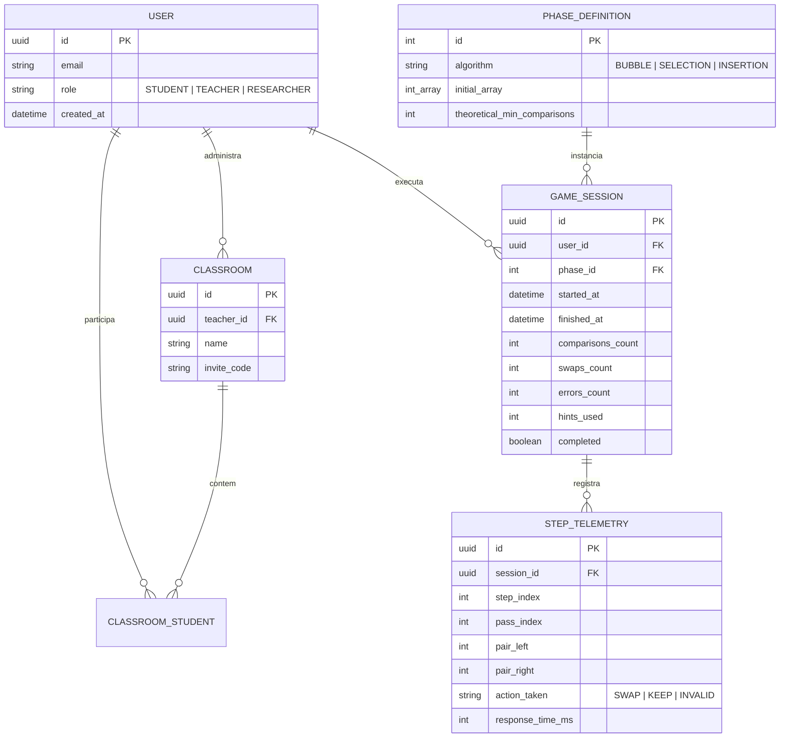

# 07 — Backend e Persistência: Realidade Atual, Armazenamento Local e Arquitetura Futura

> **Documento canônico:** Diagnóstico de persistência, modelo de armazenamento local planejado, matriz de gatilhos operacionais e diretrizes para arquitetura futura de backend do **Sorting Station**.  
> **Status:** Ativo / Base de Verdade da Wiki  
> **Data:** 08/09/2026  
> **Dependências:** [`AGENTS.md`](file:///C:/Users/marcos.mendes/Downloads/Sorting%20Station%20Interface%20Design/AGENTS.md), [`CLAUDE.md`](file:///C:/Users/marcos.mendes/Downloads/Sorting%20Station%20Interface%20Design/CLAUDE.md), [`docs/wiki/00-repository-inventory.md`](file:///C:/Users/marcos.mendes/Downloads/Sorting%20Station%20Interface%20Design/docs/wiki/00-repository-inventory.md), [`docs/wiki/01-product-vision.md`](file:///C:/Users/marcos.mendes/Downloads/Sorting%20Station%20Interface%20Design/docs/wiki/01-product-vision.md), [`docs/wiki/02-system-architecture.md`](file:///C:/Users/marcos.mendes/Downloads/Sorting%20Station%20Interface%20Design/docs/wiki/02-system-architecture.md).

---

Atualmente, o **Sorting Station é uma aplicação front-end estritamente client-side** (Single Page Application) e **não possui backend, servidor de aplicação, banco de dados, API remota ou qualquer mecanismo de persistência de dados em disco ou armazenamento local**.

---

# PARTE 1 — ESTADO ATUAL

Esta seção documenta a realidade técnica fática do repositório em relação a dados, rede e estado em tempo de execução.



### 1.1. Ausência de Backend e APIs
- **Zero Endpoints:** O repositório não contém nenhum arquivo de rota de API, função serverless ou servidor backend (`Express`, `Fastify`, `NestJS`, `Django`, `Go`, etc.).
- **Zero Chamadas de Rede:** Não há chamadas `fetch`, `axios` ou instâncias de `WebSocket` para comunicação com APIs externas. O único tráfego de rede existente ocorre no carregamento inicial dos arquivos estáticos (`HTML`, `JS`, `CSS`) e no download das webfonts do Google Fonts.

### 1.2. Ausência de Banco de Dados
- Não há banco de dados relacional (ex.: PostgreSQL, MySQL), não relacional (ex.: MongoDB, Redis) ou embutido no navegador (IndexedDB, WebSQL).

### 1.3. Ausência de Autenticação e Perfis
- O sistema não possui contas de usuário, tela de login, sessões ativas, cookies de rastreamento ou tokens de autorização (como JWT). Todos os usuários operam anonimamente com o mesmo conjunto padrão de fases.

### 1.4. Como o Estado é Mantido Hoje
- Todo o ciclo de dados vive **exclusivamente na memória volátil da aba do navegador** através de hooks `useState` do React:
  - Em [`src/App.tsx:L22-L24`](file:///C:/Users/marcos.mendes/Downloads/Sorting%20Station%20Interface%20Design/src/App.tsx#L22-L24): variáveis `screen`, `phase` e `result`;
  - Em [`src/screens/GameScreen.tsx:L21-L30`](file:///C:/Users/marcos.mendes/Downloads/Sorting%20Station%20Interface%20Design/src/screens/GameScreen.tsx#L21-L30): variáveis locais `boxes`, `selected`, `comparisons`, `swaps`, `instruction`, `animating` e `hintPair`.

### 1.5. O que se Perde ao Recarregar a Página
Caso o usuário atualize a página (F5 ou `Ctrl+R`), feche a aba ou reinicie o navegador:
1. O estado de `screen` é reinicializado para `"home"`;
2. A fase ativa é redefinida para `1`;
3. Todas as métricas de fases anteriores (`comparisons`, `swaps`, relatórios de eficiência) são imediatamente apagadas;
4. O progresso do tutorial é esquecido, obrigando o usuário a passar novamente pela tela de tutorial se clicar em "INICIAR TURNO".

---

# PARTE 2 — PERSISTÊNCIA LOCAL PLANEJADA (LOCALSTORAGE) `[PLANEJADO - P1]`

A evolução mais imediata, econômica e adequada para o formato do projeto é a introdução de uma camada de **persistência local desacoplada** via `localStorage` do navegador, eliminando a volatilidade sem incorrer em custos de servidor.

---

## 2.1. Escopo de Dados a Persistir Localmente

A camada de persistência local deve armazenar os seguintes blocos funcionais:

```typescript
// [PLANEJADO] Schema do armazenamento local do jogador
interface LocalStorageSaveSchema {
  readonly schemaVersion: number; // Controle de versão para migrações (ex.: 1)
  readonly lastUpdated: string;   // Timestamp ISO 8601
  
  readonly campaign: {
    readonly unlockedPhases: number; // Quantidade de fases desbloqueadas (1 a 3)
    readonly highestPhaseReached: number;
    readonly hasCompletedTutorial: boolean; // Permite pular tutorial diretamente
  };

  readonly records: Record<
    number, // Chave: número da fase (1, 2, 3...)
    {
      readonly bestComparisons: number; // Menor número de comparações já alcançado
      readonly bestSwaps: number;       // Menor número de trocas já alcançado
      readonly maxEfficiency: number;   // Maior eficiência percentual atingida
      readonly completedAt: string;     // Data da melhor pontuação
    }
  >;

  readonly preferences: {
    readonly soundEnabled: boolean;     // Futura preferência de efeitos sonoros
    readonly reducedMotion: boolean;    // Forçar desativação de animações cinéticas
    readonly highContrast: boolean;     // Modo de alto contraste para acessibilidade
  };
}
```

---

## 2.2. Avaliação de Prós e Contras do `localStorage`

| Dimensão | Vantagens (Prós) | Limitações e Riscos (Contras) |
| :--- | :--- | :--- |
| **Infraestrutura e Custo** | Zero servidor, zero hospedagem, zero latência de rede. Funciona 100% offline. | Nenhuma sincronização entre dispositivos (computador do laboratório vs. celular). |
| **Privacidade e LGPD** | 100% dos dados permanecem estritamente no dispositivo do estudante. Sem coleta remota. | Se o aluno limpar os dados de navegação ou usar aba anônima, os dados são perdidos. |
| **Desempenho** | Operações síncronas instantâneas para payloads pequenos de JSON (< 10 KB). | Bloqueia a thread principal se utilizada para grandes volumes de dados (não aplicável ao escopo). |
| **Compatibilidade** | Suporte universal em todos os navegadores modernos sem bibliotecas extras. | Limite de armazenamento de ~5MB por domínio (mais que suficiente para saves do jogo). |

---

## 2.3. Cuidados Obrigatórios e Versionamento do Schema Local

Ao implementar a persistência local, as seguintes diretrizes de segurança de software devem ser seguidas:

1. **Namespace e Prefixo Único:**  
   Utilizar uma chave com namespace e versão explícita (ex.: `sorting_station_v1_save`) para evitar colisões com outros aplicativos que possam rodar no mesmo host/porta do ambiente Figma Make.
2. **Defensividade contra Corrupção de Dados:**  
   Todo acesso a `localStorage.getItem` e `JSON.parse` deve ser encapsulado em blocos `try/catch`. Caso o JSON esteja corrompido ou o usuário tenha editado o storage manualmente, a aplicação deve descartar o dado inválido de forma transparente e inicializar o estado padrão sem quebrar a renderização:
   ```typescript
   // [PLANEJADO] Exemplo de carregamento resiliente
   export function loadLocalSave(): LocalStorageSaveSchema {
     try {
       const raw = localStorage.getItem("sorting_station_v1_save");
       if (!raw) return DEFAULT_SAVE_STATE;
       const parsed = JSON.parse(raw);
       return migrateSaveData(parsed);
     } catch (err) {
       console.warn("Falha ao ler save local; restaurando padrões:", err);
       return DEFAULT_SAVE_STATE;
     }
   }
   ```
3. **Mecanismo de Migração de Versão (`migrateSaveData`):**  
   O campo `schemaVersion` permite atualizar o formato dos dados em versões futuras (adicionando novas chaves ou fases) sem apagar o progresso anterior do estudante.

---

# PARTE 3 — GATILHOS PARA CRIAÇÃO DE BACKEND

> [!IMPORTANT]
> **Diretriz de Engenharia:**  
> **Um backend NÃO deve ser desenvolvido por inércia ou presunção arquitetural.**  
> O modelo client-side estático atual atende plenamente aos objetivos do MVP pedagógico. A complexidade operacional e o custo de manutenção de um servidor só são justificados quando houver **requisitos formais que tornem o servidor estritamente indispensável**.

A introdução de uma API e banco de dados centralizado só será autorizada mediante a ocorrência de um ou mais dos seguintes **gatilhos mandatórios**:



1. **Contas de Usuário e Autenticação:** Necessidade de identificar formalmente estudantes por e-mail institucional ou Single Sign-On (Google/GitHub/SAML escolar).
2. **Sincronização Multi-Dispositivo:** Exigência de que o aluno inicie uma fase no laboratório da universidade e conclua a mesma campanha em seu computador pessoal ou tablet.
3. **Placares e Rankings Globais Auditáveis:** Criação de tabelas de liderança competitivas onde a integridade das pontuações precise ser validada pelo servidor para evitar adulterações via console do navegador (*anti-cheat*).
4. **Painel de Turmas e Professores (*Classroom Management*):** Funcionalidade onde docentes possam cadastrar turmas, atribuir listas de fases customizadas e acompanhar relatórios consolidados de rendimento dos alunos.
5. **Telemetria de Baixo Nível para Pesquisa Acadêmica:** Coleta massiva e padronizada de eventos temporais (ex.: milissegundos transcorridos entre cada clique, quantidade exata de erros por passada) para fundamentar a avaliação estatística do artigo científico.
6. **Analytics de Aprendizagem (*Learning Analytics*):** Processamento centralizado para identificar conceitos onde os estudantes mais travam (ex.: detecção estatística de dificuldade na compreensão do caso médio do Bubble Sort).

---

# PARTE 4 — ARQUITETURA FUTURA POSSÍVEL (AGNOSTA DE TECNOLOGIA)

Esta seção traça o modelo conceitual de uma futura API, **sem escolher tecnologias ou frameworks de forma arbitrária e sem inventar endpoints ou bancos inexistentes**.

---

## 4.1. Domínios Conceituais da API Futura

Caso um dos gatilhos da Parte 3 seja disparado, a API deverá ser estruturada em torno dos seguintes subdomínios de negócio:

1. **Domínio de Identidade e Acesso (Identity & Access):**
   - Gerenciamento de credenciais, sessões seguras e perfis de usuário (`ESTUDANTE`, `PROFESSOR`, `PESQUISADOR`).
2. **Domínio de Turmas e Currículo (Academic Management):**
   - Agrupamento de alunos em turmas, vinculação a professores e definição de trilhas de fases personalizadas.
3. **Domínio de Sessões de Jogo e Telemetria (Game Tracking):**
   - Registro de execuções de fase (*runs*), registro de ações atômicas (comparações, trocas, erros) e cálculo auditado de eficiência.
4. **Domínio de Pesquisa e Analytics (Research Analytics):**
   - Extração de datasets anonimizados para ferramentas de análise estatística (R, Python, SPSS).

---

## 4.2. Entidades Conceituais de Dados



---

## 4.3. Requisitos Mandatórios de Privacidade e Conformidade (LGPD / GDPR)

A introdução de qualquer mecanismo remoto de armazenamento deve cumprir integralmente a legislação de proteção de dados:

- **Minimização de Dados:** Coletar apenas as informações estritamente necessárias para o funcionamento pedagógico e acadêmico.
- **Anonimização em Pesquisa Acadêmica:** Todos os dados de telemetria utilizados para a confecção de artigos científicos devem ser anonimizados ou pseudonimizados, desvinculando identificadores pessoais (nomes, e-mails) de métricas de desempenho.
- **Consentimento Informado:** Termo de Consentimento Livre e Esclarecido (TCLE) digital integrado para estudantes que participarem de coletas de dados empíricas.
- **Direito ao Esquecimento:** Mecanismo acessível para que o usuário solicite a exclusão definitiva de sua conta e de seu histórico de sessões.

---

## 4.4. Obrigatoriedade de um Registro de Decisão Arquitetural (ADR)

> [!CAUTION]
> **Proibição de Escolha Arbitrária de Frameworks:**  
> A escolha da linguagem de backend (ex.: TypeScript/Node vs. Python vs. Go), do framework (ex.: Fastify vs. NestJS vs. FastAPI), do banco de dados (ex.: PostgreSQL relacional vs. MongoDB) e do provedor de nuvem (ex.: AWS, GCP, Fly.io) **não deve ser decidida precipitadamente**.  
> Antes de qualquer linha de código de backend ser escrita, a equipe deverá obrigatoriamente formalizar um **ADR (Architecture Decision Record)** documentando o contexto, requisitos de latência, custos estimados de operação, conformidade e alternativas avaliadas.
