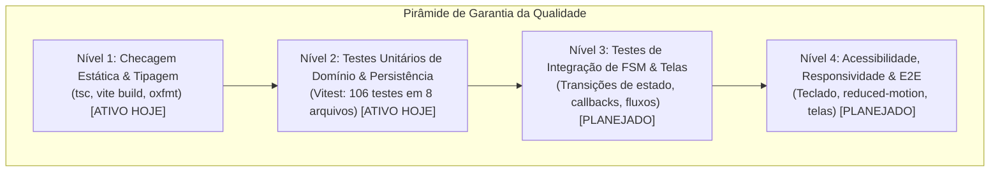

# 08 — Testes, Qualidade de Software e Definition of Done

> **Documento canônico:** Diagnóstico da cobertura atual, estratégia de garantia da qualidade (QA), matriz de casos de teste pedagógicos e critérios de Definition of Done do **Sorting Station**.  
> **Status:** Ativo / Base de Verdade da Wiki  
> **Data:** 08/09/2026  
> **Dependências:** [`AGENTS.md`](../../AGENTS.md), [`CLAUDE.md`](../../CLAUDE.md), [`package.json`](../../package.json), [`00-repository-inventory.md`](./00-repository-inventory.md), [`02-system-architecture.md`](./02-system-architecture.md), [`04-sorting-engine.md`](./04-sorting-engine.md).

---

## 1. Estado Real dos Testes Automatizados Atuais

Com as conclusões dos marcos **P0.2**, **P0.8**, **P1.1**, **P1.2**, **P1.3**, **P1.4** e **P1.6**, a infraestrutura de testes automatizados do projeto cobre 100% da lógica pura de domínio, tutorial, agregação de campanha, telemetria de sessão, replay da execução, pseudocódigo sincronizado e persistência local desacoplada:

- **Framework de Testes Implementado:** **Vitest** (`vitest ^5.0.0`) instalado como dependência de desenvolvimento canônica via `pnpm add -D vitest`.
- **Arquivos de Teste Ativos (7 arquivos, 86 testes automatizados aprovados 100% verde):**
  1. [`src/game/sorting/bubbleSortEngine.test.ts`](../../src/game/sorting/bubbleSortEngine.test.ts) (**31 testes unitários**): Cobre inicialização, invariantes algorítmicas, validação estrita de passos do usuário (`SWAP`/`KEEP`), estabilidade com duplicatas, histórico e cálculo de progresso real;
  2. [`src/game/campaign/campaignSummary.test.ts`](../../src/game/campaign/campaignSummary.test.ts) (**4 testes unitários**): Cobre agregação pura em memória das métricas factuais da campanha (fases concluídas, comparações totais, trocas totais, erros totais e dicas totais);
  3. [`src/game/tutorial/tutorialGuide.test.ts`](../../src/game/tutorial/tutorialGuide.test.ts) (**5 testes unitários**): Cobre a máquina de estados pedagógica do tutorial interativo `[3, 1, 2]` e mensagens formativas;
  4. [`src/game/session/sessionMetrics.test.ts`](../../src/game/session/sessionMetrics.test.ts) (**5 testes unitários**): Cobre o registro imutável de dicas (`hintsUsed`), inicialização e reinício de sessão desacoplados da engine (ADR 0003);
  5. [`src/game/replay/replayModel.test.ts`](../../src/game/replay/replayModel.test.ts) (**9 testes unitários**): Cobre a derivação pura de quadros de replay, quadro inicial (Quadro 0), último quadro ordenado, identificação de SWAP e KEEP, ordenação sequencial estrita, imutabilidade em runtime e recuperação segura via clamping (ADR 0004);
  6. [`src/game/replay/replayPseudocode.test.ts`](../../src/game/replay/replayPseudocode.test.ts) (**9 testes unitários**): Cobre o modelo canônico de 9 instruções, mapeamentos `INITIAL`, `KEEP` e `SWAP`, formatação de comparações concretas, identificação estrita da linha de troca, determinismo e imutabilidade (ADR 0005);
  7. [`src/game/persistence/persistence.test.ts`](../../src/game/persistence/persistence.test.ts) (**23 testes unitários**): Cobre estado padrão sem save, save/load idempotente, progressão até o teto `PHASES.length`, não-regressão ao rejogar fases anteriores, conclusão de tutorial, resiliência contra JSON corrompido, schemas com versões inválidas ou futuras, clamping numérico de fases, tolerância a exceções de storage (`SecurityError` e `QuotaExceededError`), imutabilidade profunda com `Object.freeze` e isolamento entre variáveis voláteis de sessão e progresso persistido (ADR 0006).
- **Scripts de Teste Canônicos em [`package.json`](../../package.json):**
  - `pnpm run test:run` (ou `npm run test:run`): Execução única headless da suíte completa;
  - `pnpm test` (ou `npm test`): Modo watch interativo de desenvolvimento.
- **O que ainda NÃO possui testes automatizados:**
  - Testes de renderização de componentes React e testes de ponta a ponta (E2E) em navegador real.

---

## 2. Estratégia de Qualidade Proposta

A Pirâmide de Qualidade do Sorting Station agora possui seus dois primeiros níveis operacionais:

> [!NOTE]
> **Tooling de Teste Ativo:**  
> O **Vitest** é o executor oficial de testes do projeto, com **106 testes automatizados 100% verdes** distribuídos em:
> - `bubbleSortEngine.test.ts` (28 testes)
> - `bubbleSortFsm.test.ts` (3 testes)
> - `campaignSummary.test.ts` (3 testes)
> - `sessionMetrics.test.ts` (11 testes)
> - `replayModel.test.ts` (9 testes)
> - `replayPseudocode.test.ts` (9 testes)
> - `protocolScore.test.ts` (11 testes — P1.7)
> - `persistence.test.ts` (32 testes — P1.6 e P1.7)

---

## 3. Matriz de Casos de Teste Essenciais da Engine de Ordenação `[PLANEJADO]`

Quando a engine de ordenação for desacoplada em TypeScript puro ([`04-sorting-engine.md`](./04-sorting-engine.md)), os seguintes cenários de teste unitário devem ser implementados obrigatoriamente:

### 3.1. Casos Limítrofes e Configurações de Vetor
1. **Vetor Inversamente Ordenado (Pior Caso):**  
   - Vetor: `[5, 4, 3, 2, 1]`.  
   - Critério: Deve exigir o número máximo teórico de comparações $\frac{n(n-1)}{2} = 10$ e exatamente $10$ trocas.
2. **Vetor Já Ordenado (Melhor Caso):**  
   - Vetor: `[1, 2, 3, 4, 5]`.  
   - Critério: Todas as comparações da primeira passada devem resultar em `KEEP` ($A[j] \le A[j+1]$); na variante com *early exit*, a fase deve se encerrar após $n-1 = 4$ comparações e 0 trocas.
3. **Vetor com Elementos Duplicados:**  
   - Vetor: `[4, 2, 4, 1]`.  
   - Critério: Ao comparar $4$ com $4$, a decisão correta mandatória é **MANTER (`KEEP`)**, garantindo a estabilidade matemática do algoritmo ($A[j] \le A[j+1]$).
4. **Tamanhos Mínimos:**  
   - Vetor com 2 elementos: `[2, 1]` (exige 1 comparação e 1 troca) e `[1, 2]` (exige 1 comparação e 0 trocas).
   - Vetor com 1 elemento: `[7]` (detectado como trivialmente ordenado sem comparações).

### 3.2. Testes da Máquina de Estados Finita (FSM)
1. **Seleção de Par Esperado:**  
   - Tentar selecionar o par $[j, j+1]$ no estado `AWAITING_PAIR_SELECTION` transita para `AWAITING_DECISION`.
   - Tentar selecionar um par arbitrário fora da sequência incrementa o contador `errors`, preserva o estado e emite aviso explicativo.
2. **Decisão de Troca (*Swap Decision*):**  
   - Submeter ação de troca quando $A[j] > A[j+1]$ é validado com sucesso, permuta os valores no array de trabalho e incrementa `swaps`.
   - Submeter ação de troca quando $A[j] \le A[j+1]$ é rejeitado como erro pedagógico, incrementa `errors` e não altera o vetor.
3. **Decisão de Manutenção (*Keep Decision*):**  
   - Submeter ação de manter quando $A[j] \le A[j+1]$ é validado com sucesso e não altera o vetor.
   - Submeter ação de manter quando $A[j] > A[j+1]$ é rejeitado como erro pedagógico, explicando a violação da passada.
4. **Avanço de Ponteiros e Fim de Passada:**  
   - Quando $j < n - 2 - i$, o ponteiro $j$ avança para $j + 1$.
   - Quando $j = n - 2 - i$, a passada é finalizada, $i$ incrementa para $i + 1$, $j$ é resetado para $0$ e o elemento na posição $n - 1 - i$ é marcado como `LOCKED` no `sortedBoundary`.
5. **Comportamento de Dica e Reset:**  
   - Disparar `requestHint()` incrementa `hintsUsed` e retorna o par exato da vez com a ação esperada.
   - Disparar `resetPhase()` restaura o vetor para `initialArray` e reinicia todos os ponteiros e contadores.

---

## 4. Testes de Integração e Fluxo do Front-End `[PLANEJADO]`

### 4.1. Fluxo de Transição entre Telas
Verificar se o chaveamento de `screen` em [`src/App.tsx`](../../src/App.tsx) mantém a integridade do ciclo:
- `HomeScreen` $\xrightarrow{\text{onStart}}$ `TutorialScreen` $\xrightarrow{\text{onUnderstood}}$ `GameScreen` $\xrightarrow{\text{onComplete}}$ `ResultScreen`.
- `ResultScreen` $\xrightarrow{\text{onRepeat}}$ recarrega a mesma fase com resultado limpo.
- `ResultScreen` $\xrightarrow{\text{onNext}}$ incrementa a fase de 1 para 2, e de 2 para 3, com instâncias limpas via `key={'game-phase-${phase}'}`.

### 4.2. Responsividade e Quebra de Layout
- Validar se a esteira transportadora em `GameScreen.tsx` não transborda lateralmente em viewports móveis ($375\text{px}$, $768\text{px}$) ou se ativa barra de rolagem horizontal segura (`overflow-x-auto`).
- Validar se o layout permanece estável em resoluções de desktop ($1024\text{px}$, $1440\text{px}$, $1920\text{px}$).

### 4.3. Sensibilidade a Movimento (`prefers-reduced-motion`)
- Testar se ao emular `@media (prefers-reduced-motion: reduce)`, as animações `@keyframes conveyor` (esteira) e `@keyframes swap-*` (deslocamento vertical/horizontal) são desativadas ou simplificadas para transições instantâneas de opacidade.

### 4.4. Acessibilidade de Teclado e Foco (a11y)
- Testar se todas as ações operacionais da esteira podem ser completadas utilizando **exclusivamente o teclado** (`Tab`, `Shift+Tab`, `Enter` e `Space`), sem dependência de cliques com ponteiro do mouse.
- Garantir que o indicador de foco nativo (`focus-visible`) seja perfeitamente distinguível contra o fundo escuro `#060b1a`.

### 4.5. Prevenção de Regressões Visuais Críticas
- Prevenir a recorrência do defeito visual onde `setSelected(null)` executava antes do `setTimeout`, aplicando `"left"` a ambas as caixas na troca.
- Verificar a renderização correta de todas as webfonts (`Orbitron`, `Space Mono`, `Exo 2`) sem transições bruscas de texto não estilizado (FOUT).

---

## 5. Checklists de Definition of Done (DoD)

Para assegurar que qualquer nova contribuição mantenha a estabilidade técnica e pedagógica do repositório, os seguintes checklists devem ser rigorosamente atendidos antes da conclusão de qualquer tarefa:

---

### DoD 1 — Mudança de UI (Componentes, CSS, Estilos)
- [ ] O componente segue o padrão obrigatório de **`export default`** ([`AGENTS.md`](../../AGENTS.md)).
- [ ] Todas as tags JSX estão explicitamente fechadas e chaves balanceadas ([`AGENTS.md`](../../AGENTS.md)).
- [ ] Strings literais contendo apóstrofos utilizam aspas duplas (ex.: `"Don't"`) ([`AGENTS.md`](../../AGENTS.md)).
- [ ] O componente não introduziu arquivos `tailwind.config.*` ou `postcss.config.*`.
- [ ] A estilização respeita os tokens `@theme inline` e a tipografia estabelecida em [`05-ux-design-system.md`](./05-ux-design-system.md).
- [ ] Elementos clicáveis possuem suporte a teclado (`tabIndex={0}`, `role="button"` ou tag `<button>`).
- [ ] Não há quebra de layout em resoluções de desktop ($\ge 1024\text{px}$) e visualização de iframe no Figma Make.
- [ ] `npm run build` compila sem erros (código de saída 0).
- [ ] `npx tsc --noEmit` passa com 0 erros de tipagem.

---

### DoD 2 — Mudança de Engine (Lógica de Ordenação, FSM, Regras)
- [ ] A lógica de ordenação está desacoplada de efeitos visuais imperativos do React.
- [ ] A máquina de estados impede a seleção de pares arbitrários fora da sequência determinística do algoritmo.
- [ ] Ações incorretas geram feedback explicativo em vez de apenas validação binária.
- [ ] A fixação de elementos definitivamente ordenados (`sortedBoundary`) é computada formalmente a partir das passadas concluídas, e não por heurísticas superficiais.
- [ ] O cálculo de métricas (`comparisons`, `swaps`, `errors`, `hintsUsed`) é determinístico e auditável.
- [ ] A invariante de laço do algoritmo é estritamente preservada em todos os passos.
- [ ] `npm run build` compila sem erros.
- [ ] `npx tsc --noEmit` passa com 0 erros de tipagem.

---

### DoD 3 — Nova Fase
- [ ] O vetor da nova fase foi testado matematicamente quanto ao número mínimo e máximo de comparações e trocas.
- [ ] A quantidade de elementos não provoca estouro lateral (*horizontal overflow*) no contêiner da esteira (usar `size="sm"` se $n \ge 8$).
- [ ] O vetor possui valor didático claro (demonstra uma propriedade relevante: reversão, quase ordenado ou duplicatas).
- [ ] A matriz `PHASES` em `src/App.tsx` e as constantes de total de fases foram sincronizadas.
- [ ] A tela de resultado calcula corretamente a barra de eficiência para as grandezas da nova fase.
- [ ] `npm run build` e `npx tsc --noEmit` validados com sucesso.

---

### DoD 4 — Novo Algoritmo (Selection Sort, Insertion Sort, etc.)
- [ ] O algoritmo possui **mecânica interativa dedicada**, sem copiar a esteira de permutas locais do Bubble Sort ([`04-sorting-engine.md`](./04-sorting-engine.md)).
- [ ] Foi implementada uma estratégia desacoplada compatível com a interface `SortingStrategy`.
- [ ] O bloco de pseudocódigo correspondente foi redigido e sincronizado com os passos do novo protocolo.
- [ ] Foram definidos os estados visuais específicos (ex.: scanner de mínimo no Selection Sort; pacote elevado no Insertion Sort).
- [ ] O tutorial explicativo correspondente foi elaborado antes da liberação do gameplay.
- [ ] Foi criado ou atualizado um ADR formal documentando a integração do novo algoritmo.
- [ ] `npm run build` e `npx tsc --noEmit` validados com sucesso.
