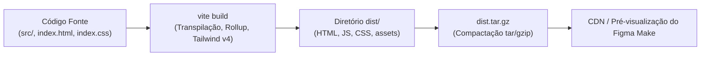

# 09 — Processo de Compilação, Build e Deploy

> **Documento canônico:** Especificação técnica dos pipelines de compilação, empacotamento, distribuição e checklist pré-deploy do **Sorting Station**.  
> **Status:** Ativo / Base de Verdade da Wiki  
> **Data:** 08/09/2026  
> **Dependências:** [`AGENTS.md`](../../AGENTS.md), [`CLAUDE.md`](../../CLAUDE.md), [`package.json`](../../package.json), [`vite.config.ts`](../../vite.config.ts), [`.figma/make/deploy`](../../.figma/make/deploy), [`.figma/make/deploy-preview`](../../.figma/make/deploy-preview), [`.figma/make/site.json`](../../.figma/make/site.json).

---

## 1. Visão Geral da Arquitetura de Distribuição

O **Sorting Station** é compilado como um conjunto de artefatos estáticos client-side distribuídos pela plataforma **Figma Make**. O ciclo de vida de empacotamento não depende de servidores de aplicação ou contêineres Docker complexos em tempo de execução: o produto final consiste estritamente em arquivos `HTML`, `JavaScript` e `CSS` otimizados para entrega via rede de distribuição de conteúdo (CDN).



---

## 2. Mecanismos de Compilação e Empacotamento

### 2.1. O Processo de Build do Vite (`vite build`)
- **Comando do `package.json`:** `"build": "vite build"` ([`package.json`](../../package.json)).
- **Pipeline de Transformação:**
  1. O Vite invoca o compilador esbuild para transpilar TypeScript e JSX em milissegundos;
  2. O plugin `@tailwindcss/vite` processa a folha de estilos [`src/index.css`](../../src/index.css), resolvendo tokens `@theme inline` e gerando as classes utilitárias utilizadas;
  3. O plugin `figmaSiteConfiguration` lê [`.figma/make/site.json`](../../.figma/make/site.json) e injeta metadados e diretivas no HTML;
  4. O Rollup agrupa e minifica os scripts em blocos (*chunks*) com hash de conteúdo no nome para invalidação de cache do navegador.

### 2.2. A Estrutura do Diretório de Saída (`dist/`)
Após a execução do build, a raiz `dist/` contém:
```text
dist/
├── index.html                  # Shell HTML com scripts e estilos injetados
├── robots.txt                  # Instruções para rastreadores (quando gerado)
└── assets/
    ├── index-[hash].css        # Folha de estilos combinada e minificada (~42 KB)
    └── index-[hash].js         # Bundle JavaScript do React e aplicação (~219 KB)
```

### 2.3. Pré-visualização Local dos Artefatos Compilados (`vite preview`)
- **Comando do `package.json`:** `"preview": "vite preview"` ([`package.json`](../../package.json)).
- Permite que o desenvolvedor execute um servidor HTTP leve apontando diretamente para a pasta `dist/`, reproduzindo exatamente o comportamento que a aplicação terá após ser empacotada.

---

## 3. Automação de Deploy no Figma Make

A integração de publicação no Figma Make é controlada por dois scripts shell dedicados localizados em [`.figma/make/`](../../.figma/make):

### 3.1. Script de Deploy de Produção (`.figma/make/deploy`)
```sh
#!/bin/sh
pnpm run build
tar -czf dist.tar.gz -C dist .
```
- Disparado pelo painel do Figma Make ao publicar a versão final da interface.
- Executa a compilação do Vite e compacta todo o conteúdo do diretório `dist/` diretamente em um arquivo `dist.tar.gz`, preservando a estrutura de arquivos para o servidor de arquivos estáticos.

### 3.2. Script de Pré-visualização (`.figma/make/deploy-preview`)
```sh
#!/bin/sh
pnpm run build
tar -czf dist.tar.gz -C dist .
```
- Disparado sempre que o usuário solicita o compartilhamento de um link de teste (*preview*) com outros colaboradores antes da publicação formal.
- Possui comportamento idêntico ao script de produção, gerando o pacote `dist.tar.gz`.

---

## 4. Configurações de Rede, Ambiente e SEO

As diretrizes de rede e hospedagem são parametrizadas no [`vite.config.ts`](../../vite.config.ts) e em [`.figma/make/site.json`](../../.figma/make/site.json):

### 4.1. Resolução Dinâmica da Base (`base`)
Em [`vite.config.ts`](../../vite.config.ts):
```typescript
base: process.env.FIGMA_PUBLIC_URL
  ? new URL(process.env.FIGMA_PUBLIC_URL).pathname
  : '/',
```
Caso a aplicação seja servida sob um sub-caminho ou proxy reverso configurado pela plataforma (ex.: `/preview/abc123/`), o Vite ajusta automaticamente todos os caminhos relativos de tags `<script>` e `<link>` para apontar para esse pathname, impedindo falhas de carregamento 404 de assets.

### 4.2. Host e Porta de Execução
Em [`vite.config.ts`](../../vite.config.ts):
- **Port:** `process.env.PORT || 8443` com `strictPort: true`. A porta fixa é mandatória para o roteamento do contêiner Figma Make.
- **Host:** `process.env.FIGMA_DEV_SERVER_HOST || '0.0.0.0'`. Permite que o servidor de desenvolvimento aceite requisições vindas do host da máquina virtual.

### 4.3. Política de Sourcemaps por Ambiente
Em [`vite.config.ts`](../../vite.config.ts):
```typescript
sourcemap: process.env.NODE_ENV === 'development' ? 'inline' : false,
```
- Em **desenvolvimento**, o mapa de código é embutido diretamente como `inline`, facilitando a depuração exata no console do navegador;
- Em **build de produção**, os sourcemaps são desativados (`false`), reduzindo o tamanho final dos arquivos e protegendo os detalhes de implementação do código-fonte.

### 4.4. Diretiva de Indexação e Privacidade (`noindex`)
No arquivo [`.figma/make/site.json`](../../.figma/make/site.json):
```json
"robots": {
  "index": false
}
```
O plugin customizado `figmaSiteConfiguration` lê essa propriedade e injeta no cabeçalho do `index.html` ([`vite.config.ts`](../../vite.config.ts)):
```html
<meta name="robots" content="noindex, nofollow" />
```
Isso impede que versões preliminares ou instâncias de teste da aplicação sejam indexadas acidentalmente por mecanismos de busca públicos.

---

## 5. Checklist Pré-Deploy Mandatório

Antes de disparar qualquer deploy de produção ou deploy-preview, o desenvolvedor deve realizar a verificação do checklist abaixo:

```markdown
### 📋 Checklist Pré-Deploy — Sorting Station

- [ ] 1. FORMATAÇÃO: Executar `npm run format` (oxfmt) garantindo que nenhum arquivo viole os padrões de estilo.
- [ ] 2. BUILD LIMPO: Executar `npm run build` e confirmar que a compilação gerou os arquivos em `dist/` com código de retorno 0.
- [ ] 3. TIPAGEM ESTRITA: Executar `npx tsc --noEmit` confirmando 0 erros de tipagem TypeScript.
- [ ] 4. NAVEGAÇÃO ENTRE TELAS: Testar no navegador o fluxo completo:
      HomeScreen ➔ TutorialScreen ➔ GameScreen ➔ ResultScreen.
- [ ] 5. EXECUÇÃO DAS FASES: Jogar e completar com sucesso as Fases 1 ([5,2,4,1]), 2 ([6,3,8,2,5]) e 3 ([9,1,7,4,3,6]).
- [ ] 6. RESPONSIVIDADE E LARGURA: Testar a renderização em largura de desktop (≥ 1024px) e em largura reduzida (768px), certificando que não há sobreposição de caixas na esteira.
- [ ] 7. CONSOLE LIMPO: Abrir as Ferramentas de Desenvolvedor (F12) e confirmar a ausência total de erros em vermelho no Console durante todo o gameplay.
- [ ] 8. TEXTOS E ASSETS: Conferir se as fontes Orbitron, Space Mono e Exo 2 foram carregadas sem substituição padrão e se não há caracteres corrompidos ou apóstrofos mal formatados.
- [ ] 9. COMPORTAMENTO DA ÚLTIMA FASE: Verificar se ao clicar em "PRÓXIMA FASE" na Fase 3 a aplicação lida com o limite de forma estável (sem crash).
- [ ] 10. ACESSIBILIDADE E MOVIMENTO: Verificar se o contraste de texto permanece legível e se o foco de seleção não apresenta cintilação nociva.
```

---

## 6. Melhorias Futuras (Planejado) `[PLANEJADO]`

> [!NOTE]
> **Ausência Atual de CI/CD:**  
> O repositório **não possui pipelines automatizados de CI/CD** (como GitHub Actions, GitLab CI ou CircleCI). Todos os deploys são acionados pelos comandos internos do Figma Make.

Caso o projeto seja exportado para um repositório git externo (GitHub/GitLab) no futuro, as seguintes melhorias devem ser estruturadas:

1. **Pipeline de Integração Contínua (CI):**  
   Automação via GitHub Actions acionada em cada *Pull Request* para executar:
   - `pnpm run format` (checagem de estilo);
   - `npx tsc --noEmit` (verificação de tipos);
   - `pnpm run build` (garantia de compilação sem falhas);
   - Execução da futura suíte de testes com Vitest ([`08-testing-and-quality.md`](./08-testing-and-quality.md)).
2. **Ambientes de Staging / Preview por PR:**  
   Geração automática de URLs temporárias de pré-visualização (ex.: via Cloudflare Pages, Vercel ou Netlify) para cada funcionalidade em revisão por professores ou pesquisadores.
3. **Monitoramento de Tamanho de Bundle (*Bundle Size Limit*):**  
   Alerta automatizado caso o bundle JavaScript compilado ultrapasse $300\text{KB}$ compactado, mantendo a aplicação leve para redes de baixa velocidade em escolas.
