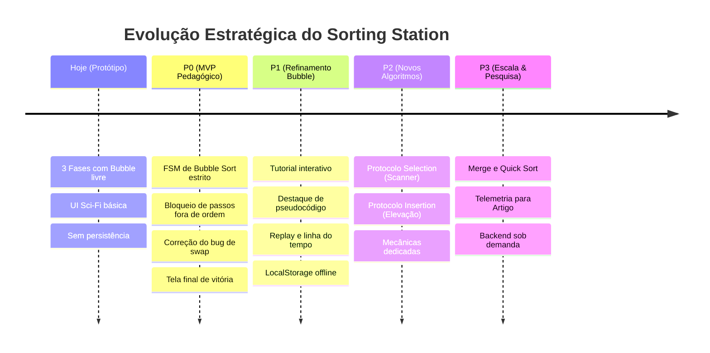

# 10 — Roadmap de Evolução Técnica e Pedagógica

> **Documento canônico:** Planejamento estratégico, priorização em níveis (P0 a P3), matriz de riscos e cronograma de implementação do **Sorting Station**.  
> **Status:** Ativo / Base de Verdade da Wiki  
> **Data:** 08/09/2026  
> **Dependências:** [`AGENTS.md`](../../AGENTS.md), [`CLAUDE.md`](../../CLAUDE.md), [`00-repository-inventory.md`](./00-repository-inventory.md) a [`09-build-deploy.md`](./09-build-deploy.md).

---

## 1. Visão Geral da Matriz de Prioridades

O roadmap do **Sorting Station** é estruturado em quatro horizontes claros de entrega. Para manter a fidelidade técnica do repositório, cada funcionalidade é categorizada rigorosamente por seu status real:
- **`IMPLEMENTADO`:** Presente no código-fonte atual e funcional no protótipo.
- **`EM PLANEJAMENTO`:** Formalmente especificado nos documentos da Wiki, com desenho arquitetural concluído e pronto para implementação de código.
- **`FUTURO`:** Visão estratégica de médio e longo prazo, dependente da maturidade do MVP e de validações empíricas.

---

## 2. Nível P0 — Bubble Sort Pedagógico Real (Fundação do MVP)

O objetivo central do nível P0 é converter o atual "puzzle de trocas livres" em uma **simulação algorítmica determinística**, na qual o jogador executa e assimila a invariante de laço real do Bubble Sort.

---

### P0.1. Máquina de Estados Finita (FSM) da Engine de Bubble Sort
- **Objetivo:** Implementar o modelo de domínio puro e a máquina de estados especificada em [`04-sorting-engine.md`](./04-sorting-engine.md), isolando a lógica matemática do ciclo de renderização do React.
- **Valor para o Aluno:** Permite que cada ação do jogo reflita a lógica estrita da computação passo a passo.
- **Dependências:** [`src/screens/GameScreen.tsx`](../../src/screens/GameScreen.tsx).
- **Risco:** Aumento da complexidade da gestão de estado em relação ao protótipo imperativo.
- **Status:** `IMPLEMENTADO` (camada de domínio puro em `src/game/sorting/`).

---

### P0.2. Testes Automatizados da Bubble Sort Engine
- **Objetivo:** Estabelecer infraestrutura de testes unitários com **Vitest** ([`src/game/sorting/bubbleSortEngine.test.ts`](../../src/game/sorting/bubbleSortEngine.test.ts)) cobrindo 15 grupos essenciais de comportamento: inicialização, par esperado, execução determinística, interação do usuário, passadas formais, invariantes de consolidação, histórico, imutabilidade e casos limítrofes (`[]`, `[42]`, `[1, 2, 3]`, duplicados e negativos).
- **Valor para o Aluno e Pesquisa:** Garante integridade pedagógica absoluta e precisão matemática rigorosa, blindando o simulador contra regressões conceituais.
- **Dependências:** P0.1.
- **Risco:** Testar detalhes de implementação interna acoplados em vez de contratos da API pública (mitigado pelo foco em asserções contratuais).
- **Critério de Aceite:** Suíte de 28 testes executando com 100% de aprovação via `pnpm run test:run` em ambiente headless.
- **Status:** `IMPLEMENTADO`.

---

### P0.3. Integração Completa da Engine com GameScreen (Passadas, Pares e Decisão TROCAR/MANTER)
- **Objetivo:** Integrar a interface gráfica do `GameScreen` com a FSM da Bubble Sort Engine, exibindo a passada corrente ($i$), o par sob escrutínio ($[j, j+1]$) e oferecendo os botões `[⇄ TROCAR]` e `[= MANTER]`.
- **Valor para o Aluno:** Ensina que a não-troca é uma decisão algorítmica fundamental e evidencia a varredura progressiva da esquerda para a direita.
- **Dependências:** P0.1, P0.2.
- **Risco:** Poluição visual se os marcadores não respeitarem o Design System sci-fi.
- **Critério de Aceite:** O par da vez recebe destaque luminoso na esteira, o cabeçalho exibe `PASSADA X/Y` e `COMPARAÇÃO J/TOTAL (PAR #L E #R)`, e os botões `TROCAR` e `MANTER` validam o passo através de `executeUserStep`.
- **Status:** `IMPLEMENTADO`.

---

### P0.4. Bloqueio de Ações Fora de Sequência e Feedback Explicativo
- **Objetivo:** Impedir que o usuário avance ou altere posições fora do par determinístico do Bubble Sort, emitindo avisos educativos.
- **Valor para o Aluno:** Protege o estudante contra a ilusão de que o algoritmo pode "adivinhar" ou pular elementos.
- **Dependências:** P0.1, P0.3.
- **Risco:** Frustração do jogador caso o bloqueio não venha acompanhado de justificativa pedagógica amigável.
- **Critério de Aceite:** Tentar clicar em caixas fora do par ativo não altera o vetor e gera mensagem informativa no painel de instruções.
- **Status:** `IMPLEMENTADO`.

---

### P0.5. Fixação Determinística de Elementos Ordenados (`sortedBoundary`)
- **Objetivo:** Substituir a heurística falha de sufixo ordenado de [`GameScreen.tsx`](../../src/screens/GameScreen.tsx) por um cálculo rigoroso: ao fim da passada $i$, o elemento na posição $n - 1 - i$ é definitivamente consolidado.
- **Valor para o Aluno:** Materializa visualmente a principal propriedade do Bubble Sort: os maiores elementos "flutuam" e travam no final da lista.
- **Dependências:** P0.1, P0.3.
- **Risco:** Marcar elementos como fixos antes de a passada formal ser completamente concluída.
- **Critério de Aceite:** Apenas caixas consolidadas pela engine (`getSortedIndices`) recebem o badge verde `OK` e estado bloqueado.
- **Status:** `IMPLEMENTADO`.

---

### P0.6. Cálculo Real de Progresso da Fase
- **Objetivo:** Substituir a fórmula arbitrária baseada em trocas pelo percentual exato de micro-passos completados em relação ao total teórico $\frac{n(n-1)}{2}$.
- **Valor para o Aluno:** Fornece métrica transparente de evolução da fase que avança mesmo quando o par não precisa de troca.
- **Dependências:** P0.1, P0.3.
- **Risco:** Nenhum.
- **Critério de Aceite:** A barra de progresso atinge 100% exatamente quando a última comparação da última passada é concluída.
- **Status:** `IMPLEMENTADO`.

---

### P0.7. Correção do Bug de Animação de Permuta
- **Objetivo:** Corrigir a condição em [`src/screens/GameScreen.tsx`](../../src/screens/GameScreen.tsx) onde `setSelected(null)` precedia o `setTimeout`, fazendo com que ambas as caixas recebessem a classe de animação `"left"`.
- **Valor para o Aluno:** Elimina o artefato visual confuso e restabelece a simetria física da troca (uma caixa move à esquerda e a outra à direita).
- **Dependências:** [`src/components/NumberedBox.tsx`](../../src/components/NumberedBox.tsx), P0.3.
- **Risco:** Baixo.
- **Critério de Aceite:** A caixa da esquerda move-se para a direita com `animate-swap-right` e a da direita move-se para a esquerda com `animate-swap-left`.
- **Status:** `IMPLEMENTADO`.

---

### P0.8. Comportamento e Tela de Conclusão da Campanha (Fim da Fase 3)
- **Objetivo:** Tratar o encerramento da última fase em [`src/App.tsx`](../../src/App.tsx), substituindo a repetição em loop da fase 3 por uma tela final de homologação técnica da estação.
- **Valor para o Aluno:** Sensação de fechamento narrativo e recompensa pelo término de todo o treinamento.
- **Dependências:** [`src/App.tsx`](../../src/App.tsx), [`src/screens/ResultScreen.tsx`](../../src/screens/ResultScreen.tsx), [`src/screens/CampaignCompleteScreen.tsx`](../../src/screens/CampaignCompleteScreen.tsx).
- **Risco:** Baixo.
- **Critério de Aceite:** Ao vencer a Fase 3, o botão "PRÓXIMA FASE" é substituído por "CONCLUIR PROTOCOLO", abrindo uma visão consolidada de todas as fases (`CampaignCompleteScreen`) com métricas globais factuais (3/3 fases, comparações e trocas totais acumuladas em memória).
- **Status:** `IMPLEMENTADO`.

---

## 3. Nível P1 — Aperfeiçoamentos do Bubble Sort (Interatividade e Didática)

---

### P1.1. Tutorial Passo a Passo Interativo
- **Objetivo:** Converter o antigo tutorial automatizado por temporizadores ([`src/screens/TutorialScreen.tsx`](../../src/screens/TutorialScreen.tsx)) em uma experiência interativa guiada sobre o vetor pedagógico `[3, 1, 2]`.
- **Valor para o Aluno:** Aprendizado ativo por manipulação direta antes de ingressar no turno real: o aluno observa o par vizinho, decide entre `TROCAR` ou `MANTER`, visualiza a animação de swap simétrica, compreende a consolidação da passada e recebe feedback formativo imediato sem penalidades agressivas.
- **Dependências:** P0.1, [`src/game/sorting/bubbleSortEngine.ts`](../../src/game/sorting/bubbleSortEngine.ts), [`src/components/NumberedBox.tsx`](../../src/components/NumberedBox.tsx).
- **Risco:** Sobrecarregar a tela de tutorial com texto excessivo (*mitigado com instruções curtas, micro-passos e cards objetivos*).
- **Critério de Aceite:** O tutorial só avança quando o aluno toma a decisão correta para o par destacado; utiliza diretamente a Sorting Engine pura; apresenta o conceito de passada ao término da primeira varredura; oferece conclusão explícita com CTA "INICIAR FASE 1 →" e botão de reinício.
- **Status:** `IMPLEMENTADO`.

---

### P1.2. Telemetria Pedagógica Local da Sessão e Dicas Contextuais
- **Objetivo:** Registrar métricas factuais descritivas da experiência do operador (decisões incorretas `errors` canônicas da engine e dicas utilizadas `hintsUsed` da sessão), integrando-as ao resultado da fase e ao relatório global da campanha, eliminando métricas heurísticas arbitrárias (como "Eficiência %").
- **Valor para o Aluno:** Transparência factual sobre sua trajetória na esteira ("O que aconteceu durante a sessão?") sem notas inventadas ou avaliações normativas artificiais.
- **Dependências:** P0.1, P0.2, P0.8, [`src/game/session/sessionMetrics.ts`](../../src/game/session/sessionMetrics.ts), ADR 0003.
- **Risco:** Confundir assistência didática com nota escolar (*mitigado pela apresentação estritamente descritiva dos dados*).
- **Critério de Aceite:** Decisões incorretas provêm canonicamente de `gameState.errors`; dicas utilizadas são rastreadas via `sessionMetrics.hintsUsed` com guardas contra acionamento duplicado ou durante animações; `ResultScreen` e `CampaignCompleteScreen` apresentam as métricas factuais (comparações, trocas, erros, dicas) sem heurística arbitrária de eficiência; 45 testes automatizados aprovados.
- **Status:** `IMPLEMENTADO`.

---

### P1.3. Replay da Partida e Linha do Tempo de Passos
- **Objetivo:** Gravar a sequência de estados no array `history` da engine e oferecer na tela de resultado uma tela dedicada de replay com controles de reprodução (Passo 0 inicial, anterior, próximo, reproduzir com autoplay auto-stop, pausar e reiniciar).
- **Valor para o Aluno:** Permite que o estudante revise retrospectivamente cada micro-passo executado, compreendendo as causas de cada troca (`SWAP`) e manutenção (`KEEP`) sem alterar métricas ou progresso.
- **Dependências:** P0.1, [`src/game/replay/replayModel.ts`](../../src/game/replay/replayModel.ts), [`src/screens/ResultScreen.tsx`](../../src/screens/ResultScreen.tsx), [`src/screens/ReplayScreen.tsx`](../../src/screens/ReplayScreen.tsx).
- **Risco:** Consumo de memória caso o histórico não seja limpo entre fases (mitigado: memória volátil do ciclo de vida da fase em `App.tsx`).
- **Critério de Aceite:** O aluno consegue retroceder qualquer fase passo a passo após sua conclusão via botão `[ VER EXECUÇÃO ]` na tela de resultados.
- **Status:** `IMPLEMENTADO`.

---

### P1.4. Pseudocódigo Sincronizado com o Replay
- **Objetivo:** Adicionar ao `ReplayScreen` um painel de pseudocódigo canônico de Bubble Sort (`BubbleSortPseudocodePanel`) que destaque deterministicamente a instrução correspondente ao frame exibido (`INITIAL`, `KEEP`, `SWAP`).
- **Valor para o Aluno:** Conecta diretamente a ação física/visual observada nas caixas à instrução formal do algoritmo sem alegar superioridade cognitiva não comprovada experimentalmente.
- **Dependências:** P0.1, P1.3, [`src/game/replay/replayPseudocode.ts`](../../src/game/replay/replayPseudocode.ts), [`src/components/BubbleSortPseudocodePanel.tsx`](../../src/components/BubbleSortPseudocodePanel.tsx), ADR 0005.
- **Risco:** Poluição visual ou competição com a esteira (mitigado por design escuro e sóbrio com rolagem vertical suave).
- **Critério de Aceite:** O frame atual determina a linha iluminada em todos os controles de replay (`ANTERIOR`, `PRÓXIMO`, `AUTOPLAY`, `REINICIAR`); preservação do pseudocódigo genérico com contextualização separada de valores concretos; 63 testes automatizados aprovados.
- **Status:** `IMPLEMENTADO`.

---

### P1.5. Homologação e UX Polish do Protocolo Bubble
- **Objetivo:** Realizar auditoria técnica e pedagógica transversal de ponta a ponta em todo o módulo Bubble Sort (`HomeScreen` $\rightarrow$ `TutorialScreen` $\rightarrow$ `GameScreen` $\rightarrow$ `ResultScreen` $\rightarrow$ `ReplayScreen` $\rightarrow$ `CampaignCompleteScreen`), refinando responsividade mobile, esteira contínua, acessibilidade, terminologia e carga cognitiva.
- **Valor para o Aluno:** Experiência consistente, sem quebras na metáfora física da esteira (evitando wraps artificiais em telas estreitas com 6 caixas), foco visual limpo priorizando a tomada de decisão (`Ação Atual` $\rightarrow$ `Consequência` $\rightarrow$ `Contexto Algorítmico`) e total acessibilidade por teclado/leitores de tela.
- **Destaques de Implementação:**
  - **Esteira Contínua em Telas Estreitas:** Substituição do `flex-wrap` por contêiner com rolagem horizontal suave e controlada (`overflow-x-auto min-w-max`) em `GameScreen` e `ReplayScreen`, preservando a metáfora física da esteira com 4, 5 e 6 caixas da Fase 3 em qualquer viewport;
  - **Acessibilidade Básica e Navegação por Teclado:** Elementos `<button>` nativos em `NumberedBox` e `GameButton` com anel de foco de alto contraste (`focus-visible:ring-2 focus-visible:ring-cyan-400 focus-visible:ring-offset-2`); `aria-label` descritiva em cada caixa de carga informando índice, valor e estado; `InstructionPanel` com `role="status"` e `aria-live="polite"`;
  - **Redução de Carga Cognitiva:** Eliminação de índices duplicados em `ReplayScreen` (remoção da label `#` redundante sob a caixa); simplificação de explicações simultâneas;
  - **Avaliação de Pseudocódigo no Gameplay:** Decisão formal documentada de manter o painel de pseudocódigo sincronizado exclusivamente no `ReplayScreen`, evitando sobrecarga da memória de trabalho e efeito de atenção dividida (*split-attention effect*) durante o gameplay ativo na esteira;
  - **Unificação Terminológica e Pseudocódigo Canônico:** `ResultScreen` alinhado à representação canônica em português `BUBBLE_SORT_PSEUDOCODE`, com métricas descritivas da fase ("MÉTRICAS DA FASE" em vez de termos normativos de desempenho);
  - **Suporte a Viewports Menores:** Rolagem vertical segura (`overflow-y-auto`) sem cortes de botões ou conteúdo em todas as 6 telas da aplicação.
- **Dependências:** P0.1 a P0.8, P1.1 a P1.4.
- **Risco:** Mínimo (modificações estritamente visuais, sem quebra de regras ou lógica algorítmica).
- **Critério de Aceite:** 63 testes automatizados passando; compilação `tsc --noEmit` e build sem alertas; navegação fluida em telas estreitas com 6 caixas; acessibilidade por teclado funcional.
- **Status:** `IMPLEMENTADO`.

---

> [!NOTE]
> **Planejamento da Camada Narrativa (Narrative Layer):**  
> A integração narrativa completa (personagens, diálogos, lore aprofundada da estação de triagem) constitui uma camada dedicada de produto que será desenvolvida em etapa futura, após a consolidação dos núcleos pedagógicos dos algoritmos. A terminologia padronizada no código e na interface (`estação`, `operador`, `cargas`, `protocolo`, `treinamento`, `turno`) foi validada como 100% compatível com a futura Narrative Layer, garantindo continuidade sem retrabalho.

---

### P1.6. Persistência Local Desacoplada (`localStorage`)
- **Objetivo:** Implementar o schema e as funções de armazenamento local especificadas em [`07-backend-and-persistence.md`](./07-backend-and-persistence.md).
- **Valor para o Aluno:** Preserva o desbloqueio de fases, recordes e preferências sem perder o progresso ao fechar o navegador.
- **Dependências:** P0.1.
- **Risco:** Incompatibilidade em modo de navegação anônima (exige fallback gracioso em memória).
- **Critério de Aceite:** Ao recarregar a página, a fase desbloqueada mais alta e os recordes são restaurados.
- **Status:** `IMPLEMENTADO` (2026-09-11 via ADR 0006; 86 testes unitários passando 100% verde).

---

### P1.7. Pontuação do Protocolo e Tempo Descritivo
- **Objetivo:** Estruturar um cálculo lúdico e transparente de pontuação por fase: `score = max(0, 100 - errors * 10 - hintsUsed * 5)`. Comparações e trocas são invariantes do algoritmo e NÃO afetam o score. O tempo transcorrido (`elapsedTimeMs`) é registrado e exibido como métrica factual secundária, puramente opcional, sem influência na pontuação e sem induzir ansiedade por velocidade.
- **Valor para o Aluno:** Oferece feedback claro de conformidade técnica sem ansiedade temporal, valorizando a reflexão lógica e desencorajando chutes aleatórios ao subsidiar o uso de dicas pedagógicas (custo da dica = metade do erro).
- **Dependências:** P0.1, P1.6.
- **Risco:** Desestímulo ao uso legítimo de dicas ou confusão entre pontuação do jogo e avaliação formal de aprendizagem.
- **Critério de Aceite:** Execução com 0 erros e 0 dicas obtém pontuação 100, independente do tempo gasto. Comparações, trocas e tempo não afetam o score. A fórmula é pública, determinística e sem variáveis ocultas. Evolução do schema de persistência para v2 com migração segura de v1.
- **Status:** `IMPLEMENTADO` (2026-09-11 via ADR 0007; 106 testes automatizados passando 100% verde; Schema v2 implementado com migração retrocompatível).

---

### P1.8. Modo Desafio / Variante Bubble Sort Early Exit
- **Objetivo:** Adicionar uma variante opcional otimizada do Bubble Sort que detecta quando uma passada completa ocorre sem trocas (`swapsInCurrentPass === 0`), concluindo a execução antecipadamente.
- **Valor para o Aluno:** Permite contrapor diretamente a complexidade do algoritmo canônico ($n(n-1)/2$ comparações fixas) com o melhor caso formal ($\Omega(n)$) e entender as limitações da otimização em casos desfavoráveis (como elementos na cauda).
- **Dependências:** P0.1, P1.4, P1.6, P1.7, ADR 0008.
- **Risco:** Misturar as regras da campanha didática canônica com a variante ou poluir a pontuação com comparações evitadas (mitigado pelo motor unificado com tipagem estrita `CANONICAL` vs `EARLY_EXIT`, preservação da fórmula P1.7 e isolamento do storage Schema v2).
- **Critério de Aceite:** Variante `EARLY_EXIT` interrompe a esteira ao término da primeira passada sem trocas; `CANONICAL` preserva rigorosamente todas as comparações originais; 3 cenários canônicos (já ordenado, quase ordenado e pior caso); tela de resultado exibe comparações executadas vs canônicas e comparações evitadas sem pontuação extra; replay sincronizado com pseudocódigo de 14 linhas da variante; desbloqueio derivado da conclusão da campanha sem IDs artificiais; 122 testes passando 100% verde.
- **Status:** `IMPLEMENTADO` (2026-09-11 via ADR 0008; 122 testes automatizados aprovados).

---

### P1.9. Infraestrutura Global de Geração Procedural de Vetores
- **Objetivo:** Implementar gerador determinístico desacoplado com PRNG Mulberry32 (`seed -> [vetor]`) atendendo a perfis didáticos configuráveis (constraints agnósticas) para todos os algoritmos atuais e futuros do Sorting Station.
- **Valor para o Aluno:** Rejogabilidade infinita com sementes reprodutíveis e desafios customizados para sala de aula e pesquisa acadêmica, eliminando a memorização mecânica de vetores estáticos.
- **Dependências:** P0.1, P1.8, ADR 0009.
- **Risco:** Misturar regras de geração com motores específicos de ordenação ou criar loops de rejeição/estatísticos (mitigado pelo módulo puro `src/game/generation/` com zero imports de `sorting/`, sampling Fisher-Yates sem colisões, fallback estruturado determinístico e falha explícita com `ArrayGenerationError`).
- **Critério de Aceite:** Geração 100% determinística para sementes numéricas ou textuais; garantia de integridade de tamanho, limites e ausência de duplicados (suportando também `allowDuplicates: true`); preset `BUBBLE_CAMPAIGN_CONSTRAINTS` garantindo vetores não ordenados, não reversos e com ao menos um swap e um keep; integração à campanha regular (F1: 4, F2: 5, F3: 6 elementos); preservação de arrays fixos no tutorial e no Modo Desafio; retenção de vetor e semente em repetições de fase (`handleRepeat`); preservação de replay consumindo unicamente `initialArray` e `history` sem regeneração por seed; Schema v2 do localStorage mantido intacto; 157 testes automatizados aprovados no Vitest.
- **Status:** `IMPLEMENTADO` (2026-09-11 via ADR 0009; 31 testes unitários dedicados aprovados).

---

### P1.10. Briefing dos Modos de Jogo
- **Objetivo:** Implementar tela intermediária de briefing orientada a dados (`ProtocolModeBriefingScreen`) após a seleção de qualquer modo de jogo (Treinamento Regular vs Modo Desafio), desacoplando a escolha da entrada imediata na esteira.
- **Valor para o Aluno:** Fornece contextualização cognitiva prévia essencial (objetivo operacional, regras de tomada de decisão na esteira, particularidades algorítmicas da variante e métricas em foco) sem sobrecarga, preparando o operador antes de submetê-lo à manipulação cinestésica.
- **Dependências:** P1.8, P1.9, ADR 0010.
- **Risco:** Fadiga de leitura ou consumo precipitado de sementes procedurais (mitigado por layout em 4 cartões concisos com ícones, botão VOLTAR sem efeitos colaterais e disparo da geração procedural exclusivamente no clique do CTA de início).
- **Critério de Aceite:** Nenhum modo entra direto na fase; dados e textos estritamente distintos para Canônico e Early Exit; botão VOLTAR retorna com segurança à tela de origem (`home` ou `campaign-complete`) sem gerar vetores, sem alterar o storage e sem mutação de progresso; semente/vetor gerados exclusivamente no clique de "INICIAR TREINAMENTO"; Modo Desafio inicia seus cenários curados via "INICIAR DESAFIO"; componente 100% genérico e reutilizável para futuros protocolos (Selection, Insertion, etc.); 169 testes passando 100% verde no Vitest.
- **Status:** `IMPLEMENTADO` (2026-09-11 via ADR 0010; 12 testes unitários dedicados aprovados).

---

## 4. Nível P2 — Novos Algoritmos de Ordenação (Mecânicas Próprias)

> [!IMPORTANT]
> **Princípio Inviolável:**  
> **Algoritmos diferentes NÃO devem ser o mesmo gameplay renomeado.**  
> Cada novo algoritmo deve introduzir metáforas diegéticas e mecânicas visuais exclusivas ([`04-sorting-engine.md`](./04-sorting-engine.md)).

---

### P2.1. Protocolo Selection Sort: "Scanner de Carga Mínima"
- **Objetivo:** Criar a engine, interface, tutorial interativo, briefing, geração procedural com constraints, pseudocódigo e campanha do Selection Sort. O jogador não compara vizinhos: ele move um sensor pela partição desordenada, identifica o menor elemento provisório e realiza uma única transferência de longa distância ao término da passada para consolidar o início da esteira.
- **Valor para o Aluno:** Compreensão da estratégia seletiva gulosa, da separação rigorosa entre inspeção cognitiva e movimentação física e da drástica redução no número de trocas em relação ao Bubble Sort ($O(n)$ trocas vs $O(n^2)$).
- **Dependências:** P0.1, [`02-system-architecture.md`](./02-system-architecture.md), [`docs/adr/0011-selection-sort-engine-and-fsm.md`](../adr/0011-selection-sort-engine-and-fsm.md), [`docs/adr/0012-selection-sort-pedagogical-layer-and-interactive-tutorial.md`](../adr/0012-selection-sort-pedagogical-layer-and-interactive-tutorial.md).
- **Risco:** Reutilização indevida de componentes do Bubble Sort que quebrem a metáfora do scanner ou precipitação na exposição de campanha sem persistência.
- **Critério de Aceite:** A interface impede trocas adjacentes; FSM bimodal `INSPECT` / `COMMIT` com engine pura e imutável; constraints procedurais desacopladas com predicados puros para fases de 4, 5 e 6 elementos; briefing oficial no catálogo sem duplicação de JSX; tutorial interativo com engine real sobre `[4, 1, 3]`; navegação segura na HomeScreen; 210 testes Vitest passando 100% verde.
- **Status:** `EM ANDAMENTO` (Design pedagógico concluído em P2.1-A; Domínio puro e FSM concluídos em P2.1-B via ADR 0011; Constraints procedurais, briefing e tutorial interativo concluídos em P2.1-C via ADR 0012; Próximo passo: P2.1-D com campanha de 3 fases, persistência Schema v3 e telas finais de Selection).

---

### P2.2. Protocolo Insertion Sort: "Desvio e Encaixe de Cargas"
- **Objetivo:** Criar a engine e a tela do Insertion Sort. O jogador eleva uma carga da partição desordenada para um trilho superior e desloca os elementos maiores da partição já ordenada para abrir a vaga de inserção correta.
- **Valor para o Aluno:** Assimilação táctil do conceito de subvetor incremental ordenado e deslocamento em cascata.
- **Dependências:** P0.1, [`02-system-architecture.md`](./02-system-architecture.md).
- **Risco:** Complexidade de animação CSS ao elevar pacotes e deslocar elementos vizinhos simultaneamente.
- **Critério de Aceite:** A carga é inserida na lacuna correta após o deslocamento regressivo dos itens maiores.
- **Status:** `FUTURO`.

---

## 5. Nível P3 — Expansão do Produto e Pesquisa Acadêmica

---

### P3.1. Algoritmos Avançados: Divisão e Conquista (Merge, Quick, Heap Sort)
- **Objetivo:** Modelar interfaces para algoritmos $O(n \log n)$ com sub-esteiras paralelas (Merge Sort com divisão e intercalação) e seleção de pivô com particionamento bilateral (Quick Sort).
- **Valor para o Aluno:** Permite que estudantes universitários avançados utilizem a mesma ferramenta durante todo o semestre letivo.
- **Dependências:** Nível P2 consolidado.
- **Risco:** Sobrecarga visual ao exibir múltiplas esteiras e árvores de recursão em tela única.
- **Critério de Aceite:** Cada algoritmo possui visualização clara de sua divisão de espaço e chamadas recursivas.
- **Status:** `FUTURO`.

---

### P3.2. Modo Comparação de Algoritmos (Duelo de Protocolos)
- **Objetivo:** Executar dois algoritmos lado a lado sobre o mesmo vetor de entrada inicial, evidenciando graficamente a diferença no volume total de operações.
- **Valor para o Aluno:** Visualização empírica imediata de por que algoritmos eficientes superam abordagens ingênuas em lotes maiores.
- **Dependências:** P2.1, P2.2.
- **Risco:** Queda de taxa de quadros (FPS) ao renderizar duas esteiras simultâneas em máquinas modestas.
- **Critério de Aceite:** As duas esteiras processam o vetor exibindo gráficos comparativos de barras em tempo real.
- **Status:** `FUTURO`.

---

### P3.3. Modos Especiais: "Demonstração Guiada" e "Desafio sob Pressão"
- **Objetivo:** Criar um modo *Showroom* para professores utilizarem em projetores de sala de aula (com autoplay ajustável) e um modo *Desafio* com vetores randômicos e penalidades de erro.
- **Valor para o Aluno:** Flexibilidade de uso em aula expositiva ou prática individual.
- **Dependências:** Níveis P0 e P1.
- **Risco:** Divergência de foco didático.
- **Critério de Aceite:** O professor consegue pausar e avançar a simulação com as teclas de seta do teclado.
- **Status:** `FUTURO`.

---

### P3.4. Backend Futuro Condicionado (Sob Demanda)
- **Objetivo:** Desenvolver uma API e banco de dados centralizado **exclusivamente se houver necessidade comprovada** de contas de usuário, sincronização multi-dispositivo, rankings globais auditados ou painéis de gestão para professores ([`07-backend-and-persistence.md`](./07-backend-and-persistence.md)).
- **Valor para o Aluno:** Sincronização entre laboratório da faculdade e residência.
- **Dependências:** Disparo formal de um dos gatilhos arquiteturais e aprovação de ADR.
- **Risco:** Custo de hospedagem e overhead de infraestrutura sem base de usuários ativa.
- **Critério de Aceite:** API atende aos 4 domínios conceituais respeitando LGPD/GDPR sem degradar o modo offline client-side.
- **Status:** `FUTURO`.

---

### P3.5. Alinhamento com a Metodologia do Artigo Acadêmico
- **Objetivo:** Utilizar os dados de telemetria da engine para embasar a seção empírica do artigo científico de graduação/pós-graduação.
- **Valor Acadêmico:** Garante integridade científica ao projeto de pesquisa.
- **Diretriz Mandatória de Honestidade Científica:**
  - O jogo alimenta a metodologia e o relato de desenvolvimento do artigo;
  - A avaliação empírica com estudantes reais (testes pré e pós-intervenção, questionários de aceitação tecnológica) constitui uma **etapa futura**;
  - **É terminantemente proibido registrar ou alegar na documentação resultados estatísticos ou pedagógicos que ainda não foram efetivamente coletados.**
- **Status:** `EM PLANEJAMENTO`.

---

## 6. Ordem Recomendada das Próximas 10 Tarefas de Desenvolvimento

Para guiar os próximos passos de implementação de código de forma incremental e segura:

| Ordem | Código | Tarefa Recomendada | Arquivos Impactados | Entrega Principal |
| :---: | :---: | :--- | :--- | :--- |
| **1** | `TASK-01` | **Corrigir Bug de Animação de Permuta** | `GameScreen.tsx`, `NumberedBox.tsx` | Garantir que a caixa esquerda receba `"right"` e a direita receba `"left"`. |
| **2** | `TASK-02` | **Corrigir Transição de Fim da Fase 3** | `App.tsx`, `ResultScreen.tsx` | Impedir repetição da fase 3 e exibir botão de homologação final. |
| **3** | `TASK-03` | **Criar Estrutura de Domínio da Engine** | `src/domain/` ou `src/engine/` | Interfaces TypeScript puras (`BubbleSortState`, `StepRecord`, tipos de ação). |
| **4** | `TASK-04` | **Implementar FSM de Bubble Sort Estrito** | `src/engine/bubbleSortMachine.ts` | Transições de estado puras com controle de $i$, $j$, par mandatório e travamento. |
| **5** | `TASK-05` | **Integrar FSM à Interface de Gameplay** | `src/screens/GameScreen.tsx` | Substituir os `useState` dispersos pelo consumo da nova máquina de estados. |
| **6** | `TASK-06` | **Implementar Ação Explícita "Manter Ordem"** | `GameScreen.tsx`, `GameButton.tsx` | Permitir ao aluno confirmar que o par já está ordenado sem trocar. |
| **7** | `TASK-07` | **Implementar Bloqueio com Feedback Explicativo** | `GameScreen.tsx`, `InstructionPanel.tsx` | Avisos educativos ao tentar selecionar pares fora da passada do Bubble. |
| **8** | `TASK-08` | **Adequar Acessibilidade Básica de Teclado** | `NumberedBox.tsx`, `index.css` | Adicionar suporte a `Tab`/`Enter`/`Space` e foco visível nas caixas. |
| **9** | `TASK-09` | **Criar Módulo de Persistência `localStorage`** | `src/storage/localSave.ts`, `App.tsx` | Salvar e restaurar progresso de fases e recordes localmente de forma segura. |
| **10**| `TASK-10` | **Sincronizar Pseudocódigo em Tempo Real** | `GameScreen.tsx`, `ResultScreen.tsx` | Destacar dinamicamente a linha de código correspondente ao par sob teste. |
