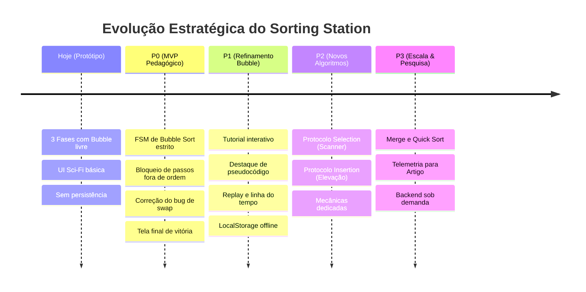

# 10 — Roadmap de Evolução Técnica e Pedagógica

> **Documento canônico:** Planejamento estratégico, priorização em níveis (P0 a P3), matriz de riscos e cronograma de implementação do **Sorting Station**.  
> **Status:** Ativo / Base de Verdade da Wiki  
> **Data:** 08/09/2026  
> **Dependências:** [`AGENTS.md`](file:///C:/Users/marcos.mendes/Downloads/Sorting%20Station%20Interface%20Design/AGENTS.md), [`CLAUDE.md`](file:///C:/Users/marcos.mendes/Downloads/Sorting%20Station%20Interface%20Design/CLAUDE.md), [`docs/wiki/00-repository-inventory.md`](file:///C:/Users/marcos.mendes/Downloads/Sorting%20Station%20Interface%20Design/docs/wiki/00-repository-inventory.md) a [`docs/wiki/09-build-deploy.md`](file:///C:/Users/marcos.mendes/Downloads/Sorting%20Station%20Interface%20Design/docs/wiki/09-build-deploy.md).

---

## 1. Visão Geral da Matriz de Prioridades

O roadmap do **Sorting Station** é estruturado em quatro horizontes claros de entrega. Para manter a fidelidade técnica do repositório, cada funcionalidade é categorizada rigorosamente por seu status real:
- **`IMPLEMENTADO`:** Presente no código-fonte atual e funcional no protótipo.
- **`EM PLANEJAMENTO`:** Formalmente especificado nos documentos da Wiki, com desenho arquitetural concluído e pronto para implementação de código.
- **`FUTURO`:** Visão estratégica de médio e longo prazo, dependente da maturidade do MVP e de validações empíricas.

---

## 2. Nível P0 — Bubble Sort Pedagógico Real (Fundação do MVP)

O objetivo central do nível P0 é converter o atual "puzzle de trocas livres" em uma **simulação algorítmica determinística**, na qual o jogador executa e assimila a invariante de laço real do Bubble Sort.

---

### P0.1. Máquina de Estados Finita (FSM) da Engine de Bubble Sort
- **Objetivo:** Implementar o modelo de domínio puro e a máquina de estados especificada em [`docs/wiki/04-sorting-engine.md`](file:///C:/Users/marcos.mendes/Downloads/Sorting%20Station%20Interface%20Design/docs/wiki/04-sorting-engine.md), isolando a lógica matemática do ciclo de renderização do React.
- **Valor para o Aluno:** Permite que cada ação do jogo reflita a lógica estrita da computação passo a passo.
- **Dependências:** [`src/screens/GameScreen.tsx`](file:///C:/Users/marcos.mendes/Downloads/Sorting%20Station%20Interface%20Design/src/screens/GameScreen.tsx).
- **Risco:** Aumento da complexidade da gestão de estado em relação ao protótipo imperativo.
- **Critério de Aceite:** O estado mantém com precisão `passIndex`, `comparisonIndex`, `currentPair`, `swapsInCurrentPass` e emite eventos de transição puros.
- **Status:** `EM PLANEJAMENTO`.

---

### P0.2. Rastreamento e Exibição de Passada Atual e Par Esperado
- **Objetivo:** Indicar visualmente na interface qual é a passada em execução ($i$) e qual é o par mandatório sob escrutínio ($[j, j+1]$).
- **Valor para o Aluno:** Elimina a confusão sobre onde focar a atenção e demonstra a varredura progressiva da esquerda para a direita.
- **Dependências:** P0.1.
- **Risco:** Poluição visual se os marcadores não respeitarem o Design System sci-fi.
- **Critério de Aceite:** O par da vez recebe destaque luminoso na esteira e o cabeçalho exibe `PASSADA X DE Y` e `PAR [j, j+1]`.
- **Status:** `EM PLANEJAMENTO`.

---

### P0.3. Mecânica de Decisão Explícita: "Trocar" vs. "Manter Ordem"
- **Objetivo:** Adicionar botões ou gatilhos na esteira para que o jogador decida ativamente se o par focado deve ser trocado ($A[j] > A[j+1]$) ou mantido ($A[j] \le A[j+1]$).
- **Valor para o Aluno:** Ensina que a não-troca é uma decisão algorítmica tão relevante quanto a troca.
- **Dependências:** P0.1, P0.2.
- **Risco:** Tornar o jogo mais lento se a interação exigir muitos cliques por par.
- **Critério de Aceite:** O jogador consegue validar o par sem trocar quando a ordem já estiver correta, avançando o algoritmo sem gerar inconsistência.
- **Status:** `EM PLANEJAMENTO`.

---

### P0.4. Bloqueio de Ações Fora de Sequência e Feedback Explicativo
- **Objetivo:** Impedir que o usuário clique em pares arbitrários e emitir avisos educativos explicando por que a ação violou o protocolo do Bubble Sort.
- **Valor para o Aluno:** Protege o estudante contra a ilusão de que o algoritmo pode "adivinhar" ou pular elementos.
- **Dependências:** P0.1.
- **Risco:** Frustração do jogador caso o bloqueio não venha acompanhado de justificativa pedagógica amigável.
- **Critério de Aceite:** Tentar clicar em caixas fora do par $[j, j+1]$ não altera o vetor e gera mensagem explicativa em `InstructionPanel`.
- **Status:** `EM PLANEJAMENTO`.

---

### P0.5. Fixação Determinística de Elementos Ordenados (`sortedBoundary`)
- **Objetivo:** Substituir a heurística falha de sufixo ordenado de [`GameScreen.tsx:L130-L136`](file:///C:/Users/marcos.mendes/Downloads/Sorting%20Station%20Interface%20Design/src/screens/GameScreen.tsx#L130-L136) por um cálculo rigoroso: ao fim da passada $i$, o elemento na posição $n - 1 - i$ é definitivamente selado como `LOCKED`.
- **Valor para o Aluno:** Materializa visualmente a principal propriedade do Bubble Sort: os maiores elementos "flutuam" e travam no final da lista.
- **Dependências:** P0.1.
- **Risco:** Marcar elementos como fixos antes de a passada formal ser completamente concluída.
- **Critério de Aceite:** Apenas caixas que passaram por toda a varredura e chegaram à sua posição definitiva recebem o badge verde `OK` e o estado bloqueado.
- **Status:** `EM PLANEJAMENTO`.

---

### P0.6. Cálculo Real de Progresso da Fase
- **Objetivo:** Substituir a fórmula arbitrária baseada em trocas ([`GameScreen.tsx:L260`](file:///C:/Users/marcos.mendes/Downloads/Sorting%20Station%20Interface%20Design/src/screens/GameScreen.tsx#L260)) pelo percentual exato de comparações completadas em relação ao total da fase.
- **Valor para o Aluno:** Fornece métrica transparente de evolução da fase que avança mesmo quando o par não precisa de troca.
- **Dependências:** P0.1.
- **Risco:** Nenhum.
- **Critério de Aceite:** A barra de progresso atinge 100% exatamente quando a última comparação da última passada é concluída.
- **Status:** `EM PLANEJAMENTO`.

---

### P0.7. Correção do Bug de Animação de Permuta
- **Objetivo:** Corrigir a condição em [`src/screens/GameScreen.tsx:L68`](file:///C:/Users/marcos.mendes/Downloads/Sorting%20Station%20Interface%20Design/src/screens/GameScreen.tsx#L68) onde `setSelected(null)` precede o `setTimeout`, fazendo com que ambas as caixas recebam a classe de animação `"left"`.
- **Valor para o Aluno:** Elimina o artefato visual confuso e restabelece a simetria física da troca (uma caixa move à esquerda e a outra à direita).
- **Dependências:** [`src/components/NumberedBox.tsx`](file:///C:/Users/marcos.mendes/Downloads/Sorting%20Station%20Interface%20Design/src/components/NumberedBox.tsx).
- **Risco:** Baixo.
- **Critério de Aceite:** A caixa da esquerda move-se para a direita com `animate-swap-right` e a da direita move-se para a esquerda com `animate-swap-left`.
- **Status:** `EM PLANEJAMENTO`.

---

### P0.8. Comportamento e Tela de Conclusão da Campanha (Fim da Fase 3)
- **Objetivo:** Tratar o encerramento da última fase em [`src/App.tsx:L32`](file:///C:/Users/marcos.mendes/Downloads/Sorting%20Station%20Interface%20Design/src/App.tsx#L32), substituindo a repetição em loop da fase 3 por uma tela final de homologação técnica da estação.
- **Valor para o Aluno:** Sensação de fechamento narrativo e recompensa pelo término de todo o treinamento.
- **Dependências:** [`src/App.tsx`](file:///C:/Users/marcos.mendes/Downloads/Sorting%20Station%20Interface%20Design/src/App.tsx), [`src/screens/ResultScreen.tsx`](file:///C:/Users/marcos.mendes/Downloads/Sorting%20Station%20Interface%20Design/src/screens/ResultScreen.tsx).
- **Risco:** Baixo.
- **Critério de Aceite:** Ao vencer a Fase 3, o botão "PRÓXIMA FASE" é substituído por "CONCLUIR PROTOCOLO", abrindo uma visão consolidada de todas as fases.
- **Status:** `EM PLANEJAMENTO`.

---

## 3. Nível P1 — Aperfeiçoamentos do Bubble Sort (Interatividade e Didática)

---

### P1.1. Tutorial Passo a Passo Interativo
- **Objetivo:** Converter o atual tutorial automatizado por temporizadores ([`src/screens/TutorialScreen.tsx`](file:///C:/Users/marcos.mendes/Downloads/Sorting%20Station%20Interface%20Design/src/screens/TutorialScreen.tsx)) em uma experiência guiada onde o usuário clica e executa as 3 primeiras trocas com instruções na tela.
- **Valor para o Aluno:** Aprendizado ativo imediato antes de ingressar na fase cronometrada.
- **Dependências:** P0.1.
- **Risco:** Sobrecarregar a tela de tutorial com texto excessivo.
- **Critério de Aceite:** O tutorial só avança quando o aluno clica no par indicado pela instrução.
- **Status:** `EM PLANEJAMENTO`.

---

### P1.2. Sistema de Dica Contextual Baseado no Passo Atual
- **Objetivo:** Fazer o botão "DICA" apontar a decisão correta para o par mandatória da vez ($[j, j+1]$), em vez de fazer uma busca linear pela primeira inversão do array.
- **Valor para o Aluno:** Ajuda pontual e relevante sem quebrar o fluxo da passada.
- **Dependências:** P0.1, P0.2.
- **Risco:** Aluno usar dica em excesso sem tentar raciocinar.
- **Critério de Aceite:** A dica destaca o par sob foco, exibe a relação de ordem ($A[j] > A[j+1]$ ou vice-versa) e incrementa `hintsUsed`.
- **Status:** `EM PLANEJAMENTO`.

---

### P1.3. Replay da Partida e Linha do Tempo de Passos
- **Objetivo:** Gravar a sequência de estados no array `history` da engine e oferecer na tela de resultado uma barra de reprodução (play, pause, passo anterior, próximo passo).
- **Valor para o Aluno:** Permite que o estudante revise retrospectivamente onde errou ou como o vetor se estabilizou.
- **Dependências:** P0.1, [`src/screens/ResultScreen.tsx`](file:///C:/Users/marcos.mendes/Downloads/Sorting%20Station%20Interface%20Design/src/screens/ResultScreen.tsx).
- **Risco:** Consumo de memória caso o histórico não seja limpo entre fases.
- **Critério de Aceite:** O aluno consegue retroceder qualquer fase passo a passo após sua conclusão.
- **Status:** `EM PLANEJAMENTO`.

---

### P1.4. Destaque Dinâmico de Pseudocódigo em Tempo Real
- **Objetivo:** Exibir o bloco de pseudocódigo em um painel lateral em `GameScreen.tsx`, iluminando a linha exata (ex.: `se A[j] > A[j+1] entao`) conforme o par é avaliado.
- **Valor para o Aluno:** Conecta diretamente a ação física do mouse à sintaxe de programação.
- **Dependências:** P0.1.
- **Risco:** Redução do espaço horizontal em telas menores.
- **Critério de Aceite:** Cada clique ou avanço de índice destaca a linha de pseudocódigo correspondente.
- **Status:** `EM PLANEJAMENTO`.

---

### P1.5. Persistência Local Desacoplada (`localStorage`)
- **Objetivo:** Implementar o schema e as funções de armazenamento local especificadas em [`docs/wiki/07-backend-and-persistence.md`](file:///C:/Users/marcos.mendes/Downloads/Sorting%20Station%20Interface%20Design/docs/wiki/07-backend-and-persistence.md).
- **Valor para o Aluno:** Preserva o desbloqueio de fases, recordes e preferências sem perder o progresso ao fechar o navegador.
- **Dependências:** P0.1.
- **Risco:** Incompatibilidade em modo de navegação anônima (exige fallback gracioso em memória).
- **Critério de Aceite:** Ao recarregar a página, a fase desbloqueada mais alta e os recordes são restaurados.
- **Status:** `EM PLANEJAMENTO`.

---

### P1.6. Pontuação Pedagógica e Tempo como Recurso Secundário
- **Objetivo:** Estruturar um cálculo de pontuação baseado na precisão (mínimo de comparações e trocas desnecessárias, penalizando erros e dicas). O tempo transcorrido deve ser exibido como métrica secundária e puramente opcional, nunca punitiva.
- **Valor para o Aluno:** Evita a ansiedade gerada por cronômetros decrescentes, priorizando a qualidade do raciocínio lógico.
- **Dependências:** P0.1.
- **Risco:** Gamificação distorcida favorecendo velocidade em detrimento do entendimento.
- **Critério de Aceite:** A pontuação máxima é alcançada executando o protocolo com 0 erros e 0 dicas, independente do tempo gasto.
- **Status:** `EM PLANEJAMENTO`.

---

## 4. Nível P2 — Novos Algoritmos de Ordenação (Mecânicas Próprias)

> [!IMPORTANT]
> **Princípio Inviolável:**  
> **Algoritmos diferentes NÃO devem ser o mesmo gameplay renomeado.**  
> Cada novo algoritmo deve introduzir metáforas diegéticas e mecânicas visuais exclusivas ([`docs/wiki/04-sorting-engine.md`](file:///C:/Users/marcos.mendes/Downloads/Sorting%20Station%20Interface%20Design/docs/wiki/04-sorting-engine.md)).

---

### P2.1. Protocolo Selection Sort: "Scanner de Carga Mínima"
- **Objetivo:** Criar a engine e a tela do Selection Sort. O jogador não compara vizinhos: ele move um sensor pela partição desordenada, identifica o menor elemento e realiza uma única troca de longa distância para colocá-lo no início da esteira.
- **Valor para o Aluno:** Compreensão da estratégia gulosa e da drástica redução no número de trocas em relação ao Bubble Sort.
- **Dependências:** P0.1, [`docs/wiki/02-system-architecture.md`](file:///C:/Users/marcos.mendes/Downloads/Sorting%20Station%20Interface%20Design/docs/wiki/02-system-architecture.md).
- **Risco:** Reutilização indevida de componentes do Bubble Sort que quebrem a metáfora do scanner.
- **Critério de Aceite:** A interface impede trocas adjacentes e exige a seleção do mínimo global antes da transferência para a partição ordenada.
- **Status:** `FUTURO`.

---

### P2.2. Protocolo Insertion Sort: "Desvio e Encaixe de Cargas"
- **Objetivo:** Criar a engine e a tela do Insertion Sort. O jogador eleva uma carga da partição desordenada para um trilho superior e desloca os elementos maiores da partição já ordenada para abrir a vaga de inserção correta.
- **Valor para o Aluno:** Assimilação táctil do conceito de subvetor incremental ordenado e deslocamento em cascata.
- **Dependências:** P0.1, [`docs/wiki/02-system-architecture.md`](file:///C:/Users/marcos.mendes/Downloads/Sorting%20Station%20Interface%20Design/docs/wiki/02-system-architecture.md).
- **Risco:** Complexidade de animação CSS ao elevar pacotes e deslocar elementos vizinhos simultaneamente.
- **Critério de Aceite:** A carga é inserida na lacuna correta após o deslocamento regressivo dos itens maiores.
- **Status:** `FUTURO`.

---

## 5. Nível P3 — Expansão do Produto e Pesquisa Acadêmica

---

### P3.1. Algoritmos Avançados: Divisão e Conquista (Merge, Quick, Heap Sort)
- **Objetivo:** Modelar interfaces para algoritmos $O(n \log n)$ com sub-esteiras paralelas (Merge Sort com divisão e intercalação) e seleção de pivô com particionamento bilateral (Quick Sort).
- **Valor para o Aluno:** Permite que estudantes universitários avançados utilizem a mesma ferramenta durante todo o semestre letivo.
- **Dependências:** Nível P2 consolidado.
- **Risco:** Sobrecarga visual ao exibir múltiplas esteiras e árvores de recursão em tela única.
- **Critério de Aceite:** Cada algoritmo possui visualização clara de sua divisão de espaço e chamadas recursivas.
- **Status:** `FUTURO`.

---

### P3.2. Modo Comparação de Algoritmos (Duelo de Protocolos)
- **Objetivo:** Executar dois algoritmos lado a lado sobre o mesmo vetor de entrada inicial, evidenciando graficamente a diferença no volume total de operações.
- **Valor para o Aluno:** Visualização empírica imediata de por que algoritmos eficientes superam abordagens ingênuas em lotes maiores.
- **Dependências:** P2.1, P2.2.
- **Risco:** Queda de taxa de quadros (FPS) ao renderizar duas esteiras simultâneas em máquinas modestas.
- **Critério de Aceite:** As duas esteiras processam o vetor exibindo gráficos comparativos de barras em tempo real.
- **Status:** `FUTURO`.

---

### P3.3. Modos Especiais: "Demonstração Guiada" e "Desafio sob Pressão"
- **Objetivo:** Criar um modo *Showroom* para professores utilizarem em projetores de sala de aula (com autoplay ajustável) e um modo *Desafio* com vetores randômicos e penalidades de erro.
- **Valor para o Aluno:** Flexibilidade de uso em aula expositiva ou prática individual.
- **Dependências:** Níveis P0 e P1.
- **Risco:** Divergência de foco didático.
- **Critério de Aceite:** O professor consegue pausar e avançar a simulação com as teclas de seta do teclado.
- **Status:** `FUTURO`.

---

### P3.4. Backend Futuro Condicionado (Sob Demanda)
- **Objetivo:** Desenvolver uma API e banco de dados centralizado **exclusivamente se houver necessidade comprovada** de contas de usuário, sincronização multi-dispositivo, rankings globais auditados ou painéis de gestão para professores ([`docs/wiki/07-backend-and-persistence.md`](file:///C:/Users/marcos.mendes/Downloads/Sorting%20Station%20Interface%20Design/docs/wiki/07-backend-and-persistence.md)).
- **Valor para o Aluno:** Sincronização entre laboratório da faculdade e residência.
- **Dependências:** Disparo formal de um dos gatilhos arquiteturais e aprovação de ADR.
- **Risco:** Custo de hospedagem e overhead de infraestrutura sem base de usuários ativa.
- **Critério de Aceite:** API atende aos 4 domínios conceituais respeitando LGPD/GDPR sem degradar o modo offline client-side.
- **Status:** `FUTURO`.

---

### P3.5. Alinhamento com a Metodologia do Artigo Acadêmico
- **Objetivo:** Utilizar os dados de telemetria da engine para embasar a seção empírica do artigo científico de graduação/pós-graduação.
- **Valor Acadêmico:** Garante integridade científica ao projeto de pesquisa.
- **Diretriz Mandatória de Honestidade Científica:**
  - O jogo alimenta a metodologia e o relato de desenvolvimento do artigo;
  - A avaliação empírica com estudantes reais (testes pré e pós-intervenção, questionários de aceitação tecnológica) constitui uma **etapa futura**;
  - **É terminantemente proibido registrar ou alegar na documentação resultados estatísticos ou pedagógicos que ainda não foram efetivamente coletados.**
- **Status:** `EM PLANEJAMENTO`.

---

## 6. Ordem Recomendada das Próximas 10 Tarefas de Desenvolvimento

Para guiar os próximos passos de implementação de código de forma incremental e segura:

| Ordem | Código | Tarefa Recomendada | Arquivos Impactados | Entrega Principal |
| :---: | :---: | :--- | :--- | :--- |
| **1** | `TASK-01` | **Corrigir Bug de Animação de Permuta** | `GameScreen.tsx`, `NumberedBox.tsx` | Garantir que a caixa esquerda receba `"right"` e a direita receba `"left"`. |
| **2** | `TASK-02` | **Corrigir Transição de Fim da Fase 3** | `App.tsx`, `ResultScreen.tsx` | Impedir repetição da fase 3 e exibir botão de homologação final. |
| **3** | `TASK-03` | **Criar Estrutura de Domínio da Engine** | `src/domain/` ou `src/engine/` | Interfaces TypeScript puras (`BubbleSortState`, `StepRecord`, tipos de ação). |
| **4** | `TASK-04` | **Implementar FSM de Bubble Sort Estrito** | `src/engine/bubbleSortMachine.ts` | Transições de estado puras com controle de $i$, $j$, par mandatório e travamento. |
| **5** | `TASK-05` | **Integrar FSM à Interface de Gameplay** | `src/screens/GameScreen.tsx` | Substituir os `useState` dispersos pelo consumo da nova máquina de estados. |
| **6** | `TASK-06` | **Implementar Ação Explícita "Manter Ordem"** | `GameScreen.tsx`, `GameButton.tsx` | Permitir ao aluno confirmar que o par já está ordenado sem trocar. |
| **7** | `TASK-07` | **Implementar Bloqueio com Feedback Explicativo** | `GameScreen.tsx`, `InstructionPanel.tsx` | Avisos educativos ao tentar selecionar pares fora da passada do Bubble. |
| **8** | `TASK-08` | **Adequar Acessibilidade Básica de Teclado** | `NumberedBox.tsx`, `index.css` | Adicionar suporte a `Tab`/`Enter`/`Space` e foco visível nas caixas. |
| **9** | `TASK-09` | **Criar Módulo de Persistência `localStorage`** | `src/storage/localSave.ts`, `App.tsx` | Salvar e restaurar progresso de fases e recordes localmente de forma segura. |
| **10**| `TASK-10` | **Sincronizar Pseudocódigo em Tempo Real** | `GameScreen.tsx`, `ResultScreen.tsx` | Destacar dinamicamente a linha de código correspondente ao par sob teste. |
