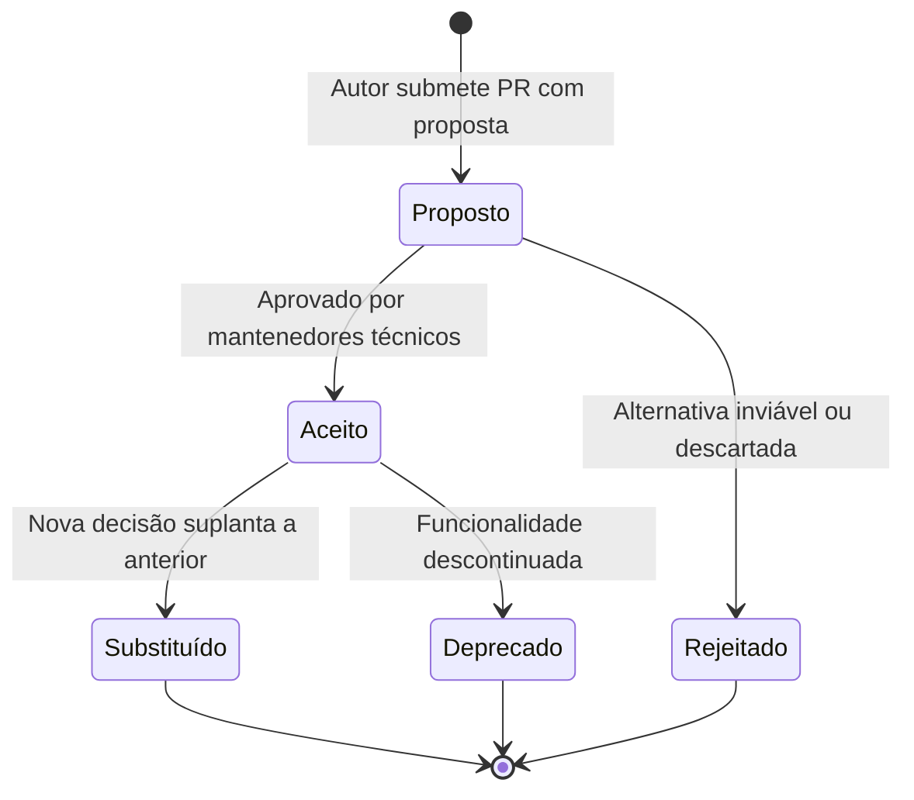

# 11 — Registro de Decisões Arquiteturais (ADRs)

> **Documento canônico:** Governança técnica, processo formal de deliberação arquitetural, template padronizado e catálogo de decisões candidatas do **Sorting Station**.  
> **Status:** Ativo / Base de Verdade da Wiki  
> **Data:** 08/09/2026  
> **Dependências:** [`AGENTS.md`](file:///C:/Users/marcos.mendes/Downloads/Sorting%20Station%20Interface%20Design/AGENTS.md), [`CLAUDE.md`](file:///C:/Users/marcos.mendes/Downloads/Sorting%20Station%20Interface%20Design/CLAUDE.md), [`docs/wiki/00-repository-inventory.md`](file:///C:/Users/marcos.mendes/Downloads/Sorting%20Station%20Interface%20Design/docs/wiki/00-repository-inventory.md) a [`docs/wiki/10-roadmap.md`](file:///C:/Users/marcos.mendes/Downloads/Sorting%20Station%20Interface%20Design/docs/wiki/10-roadmap.md), [`docs/adr/TEMPLATE.md`](file:///C:/Users/marcos.mendes/Downloads/Sorting%20Station%20Interface%20Design/docs/adr/TEMPLATE.md).

---

## 1. Governança e Princípio da Honestidade Histórica

Para que a documentação técnica sirva de fundação sólida para a engenharia de software e para a futura pesquisa acadêmica, o **Sorting Station** adota o modelo de **Architecture Decision Records (ADRs)** para registrar mudanças fundamentais no sistema.

> [!IMPORTANT]
> **Diretriz de Honestidade Histórica:**  
> **Não reescrever a história técnica do projeto.**  
> Decisões arquiteturais tomadas durante a fase inicial de prototipagem (como a escolha implícita de manter estado com `useState` imperativo em `GameScreen.tsx` ou a ausência de roteador) **não devem ser retroativamente inventadas como se fossem ADRs formalmente aprovados no passado**.  
> Os ADRs passam a vigorar a partir deste marco canônico para guiar deliberações presentes e futuras. Propostas de evolução técnica são tratadas honestamente como **Candidatas a ADR**, e só recebem o status de `Aceito` após consenso técnico e validação nos fóruns de projeto.

---

## 2. O Ciclo de Vida de um ADR

Todos os registros formais de decisão serão armazenados no diretório [`docs/adr/`](file:///C:/Users/marcos.mendes/Downloads/Sorting%20Station%20Interface%20Design/docs/adr) seguindo o padrão de nomenclatura sequencial `docs/adr/ADR-XXX-[slug].md` (ex.: `ADR-001-separacao-engine-ui.md`).



- **`Proposto`:** Submetido para revisão da equipe; descreve o problema, alternativas e impactos. O código ainda não deve refletir a decisão como definitiva.
- **`Aceito`:** Formalmente aprovado; autoriza a implementação de código e passa a constituir a verdade arquitetural canônica.
- **`Rejeitado`:** Avaliado e descartado; preservado no repositório para evitar que a equipe rediscuta ideias já refutadas sem novos fatos.
- **`Substituído`:** Uma decisão previamente aceita foi suplantada por uma solução mais madura (aponta explicitamente para o novo `ADR-YYY`).
- **`Deprecado`:** A decisão perdeu relevância devido à remoção da funcionalidade correspondente.

---

## 3. Template Canônico de ADR

O modelo oficial de deliberação está versionado em [`docs/adr/TEMPLATE.md`](file:///C:/Users/marcos.mendes/Downloads/Sorting%20Station%20Interface%20Design/docs/adr/TEMPLATE.md) e deve conter obrigatoriamente os seguintes campos:

```markdown
# ADR [NÚMERO]: [TÍTULO DA DECISÃO ARQUITETURAL]

- **Status:** Proposto | Aceito | Rejeitado | Deprecado | Substituído por [ADR-XXX]
- **Data:** AAAA-MM-DD
- **Autores:** [Nomes dos responsáveis ou papéis técnicos]
- **Decisores:** [Equipe técnica / Mantenedores]

---

## 1. Contexto e Declaração do Problema
[Descreve o cenário operacional, a restrição de ambiente e a necessidade real de mudança]

---

## 2. Decisão Arquitetural
[Declaração direta, inequívoca e assertiva da solução adotada]

---

## 3. Alternativas Consideradas
- **Alternativa A:** [Descrição e motivo do descarte]
- **Alternativa B:** [Descrição e motivo do descarte]

---

## 4. Consequências e Trade-offs
### 4.1. Consequências Positivas (Ganhos)
### 4.2. Consequências Negativas ou Custos (Trade-offs)

---

## 5. Riscos e Mitigações
[Matriz de riscos com severidade e ações preventivas/corretivas]

---

## 6. Links e Referências
- **Código-fonte Afetado:** [links de arquivo]
- **Documentos da Wiki Relacionados:** [links de documentação]
```

---

## 4. Catálogo de Candidatos a ADR Futuro

As seguintes propostas de evolução estrutural estão documentadas como **candidatas formais**. Nenhuma delas deve ser tratada como previamente aprovada antes da abertura e aceite de seu respectivo ADR.

---

### Candidato 1 — Desacoplamento da Engine de Ordenação em Relação à UI
- **Contexto:** Atualmente, a lógica de ordenação e comparação vive emaranhada com `useState` e `setTimeout` dentro de [`src/screens/GameScreen.tsx`](file:///C:/Users/marcos.mendes/Downloads/Sorting%20Station%20Interface%20Design/src/screens/GameScreen.tsx), impedindo testes unitários e reutilização de regras.
- **Proposta sob Avaliação:** Extrair o domínio algorítmico para um módulo TypeScript independente (`src/engine/` ou `src/domain/`) contendo funções puras e tipos imutáveis.
- **Alternativas a Ponderar:** Manter hooks customizados (`useSortingGame`) sem classes vs. instâncias puras de classes de domínio vs. Redux Toolkit.
- **Impacto:** Alto. Requer refatoração segura da tela principal sem regressões visuais.
- **Status:** `CANDIDATO PROPOSTO (P0)`.

---

### Candidato 2 — Máquina de Estados Finita (FSM) Pedagógica para o Bubble Sort
- **Contexto:** O protótipo permite ao jogador clicar em qualquer par vizinho em qualquer ordem, descaracterizando o Bubble Sort estrito.
- **Proposta sob Avaliação:** Adotar uma máquina de estados com controle estrito de `passIndex`, `comparisonIndex` e `currentPair`, bloqueando ações fora da passada e emitindo feedbacks educativos ([`docs/wiki/04-sorting-engine.md`](file:///C:/Users/marcos.mendes/Downloads/Sorting%20Station%20Interface%20Design/docs/wiki/04-sorting-engine.md)).
- **Alternativas a Ponderar:** FSM manual pura em TypeScript vs. biblioteca especializada (como XState).
- **Impacto:** Alto. Central para a integridade pedagógica do jogo.
- **Status:** `CANDIDATO PROPOSTO (P0)`.

---

### Candidato 3 — Estratégia de Persistência Local Desacoplada
- **Contexto:** Todo o progresso de campanha e métricas de desempenho são perdidos ao atualizar a página (F5).
- **Proposta sob Avaliação:** Implementar persistência local via `localStorage` com controle de versão de schema e fallback defensivo em memória ([`docs/wiki/07-backend-and-persistence.md`](file:///C:/Users/marcos.mendes/Downloads/Sorting%20Station%20Interface%20Design/docs/wiki/07-backend-and-persistence.md)).
- **Alternativas a Ponderar:** `localStorage` síncrono simples vs. `IndexedDB` assíncrono (ex.: Dexie.js) vs. persistência em cookies.
- **Impacto:** Médio. Preserva autonomia do estudante sem custos de servidor.
- **Status:** `CANDIDATO PROPOSTO (P1)`.

---

### Candidato 4 — Adoção de Backend Centralizado e Modelo de Hospedagem
- **Contexto:** Avaliar sob quais condições fáticas um backend deve ser desenvolvido.
- **Proposta sob Avaliação:** Condicionar a criação de uma API e banco de dados exclusivamente ao disparo de gatilhos operacionais comprovados (contas institucionais, sincronização multi-dispositivo, combate a fraude em placares ou telemetria para artigos acadêmicos).
- **Alternativas a Ponderar:** Backend Node/TypeScript (Fastify/Nest) vs. Python (FastAPI para análise de dados) vs. Backend-as-a-Service (Supabase/Firebase).
- **Impacto:** Crítico. Exige custos de nuvem e compliance rigoroso com a LGPD/GDPR.
- **Status:** `CANDIDATO CONDICIONADO (P3)`.

---

### Candidato 5 — Seleção de Framework de Testes Automatizados
- **Contexto:** O repositório possui atualmente 0 frameworks e 0 arquivos de teste automatizado ([`docs/wiki/08-testing-and-quality.md`](file:///C:/Users/marcos.mendes/Downloads/Sorting%20Station%20Interface%20Design/docs/wiki/08-testing-and-quality.md)).
- **Proposta sob Avaliação:** Adotar o **Vitest** como executor nativo de testes integrado ao pipeline do Vite, em conjunto com `@testing-library/react`.
- **Alternativas a Ponderar:** Vitest vs. Jest (overhead de configuração com Vite e ESM) vs. Cypress/Playwright para testes ponta a ponta exclusivos.
- **Impacto:** Médio. Essencial para garantir não regressão da FSM e dos cálculos de complexidade.
- **Status:** `CANDIDATO PROPOSTO (P1)`.

---

### Candidato 6 — Arquitetura de Roteamento Client-Side
- **Contexto:** A navegação atual é controlada por uma variável de estado em [`src/App.tsx:L22`](file:///C:/Users/marcos.mendes/Downloads/Sorting%20Station%20Interface%20Design/src/App.tsx#L22) (`screen: "home" | "tutorial" | "game" | "result"`), sem URLs navegáveis pelo histórico do navegador (botão "Voltar").
- **Proposta sob Avaliação:** Avaliar se a máquina de telas em `App.tsx` continua sendo a abordagem mais limpa ou se deve ser introduzido um roteador hash (`react-router-dom` ou similar).
- **Alternativas a Ponderar:** Manter `screen` em `useState` vs. Hash Router (`#/game/1`) vs. Browser History API (risco de 404 em sandboxes do Figma Make).
- **Impacto:** Baixo/Médio. Deve garantir total compatibilidade com o iframe e CDN do Figma Make.
- **Status:** `CANDIDATO PROPOSTO (P2)`.

---

### Candidato 7 — Estratégia Arquitetural para Novos Algoritmos (Selection e Insertion)
- **Contexto:** Garantir que novos algoritmos não sejam implementados apenas como renomeação de rótulos visuais, mas com mecânicas interativas exclusivas ([`docs/wiki/04-sorting-engine.md`](file:///C:/Users/marcos.mendes/Downloads/Sorting%20Station%20Interface%20Design/docs/wiki/04-sorting-engine.md)).
- **Proposta sob Avaliação:** Adotar o padrão de projeto **Strategy**, no qual cada protocolo de ordenação encapsula sua própria FSM, regras de par/mínimo, representação visual da esteira e pseudocódigo.
- **Alternativas a Ponderar:** Componentes de tela inteiramente separados (`SelectionGameScreen.tsx`) vs. Tela genérica parametrizada por um Strategy Object.
- **Impacto:** Alto. Define a escalabilidade do produto para suportar até 6 algoritmos diferentes no futuro.
- **Status:** `CANDIDATO PROPOSTO (P2)`.

---

### Candidato 8 — Telemetria Acadêmica, Anonimização e Privacidade de Dados
- **Contexto:** O projeto visa embasar um artigo científico com dados empíricos de aprendizagem e usabilidade.
- **Proposta sob Avaliação:** Especificar formalmente a taxonomia de eventos de telemetria (tempo de resposta, erros cometidos, padrão de busca), com anonimização mandatória desde a coleta (sem vincular nomes civis ou endereços IP aos registros de jogo).
- **Alternativas a Ponderar:** Coleta via beacon HTTP anônimo vs. exportação manual de arquivo JSON pelo próprio estudante ao final da aula.
- **Impacto:** Alto. Decisivo para a aprovação ética e legal da pesquisa perante comitês universitários.
- **Status:** `CANDIDATO PROPOSTO (P3)`.

---

## 5. Diretrizes de Integração com a Wiki

1. **Rastreabilidade Bidirecional:** Sempre que um ADR for aceito ou modificado, a página correspondente da Wiki (ex.: [`docs/wiki/02-system-architecture.md`](file:///C:/Users/marcos.mendes/Downloads/Sorting%20Station%20Interface%20Design/docs/wiki/02-system-architecture.md) ou [`docs/wiki/07-backend-and-persistence.md`](file:///C:/Users/marcos.mendes/Downloads/Sorting%20Station%20Interface%20Design/docs/wiki/07-backend-and-persistence.md)) deve ser atualizada para citar o número do ADR aprovado.
2. **Atualização do `SUMMARY.md`:** Qualquer novo ADR formalmente aceito deve ter sua entrada registrada no índice principal da Wiki.
3. **Respeito ao `AGENTS.md`:** Nenhum ADR poderá propor padrões que violem as restrições inegociáveis do ambiente (ex.: quebra de compatibilidade com Vite no Figma Make ou remoção indevida dos scripts em `.figma/make/*`).
