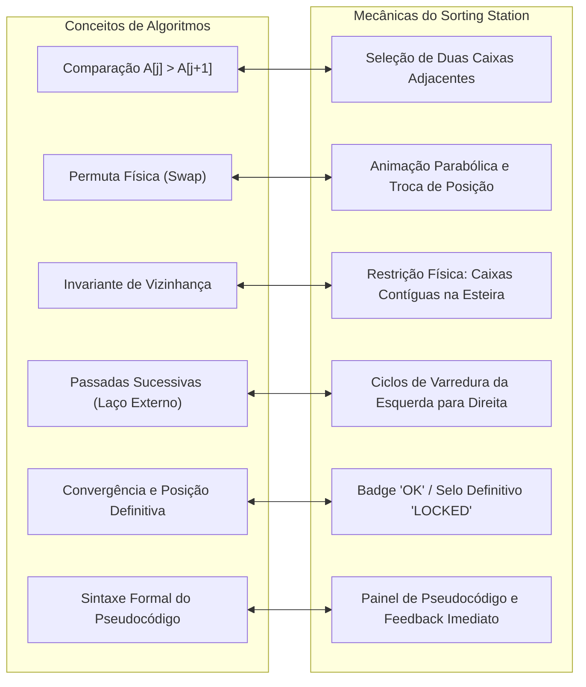

# 12 — Pedagogia, Rastreabilidade Acadêmica e Rigor Científico

> **Documento canônico:** Mapeamento epistemológico entre mecânicas de jogo e conceitos de ciência da computação, fundamentação pedagógica e diretrizes para a elaboração de artigo acadêmico do **Sorting Station**.  
> **Status:** Ativo / Base de Verdade da Wiki  
> **Data:** 08/09/2026  
> **Dependências:** [`AGENTS.md`](file:///C:/Users/marcos.mendes/Downloads/Sorting%20Station%20Interface%20Design/AGENTS.md), [`CLAUDE.md`](file:///C:/Users/marcos.mendes/Downloads/Sorting%20Station%20Interface%20Design/CLAUDE.md), [`docs/wiki/00-repository-inventory.md`](file:///C:/Users/marcos.mendes/Downloads/Sorting%20Station%20Interface%20Design/docs/wiki/00-repository-inventory.md), [`docs/wiki/01-product-vision.md`](file:///C:/Users/marcos.mendes/Downloads/Sorting%20Station%20Interface%20Design/docs/wiki/01-product-vision.md), [`docs/wiki/04-sorting-engine.md`](file:///C:/Users/marcos.mendes/Downloads/Sorting%20Station%20Interface%20Design/docs/wiki/04-sorting-engine.md), [`docs/wiki/10-roadmap.md`](file:///C:/Users/marcos.mendes/Downloads/Sorting%20Station%20Interface%20Design/docs/wiki/10-roadmap.md).

---

## 1. Fundamentação Epistemológica e Níveis de Afirmação

Para garantir total conformidade com a ética em pesquisa acadêmica e a integridade de publicações científicas, este documento estabelece uma distinção metodológica estrita entre cinco categorias conceituais:

1. **Intenção Pedagógica:** O conceito computacional exato que a mecânica de jogo foi concebida para transmitir (o *objetivo de aprendizagem*).
2. **Implementação Observável:** O comportamento real e verificável presente no código-fonte atual do repositório ([`docs/wiki/00-repository-inventory.md`](file:///C:/Users/marcos.mendes/Downloads/Sorting%20Station%20Interface%20Design/docs/wiki/00-repository-inventory.md)).
3. **Hipótese / Proposta:** A conjectura pedagógica teórica formulada pelos autores sobre os potenciais efeitos cognitivos da intervenção (ex.: redução da carga cognitiva, retenção de invariantes de laço).
4. **Avaliação Futura:** O protocolo experimental empírico que deverá ser desenhado e executado para testar as hipóteses científicas (ex.: testes pré e pós-intervenção com estudantes).
5. **Resultado Comprovado:** Conclusões sustentadas por dados quantitativos ou qualitativos reais. **Atualmente, o projeto possui ZERO resultados comprovados**, uma vez que nenhuma avaliação empírica foi coletada ou registrada no repositório.

---

## 2. Rastreabilidade entre Conceitos Computacionais e Mecânicas de Jogo

---

### 2.1. Comparação de Elementos ($C(n)$)
- **Conceito Teórico:** A operação fundamental de tomada de decisão onde a ordem relativa entre dois valores $A[j]$ e $A[j+1]$ é avaliada. Determina a complexidade de tempo dos algoritmos de comparação ($\Omega(n \log n)$ no caso geral, $O(n^2)$ nos algoritmos elementares).
- **Intenção Pedagógica:** Fazer o aluno perceber que comparar elementos consome recursos computacionais finitos e que mesmo comparações que não resultam em troca possuem custo operacional.
- **Implementação Observável:** Em [`src/screens/GameScreen.tsx:L67`](file:///C:/Users/marcos.mendes/Downloads/Sorting%20Station%20Interface%20Design/src/screens/GameScreen.tsx#L67), toda seleção válida de um par vizinho incrementa o contador `comparisons`, exibido no [`StatsPanel`](file:///C:/Users/marcos.mendes/Downloads/Sorting%20Station%20Interface%20Design/src/components/StatsPanel.tsx).
- **Hipótese:** A visualização contínua do contador de comparações desmistifica a ilusão de que ordenar é apenas "arrastar para o lugar", evidenciando o esforço analítico da máquina.
- **Avaliação Futura:** Questionar os alunos após o jogo sobre qual operação é mais frequente no Bubble Sort (comparações vs. trocas).

---

### 2.2. Ação de Troca / Permuta ($M(n)$)
- **Conceito Teórico:** A modificação do estado da memória transferindo o conteúdo de duas posições do vetor: `temp = A[j]; A[j] = A[j+1]; A[j+1] = temp`.
- **Intenção Pedagógica:** Materializar o custo físico de movimentação de dados em memória e diferenciar elementos na ordem correta daqueles fora de ordem.
- **Implementação Observável:** Em [`GameScreen.tsx:L75-L84`](file:///C:/Users/marcos.mendes/Downloads/Sorting%20Station%20Interface%20Design/src/screens/GameScreen.tsx#L75-L84), a troca só ocorre quando $A[\text{left}] > A[\text{right}]$, disparando animação de translação horizontal por $500\text{ms}$ e incrementando `swaps`.
- **Hipótese:** A necessidade de aguardar a troca visual e ver o contador de trocas avançar associa a permutação a uma operação custosa de escrita em memória.
- **Avaliação Futura:** Medir o entendimento do estudante sobre o melhor caso ($0$ trocas) versus pior caso ($\frac{n(n-1)}{2}$ trocas).

---

### 2.3. Vizinhança e Adjacência no Bubble Sort
- **Conceito Teórico:** O Bubble Sort restringe todas as suas comparações e permutas a **elementos contíguos** ($j$ e $j+1$). Ele não tem "visão global" do vetor.
- **Intenção Pedagógica:** Ensinar o conceito de algoritmo puramente local, onde a ordem global emerge unicamente de decisões tomadas em nível microscópico (vizinho imediato).
- **Implementação Observável:** Em [`GameScreen.tsx:L58-L62`](file:///C:/Users/marcos.mendes/Downloads/Sorting%20Station%20Interface%20Design/src/screens/GameScreen.tsx#L58-L62), a regra `Math.abs(selected - index) !== 1` bloqueia seleções não adjacentes.
- **Dívida Pedagógica Atual:** O protótipo atual permite escolher *qualquer* par vizinho em qualquer ordem, descaracterizando a varredura linear do algoritmo ([`docs/wiki/04-sorting-engine.md`](file:///C:/Users/marcos.mendes/Downloads/Sorting%20Station%20Interface%20Design/docs/wiki/04-sorting-engine.md)).
- **Proposta P0:** A introdução da FSM travará o foco no par mandatória da passada, garantindo aderência rigorosa ao laço interno `for j = 0 to n - 2 - i`.

---

### 2.4. Passadas Sucessivas e o Laço Externo ($i$)
- **Conceito Teórico:** Uma única varredura pelo vetor não garante a ordenação completa; são necessárias até $n-1$ passadas para que todas as inversões sejam resolvidas.
- **Intenção Pedagógica:** Ilustrar a necessidade de laços aninhados (*nested loops*) e demonstrar por que o algoritmo possui complexidade quadrática no caso médio.
- **Implementação Observável:** Ausente no protótipo atual (não há controle explícito de passadas, apenas verificação global de `isSorted(boxes)`).
- **Proposta P0:** Implementar o indicador `PASSADA X DE Y` que avança formalmente ao término da varredura de cada lote.

---

### 2.5. Elemento Fixado ao Final da Passada (*Invariante de Laço*)
- **Conceito Teórico:** Ao final da passada $i$, o elemento que for o maior da sublista não ordenada atinge sua posição definitiva no índice $n - 1 - i$ e **nunca mais precisará ser comparado**.
- **Intenção Pedagógica:** Fixar cinestesicamente a invariante de laço do Bubble Sort: a partição $[n-1-i \dots n-1]$ está estritamente ordenada e contém os maiores elementos do vetor.
- **Implementação Observável:** Heurística falha baseada em sufixo em [`GameScreen.tsx:L130-L136`](file:///C:/Users/marcos.mendes/Downloads/Sorting%20Station%20Interface%20Design/src/screens/GameScreen.tsx#L130-L136).
- **Proposta P0:** O selamento formal com a etiqueta `LOCKED` no `sortedBoundary`, eliminando a caixa das futuras comparações da fase.

---

### 2.6. A Conexão Tríade: Ação $\rightarrow$ Visualização $\rightarrow$ Pseudocódigo
- **Conceito Teórico:** A dissociação entre o código formal e a visualização mental é um dos principais obstáculos cognitivos no aprendizado de algoritmos.
- **Intenção Pedagógica:** O estudante deve conectar simultaneamente a ação motora (clique), o efeito físico concreto (caixa deslizando na esteira) e a linha abstrata de código que comanda aquela operação.
- **Implementação Observável:** Parcial. A tela de resultado ([`src/screens/ResultScreen.tsx:L83-L99`](file:///C:/Users/marcos.mendes/Downloads/Sorting%20Station%20Interface%20Design/src/screens/ResultScreen.tsx#L83-L99)) exibe o pseudocódigo estático, mas ele não está sincronizado dinamicamente durante a execução do jogo.
- **Proposta P1:** Painel de pseudocódigo lateral em `GameScreen.tsx` que ilumina em tempo real a linha em execução conforme o par é testado.

---

### 2.7. Feedback Imediato e Formativo
- **Conceito Teórico:** O feedback imediato reduz o acúmulo de equívocos mentais (*misconceptions*), permitindo que o aluno corrija o raciocínio no instante exato da falha.
- **Implementação Observável:** Em [`GameScreen.tsx:L60`](file:///C:/Users/marcos.mendes/Downloads/Sorting%20Station%20Interface%20Design/src/screens/GameScreen.tsx#L60) e [`L91`](file:///C:/Users/marcos.mendes/Downloads/Sorting%20Station%20Interface%20Design/src/screens/GameScreen.tsx#L91), o painel [`InstructionPanel`](file:///C:/Users/marcos.mendes/Downloads/Sorting%20Station%20Interface%20Design/src/components/InstructionPanel.tsx) explica textualmente o motivo da rejeição ou aceitação da operação (ex.: `"As caixas precisam ser vizinhas"` ou `"X ≤ Y — já estão na ordem correta!"`).

---

### 2.8. Replay Retrospectivo e Linha do Tempo (Ideia Futura — P1)
- **Conceito Teórico:** A autorreflexão e a meta-cognição são fortalecidas quando o estudante pode rever retrospectivamente sua trajetória de decisões e erros.
- **Proposta P1:** Gravação do vetor imutável `history` permitindo ao aluno navegar em uma barra de tempo após o término da fase, assistindo novamente a como suas decisões estabilizaram o vetor.

---

### 2.9. Diferenças Pedagógicas Planejadas para Novos Algoritmos (P2)

Para garantir que o jogo não caia na armadilha de usar a mesma mecânica de permuta para algoritmos distintos:

| Algoritmo | Invariante Central a Ensinar | Mecânica Dedicada de Jogo | Diferencial Cognitivo para o Aluno |
| :--- | :--- | :--- | :--- |
| **Bubble Sort** | O maior elemento flutua a cada passada por comparações locais | Testar vizinhos contíguos na esteira | Compreender o custo cumulativo de permutas locais sucessivas |
| **Selection Sort** | O menor elemento da partição desordenada é localizado e posicionado | Scanner de busca do mínimo global e troca única de longa distância | Perceber a redução drástica de escritas ($M(n) \le n-1$), mantendo $O(n^2)$ comparações |
| **Insertion Sort** | Um elemento por vez é encaixado na posição correta da sublista ordenada | Elevação do pacote chave e deslocamento regressivo dos itens maiores | Compreender a construção incremental de listas ordenadas e o melhor caso linear $O(n)$ |

---

## 3. O que Podemos Afirmar no Artigo Acadêmico Hoje

Com base exclusivamente nos fatos implementados e no código auditado do repositório, o artigo científico pode atestar legitimamente os seguintes pontos em suas seções de **Introdução, Arquitetura e Desenvolvimento**:

1. **Design e Arquitetura do Software:**  
   O Sorting Station foi concebido e implementado como uma aplicação Single Page Application (SPA) responsiva em React 19, TypeScript estrito, Tailwind CSS v4 e Vite, operando 100% no cliente sem dependência de infraestrutura de servidor.
2. **Proposta de Valor e Modelo de Gamificação:**  
   O jogo adota uma metáfora diegética sci-fi industrial de centro de triagem logística para converter a execução abstrata de algoritmos em manipulação cinestésica direta sobre esteiras rolantes.
3. **Mapeamento Conceitual de Domínio:**  
   As decisões de design estabelecem correspondência formal entre variáveis matemáticas de complexidade ($C(n)$ e $M(n)$) e interações do usuário (seleção de caixas e animações de permuta física).
4. **Governança e Rastreabilidade Documental:**  
   O repositório possui uma base de verdade canônica estruturada na Wiki e registros de decisão arquitetural (ADRs) que detalham o diagnóstico de limitações e a evolução técnica planejada.
5. **Diferenciação Crítica de Mecânicas:**  
   O projeto estabelece formalmente o princípio de que novos algoritmos de ordenação exigem mecânicas interativas exclusivas baseadas em suas respectivas invariantes de laço.

---

## 4. O que Só Poderemos Afirmar Após Avaliação Empírica

> [!CAUTION]
> **Veto a Alegações Científicas não Comprovadas:**  
> As afirmações listadas abaixo dependem estritamente da realização de um **estudo experimental controlado** com estudantes reais, com aprovação prévia em comitê de ética em pesquisa e metodologia estatística formal. **Nenhuma delas pode ser afirmada como fato no estado atual do projeto**:

1. **Ganho de Aprendizagem e Desempenho Acadêmico:**  
   *Não podemos afirmar* que estudantes que jogaram o Sorting Station obtiveram notas superiores ou demonstraram maior domínio de algoritmos do que aqueles que assistiram aulas tradicionais ou usaram pseudocódigo puro.
2. **Superioridade em Relação a Visualizadores Passivos:**  
   *Não podemos afirmar* que a manipulação ativa por clique resulta em menor taxa de esquecimento do que visualizadores algorítmicos convencionais (como VisuAlgo ou animações em vídeo).
3. **Redução de Carga Cognitiva:**  
   *Não podemos afirmar* que a metáfora sci-fi reduziu a carga cognitiva intrínseca ou germane dos alunos sem medição psicométrica validada (ex.: escala NASA-TLX ou questionários padronizados).
4. **Satisfação e Engajamento dos Estudantes:**  
   *Não podemos afirmar* que os usuários acharam a interface intuitiva, envolvente ou motivadora sem dados de escalas de usabilidade (como SUS — *System Usability Scale*) e entrevistas qualitativas.
5. **Qualquer Conclusão Estatística ou P-Valor:**  
   É terminantemente vedado apresentar médias, desvios-padrão, testes t de Student ou valores de significância estatística ($p < 0.05$) antes da coleta empírica real de dados com turmas experimentais e grupos de controle.
