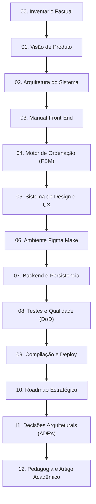

# Wiki do Sorting Station: Índice Canônico e Base de Conhecimento

> **Índice Mestre da Wiki:** Ponto de entrada canônico e mapa de navegação documental do projeto **Sorting Station**.  
> **Status:** Ativo / Base de Verdade da Wiki  
> **Data:** 08/09/2026  
> **Governança:** [`AGENTS.md`](../../AGENTS.md) e [`CLAUDE.md`](../../CLAUDE.md).

---

## Comece por aqui

> Para qualquer agente ou desenvolvedor entrando no projeto, leia primeiro [SUMMARY.md](./SUMMARY.md). Em seguida, consulte as páginas específicas relacionadas à tarefa. O arquivo [AGENTS.md](../../AGENTS.md) contém as regras obrigatórias e restrições inegociáveis do projeto.

---

## Para Agentes e Desenvolvedores

- **Preflight Obrigatório:** Todo agente de IA, desenvolvedor, designer, testador ou pesquisador DEVE iniciar qualquer tarefa consultando a Wiki antes de tomar decisões ou modificar arquivos de código.
- **Ponto de Entrada Recomendado:** O arquivo [`docs/wiki/SUMMARY.md`](./SUMMARY.md) é o sumário operacional e mapa de navegação canônico do repositório.
- **Consulta Obrigatória a Páginas Detalhadas:** O `SUMMARY.md` funciona como índice e não substitui a leitura atenta das páginas temáticas detalhadas correspondentes ao escopo da tarefa.
- **Hierarquia de Verdade e Código:** Em caso de divergência entre a Wiki e o código, o agente deve verificar o estado real implementado, agir com base nele e atualizar a documentação afetada.
- **Princípio Operacional Contínuo:**
  $$\text{LER A WIKI} \longrightarrow \text{ENTENDER O CONTEXTO} \longrightarrow \text{VERIFICAR O CÓDIGO} \longrightarrow \text{EXECUTAR} \longrightarrow \text{ATUALIZAR A WIKI}$$

---

## 1. Visão Rápida do Projeto

O **Sorting Station** é um jogo educacional point-and-click para navegadores web ambientado em uma central logística futurista de alta tecnologia. Caixas numeradas representam elementos de vetores matemáticos sobre esteiras mecânicas contínuas. 

O objetivo pedagógico central é **ensinar algoritmos de ordenação por manipulação cinestésica direta**, superando a passividade de animações tradicionais e conectando simultaneamente três dimensões essenciais:
1. **Ação física do estudante** (clique no par vizinho mandatório);
2. **Representação visual da esteira** (elevação e translação física das caixas);
3. **Execução lógica do pseudocódigo formal** (sincronização de passos e invariantes de laço).

### Stack Tecnológica Real e Confirmada
- **Ambiente de Execução:** Sandbox conteinerizada do **Figma Make** (Porta padrão `8443`, HMR dinâmico);
- **Toolchain:** Node.js 22 LTS, pnpm 10.34.3 (compatível com `npm` / `npx`), TypeScript 5.7 (Strict Mode);
- **Frontend Core:** React 19 (`react` e `react-dom` `^19.0.0`), Vite 8 (`vite` `^8.0.5`);
- **Estilização e Design:** Tailwind CSS v4 (`@tailwindcss/vite` e `tailwindcss` `^4.0.0`) com tokens `@theme inline`, sem arquivos legados de configuração;
- **Formatador:** `oxfmt` (baseado em Rust/Biome);
- **Estado de Rede:** Single Page Application (SPA) **estritamente client-side**, sem backend, sem banco de dados, sem autenticação e sem persistência em disco.

---

## 2. Legenda Canônica de Status da Wiki

Para assegurar honestidade intelectual e rigor de engenharia, cada afirmação, componente ou funcionalidade documentada na Wiki é classificada sob a seguinte convenção:

| Tag de Status | Significado Canônico | Exemplo no Projeto |
| :---: | :--- | :--- |
| **`IMPLEMENTADO`** | Presente no código-fonte atual e verificável em tempo de execução no repositório. | 3 fases de Bubble Sort livre, tela de resultado com pontuação, componentes de interface. |
| **`EM PLANEJAMENTO`** | Formalmente desenhado e especificado nos documentos da Wiki; pronto para ser codificado. | Máquina de estados finita (FSM) de Bubble Sort estrito, travamento formal `LOCKED`, save via `localStorage`. |
| **`FUTURO`** | Direção de médio e longo prazo do produto, dependente da maturidade do MVP e validação de usuários. | Selection Sort (Scanner), Insertion Sort (Trilho suspenso), Merge Sort, duelos comparativos. |
| **`EM DECISÃO`** | Tópico registrado como candidato a ADR, aguardando consenso técnico e aprovação formal. | Framework de testes unitários (Vitest), adoção de backend condicionado a requisitos. |

---

## 3. Catálogo Geral de Documentos da Wiki

A documentação canônica é composta por 13 páginas temáticas e o repositório de decisões arquiteturais:

| Nº | Documento Canônico | Status Predominante | Resumo do Conteúdo |
| :---: | :--- | :---: | :--- |
| **00** | [`00-repository-inventory.md`](00-repository-inventory.md) | `IMPLEMENTADO` | Inventário técnico de todos os arquivos, stack, dependências, scripts e base de verdade. |
| **01** | [`01-product-vision.md`](01-product-vision.md) | `IMPLEMENTADO` / `EM PLANEJAMENTO` | Problema educacional, proposta de valor, público-alvo, narrativa diegética e princípios de produto. |
| **02** | [`02-system-architecture.md`](02-system-architecture.md) | `IMPLEMENTADO` / `EM PLANEJAMENTO` | Diagramas de fluxo frontend, chaveamento de telas em `App.tsx`, ausências reais e arquitetura alvo. |
| **03** | [`03-frontend.md`](03-frontend.md) | `IMPLEMENTADO` | Manual do desenvolvedor, catálogo de telas/componentes, props, convenções e regras de código. |
| **04** | [`04-sorting-engine.md`](04-sorting-engine.md) | `IMPLEMENTADO` / `EM PLANEJAMENTO` | Análise da lógica atual, FSM pedagógica do Bubble Sort, rastreamento de `[5,2,4,1]` e novos algoritmos. |
| **05** | [`05-ux-design-system.md`](05-ux-design-system.md) | `IMPLEMENTADO` / `EM PLANEJAMENTO` | Design System sci-fi, tokens cromáticos, tipografia tripla, efeitos CRT, componentes e vocabulário UX. |
| **06** | [`06-development-environment.md`](06-development-environment.md) | `IMPLEMENTADO` | Guia operacional do Figma Make, porta 8443, HMR, scripts `.figma/make/*` e checklist de build. |
| **07** | [`07-backend-and-persistence.md`](07-backend-and-persistence.md) | `IMPLEMENTADO` / `EM PLANEJAMENTO` | Diagnóstico de persistência zero, modelo planejado de `localStorage` e gatilhos para criação de backend. |
| **08** | [`08-testing-and-quality.md`](08-testing-and-quality.md) | `IMPLEMENTADO` / `EM PLANEJAMENTO` | Diagnóstico de zero testes automatizados, pirâmide de qualidade com Vitest e 4 checklists de DoD. |
| **09** | [`09-build-deploy.md`](09-build-deploy.md) | `IMPLEMENTADO` | Pipeline estático Vite, empacotamento `dist.tar.gz`, `FIGMA_PUBLIC_URL` e checklist pré-deploy. |
| **10** | [`10-roadmap.md`](10-roadmap.md) | `IMPLEMENTADO` / `EM PLANEJAMENTO` / `FUTURO` | Planejamento em P0 a P3, matriz de riscos, diretrizes do artigo e próximas 10 tarefas de código. |
| **11** | [`11-architecture-decisions.md`](11-architecture-decisions.md) | `IMPLEMENTADO` / `EM DECISÃO` | Governança de ADRs, honestidade histórica, template canônico e 8 decisões arquiteturais candidatas. |
| **12** | [`12-pedagogy-and-academic-traceability.md`](12-pedagogy-and-academic-traceability.md) | `IMPLEMENTADO` / `EM PLANEJAMENTO` | Rastreabilidade entre mecânicas e conceitos computacionais, limites de afirmações e rigor científico. |
| **QA** | [`qa-gameplay-checklist.md`](qa-gameplay-checklist.md) | `IMPLEMENTADO` | Roteiro operacional e matriz de testes manuais/homologação de mecânicas de gameplay e regressão. |
| **ADR**| [`docs/adr/`](../adr/) | `IMPLEMENTADO` | Repositório de ADRs, incluindo [`TEMPLATE.md`](../adr/TEMPLATE.md) e ADRs 0001 a 0005 ([`0005-replay-synchronized-pseudocode.md`](../adr/0005-replay-synchronized-pseudocode.md)). |

---

## 4. Ordem Recomendada de Leitura

Para uma compreensão aprofundada da evolução e estrutura do projeto, a leitura linear ideal segue o fluxo lógico da engenharia:

---

## 5. Trilhas Especializadas: "Por Onde Começar?"

Dependendo do papel técnico ou da tarefa a ser executada, consulte os atalhos abaixo:

### 🛠️ Trilha 1 — Desenvolvedor Front-End (UI, Telas e Componentes)
1. Inicie pelo **Manual do Desenvolvedor** ([`03-frontend.md`](03-frontend.md)) para entender as props, convenções e máquina de telas em [`src/App.tsx`](../../src/App.tsx).
2. Consulte o **Design System e UX** ([`05-ux-design-system.md`](05-ux-design-system.md)) para paleta de cores, tipografia e estados visuais de [`NumberedBox`](../../src/components/NumberedBox.tsx).
3. Verifique o **Checklist de DoD para UI** em [`08-testing-and-quality.md`](08-testing-and-quality.md#dod-1--mudança-de-ui-componentes-css-estilos) antes de concluir alterações visuais.

### ⚙️ Trilha 2 — Engenharia de Gameplay e Algoritmos
1. Leia o **Motor de Ordenação** ([`04-sorting-engine.md`](04-sorting-engine.md)) para dominar a máquina de estados (FSM) de Bubble Sort e o plano para Selection/Insertion Sort.
2. Inspecione a **Arquitetura Alvo Planejada** ([`02-system-architecture.md`](02-system-architecture.md#parte-ii--arquitetura-alvo-planejada-p0p1)) para desacoplar a lógica de ordenação em relação ao React.
3. Consulte as **Tarefas P0 Recomendadas** em [`10-roadmap.md`](10-roadmap.md#2-nível-p0--bubble-sort-pedagógico-real-fundação-do-mvp).

### 🖥️ Trilha 3 — Manutenção no Figma Make e Infraestrutura
1. Leia o **Ambiente de Desenvolvimento** ([`06-development-environment.md`](06-development-environment.md)) para compreender a porta fixa 8443, regras de HMR e scripts em [`.figma/make/*`](../../.figma/make).
2. Verifique o **Processo de Compilação e Deploy** ([`09-build-deploy.md`](09-build-deploy.md)) antes de gerar pacotes `dist.tar.gz`.
3. Revise as restrições inegociáveis de preservação em [`AGENTS.md`](../../AGENTS.md).

### 🎓 Trilha 4 — Pesquisa Científica, Metodologia e Pedagogia
1. Leia a **Visão de Produto e Problema Educacional** ([`01-product-vision.md`](01-product-vision.md)) para contextualizar o combate à passividade em visualizadores.
2. Consulte a **Rastreabilidade Pedagógica e Rigor Científico** ([`12-pedagogy-and-academic-traceability.md`](12-pedagogy-and-academic-traceability.md)) para mapear conceitos matemáticos ($C(n), M(n)$) às mecânicas de jogo e conferir os limites do que pode ser afirmado no artigo hoje.
3. Consulte a política de dados anônimos em [`07-backend-and-persistence.md`](07-backend-and-persistence.md#43-requisitos-mandatórios-de-privacidade-e-conformidade-lgpd--gdpr).

---

## 6. Governança e Regras de Manutenção da Wiki

Em conformidade estrita com o workflow canônico estabelecido em [`AGENTS.md`](../../AGENTS.md):

$$\text{READ WIKI} \longrightarrow \text{UNDERSTAND CONTEXT} \longrightarrow \text{VERIFY CODE} \longrightarrow \text{EXECUTE} \longrightarrow \text{UPDATE WIKI}$$

1. **Preflight Mandatório:** Toda sessão de engenharia deve iniciar pela leitura de `AGENTS.md`, `SUMMARY.md`, deste `README.md` e das páginas diretamente afetadas.
2. **Atualização Pós-Tarefa:** Qualquer modificação que altere arquitetura, comportamento de telas, regras de ordenação, persistência ou dependências exige atualização imediata da página afetada.
3. **Decisões Estruturais:** Alterações que envolvam mudança de padrões de engenharia devem ser acompanhadas da criação de um ADR formal no diretório [`docs/adr/`](../adr) utilizando o template [`docs/adr/TEMPLATE.md`](../adr/TEMPLATE.md).
