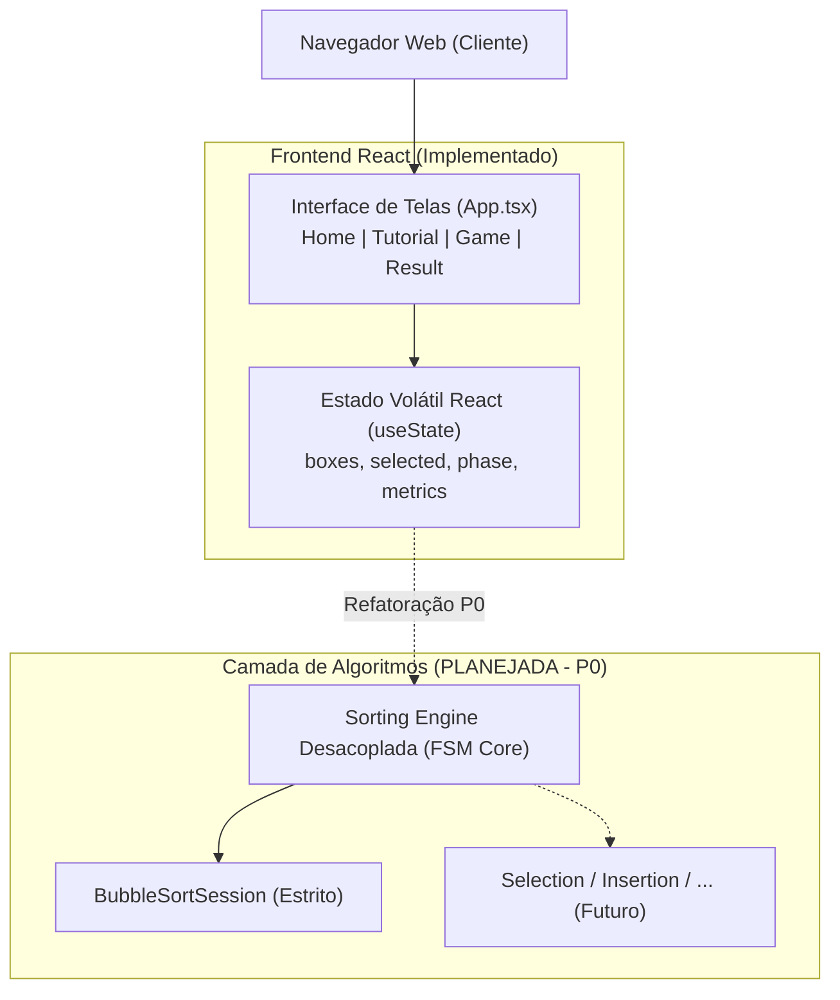

# Sorting Station – Wiki Summary

> **Status da Documentação:** Ativo / Canônico  
> **Data da Última Revisão:** 08/09/2026  
> **Branch / Commit Revisado:** `main` (`a886d0a`)  
> 
> *Este documento é o ponto de entrada operacional da Wiki. Ele não substitui as páginas detalhadas.*

---

## 1. O Projeto em 30 Segundos

O **Sorting Station** é um jogo educacional point-and-click para navegadores web ambientado em uma central logística futurista de alta tecnologia. Caixas numeradas dispostas sobre esteiras transportadoras representam elementos discretos de vetores numéricos a serem ordenados.

O objetivo pedagógico central é ensinar algoritmos de ordenação através da execução visual e da manipulação cinestésica direta pelo jogador. Ao invés de apenas assistir passivamente a animações de ordenação, o estudante assume o papel de operador da estação, decidindo ativamente quais elementos comparar e quando executar trocas físicas.

O projeto foi originalmente prototipado no ambiente **Figma Make**, evoluindo para uma aplicação web com identidade visual sci-fi/retro-futurista, conectando ações motoras imediatas, feedback visual na esteira e alinhamento conceitual com pseudocódigo algorítmico.

---

## 2. Estado Atual

| Dimensão | Estado Real Implementado no Repositório |
| :--- | :--- |
| **Frontend** | React 19 (`^19.0.0`), TypeScript 5.7 strict, Vite 8 (`^8.2.2`), Tailwind CSS v4 inline (`@tailwindcss/vite`), Figma Make. |
| **Gameplay** | Bubble Sort visual point-and-click com seleção livre de vizinhos; 3 fases progressivas (vetores de 4, 5 e 6 elementos). |
| **Telas Existentes** | 4 telas ativas: `HomeScreen`, `TutorialScreen`, `GameScreen` e `ResultScreen` (chaveadas em `src/App.tsx`). |
| **Backend** | **Inexistente.** Não há servidor de aplicação, microserviços, GraphQL ou endpoints REST. |
| **Persistência** | **Inexistente.** Não há banco de dados nem armazenamento local (`localStorage` / `sessionStorage`). O estado é puramente volátil em memória. |
| **Testes** | **Inexistentes.** Não há suíte automatizada de testes unitários, testes de integração ou testes E2E configurada no repositório. |
| **Outros Algoritmos** | Selection Sort, Insertion Sort, Merge Sort e Quick Sort são **estritamente planejados/futuros**. Não há implementação de código para eles. |

---

## 3. Prioridade Atual

A prioridade **P0** central do projeto é:

> **Transformar o gameplay de Bubble Sort atual em uma execução pedagógica estrita do algoritmo.**

O jogador deve ser conduzido a seguir rigorosamente a sequência mecânica formal do Bubble Sort através de uma máquina de estados finita (FSM), implementando:
- Controle explícito de passada (`passIndex` de $0$ a $n-2$);
- Controle do ponteiro interno de comparação (`comparisonIndex` de $0$ a $n - 2 - \text{passIndex}$);
- Destaque mandatória do par de elementos esperado (`currentPair = [j, j+1]`);
- Varredura determinística da esquerda para a direita na esteira;
- Decisão consciente do jogador: acionar troca física (*Swap*) se fora de ordem ou confirmar manutenção (*Keep/Pass*) se em ordem;
- Bloqueio de cliques fora do par ativo ou feedback explicativo formativo imediato;
- Medição e exibição do progresso real do algoritmo (passadas concluídas vs. total necessário);
- Travamento visual definitivo dos elementos fixados (`LOCKED`) no limite ordenado (`sortedBoundary`);
- Registro de histórico passo a passo das operações executadas;
- Conclusão correta e transparente de cada passada e da fase.

### Próximas 3 a 5 Tarefas Mais Importantes
1. **Desacoplamento da Engine:** Isolar a lógica matemática da ordenação fora de `src/screens/GameScreen.tsx`, criando uma camada pura de FSM (`src/engine/`);
2. **Implementação do Bubble Sort Estrito (FSM):** Introduzir ponteiros $i$ e $j$, seleção obrigatória do par corrente e bifurcação explícita *Trocar / Não Trocar*;
3. **Correção do Bug de Animação de Troca:** Ajustar o ciclo de estado em `GameScreen.tsx` para garantir translação visual bidirecional (`left` e `right`);
4. **Resolução do Encerramento da Fase 3:** Tratar o término da última fase em `src/App.tsx` para apresentar tela de vitória global da campanha ao invés de reiniciar a fase 3;
5. **Introdução de Persistência Local Básica:** Configurar gravação de progresso e preferências do operador via `localStorage`.

---

## 4. Principal Problema Atual

No protótipo atual, a tela [`src/screens/GameScreen.tsx`](../../src/screens/GameScreen.tsx) permite que o usuário selecione **qualquer par de caixas vizinhas** (qualquer índice adjacente onde $|a - b| = 1$), em qualquer ordem e em qualquer ponto do vetor.

Embora isso permita ordenar o vetor de forma livre (como um quebra-cabeça de trocas locais), **não executa nem ensina a sequência algorítmica formal do Bubble Sort**. O estudante pode ordenar o vetor da direita para a esquerda, pular pares fora de ordem ou resolver partes isoladas sem compreender o laço externo ($i$), o laço interno ($j$) nem a garantia de fixação do maior elemento ao final de cada varredura.

> *Detalhamento completo e especificação da FSM corretiva:* consulte [Sorting Engine](./04-sorting-engine.md).

---

## 5. Arquitetura Rápida



> **Aviso de Arquitetura:** Atualmente, a lógica de ordenação está acoplada diretamente dentro do componente React [`src/screens/GameScreen.tsx`](../../src/screens/GameScreen.tsx). A criação de uma `Sorting Engine` independente em TypeScript puro é uma meta **PLANEJADA (P0)** e ainda não está implementada no código atual.

---

## 6. Fonte de Verdade

Ao analisar ou modificar o projeto, siga rigorosamente a hierarquia de autoridade:

1. **Instrução explícita atual do usuário:** Define o objetivo, escopo e restrições da tarefa atual;
2. **`AGENTS.md`:** Define as regras inegociáveis de governança, restrições técnicas e workflow operacional;
3. **Código-fonte e arquivos de configuração atuais:** Representam a verdade factual e indiscutível sobre o que está efetivamente implementado;
4. **ADRs (`docs/adr/`) e páginas detalhadas da Wiki (`docs/wiki/`):** Representam as decisões arquiteturais aprovadas, visão de produto, especificações técnicas e planejamento;
5. **`docs/wiki/SUMMARY.md`:** Funciona como índice operacional e mapa de navegação rápida, mas **não substitui** a leitura da página detalhada correspondente.

> *Se código e documentação divergirem, o agente deve identificar e resolver ou registrar a divergência; nunca ignorá-la.*

---

## 7. Regra Obrigatória para Agentes

> [!IMPORTANT]
> **QUALQUER AGENTE QUE TRABALHAR NO SORTING STATION DEVE LER ESTE `SUMMARY.md` E AS PÁGINAS RELEVANTES DA WIKI ANTES DE ALTERAR CÓDIGO, DESIGN, DOCUMENTAÇÃO OU ARQUITETURA.**

Após qualquer mudança relevante de gameplay, comportamento, arquitetura, componentes, UX, dependências ou documentação acadêmica, o agente deve revisar e atualizar a Wiki e este `SUMMARY.md` antes de considerar a tarefa finalizada.

$$\text{WIKI} \longrightarrow \text{CONTEXTO} \longrightarrow \text{CÓDIGO} \longrightarrow \text{ALTERAÇÃO} \longrightarrow \text{DOCUMENTAÇÃO}$$

---

## 8. Roteador de Tarefas

Consulte este mapa para identificar imediatamente quais documentos ler antes de atuar em uma área específica:

| Quero trabalhar em... | Leia primeiro | Depois consulte |
| :--- | :--- | :--- |
| **Bubble Sort / gameplay** | [04 — Sorting Engine](./04-sorting-engine.md) | [02 — Arquitetura](./02-system-architecture.md) e [10 — Roadmap](./10-roadmap.md) |
| **Selection Sort** | [04 — Sorting Engine](./04-sorting-engine.md#5-expansão-para-outros-algoritmos) | [01 — Produto](./01-product-vision.md) e [10 — Roadmap](./10-roadmap.md) |
| **Insertion Sort** | [04 — Sorting Engine](./04-sorting-engine.md#5-expansão-para-outros-algoritmos) | [01 — Produto](./01-product-vision.md) e [10 — Roadmap](./10-roadmap.md) |
| **Novos algoritmos** | [10 — Roadmap](./10-roadmap.md#4-nível-p2--expansão-algorítmica-selection-e-insertion) | [11 — Decisões](./11-architecture-decisions.md) e [12 — Pedagogia](./12-pedagogy-and-academic-traceability.md) |
| **Componentes React** | [03 — Front-End](./03-frontend.md) | [05 — Design System](./05-ux-design-system.md) |
| **UI** | [03 — Front-End](./03-frontend.md) | [05 — Design System](./05-ux-design-system.md) e [08 — Qualidade](./08-testing-and-quality.md) |
| **UX / design system** | [05 — Design System](./05-ux-design-system.md) | [01 — Produto](./01-product-vision.md) e [03 — Front-End](./03-frontend.md) |
| **Figma Make** | [06 — Ambiente](./06-development-environment.md) | [09 — Build e Deploy](./09-build-deploy.md) e [AGENTS.md](../../AGENTS.md) |
| **Estado e navegação** | [02 — Arquitetura](./02-system-architecture.md) | [03 — Front-End](./03-frontend.md) |
| **Persistência local** | [07 — Backend e Persistência](./07-backend-and-persistence.md#2-persistência-local-planejada-localstorage) | [11 — Decisões](./11-architecture-decisions.md) |
| **Backend futuro** | [07 — Backend e Persistência](./07-backend-and-persistence.md#3-gatilhos-para-criar-backend) | [11 — Decisões](./11-architecture-decisions.md) |
| **Testes** | [08 — Qualidade e Testes](./08-testing-and-quality.md) | [04 — Sorting Engine](./04-sorting-engine.md) e [11 — Decisões](./11-architecture-decisions.md) |
| **Build / deploy** | [09 — Build e Deploy](./09-build-deploy.md) | [06 — Ambiente](./06-development-environment.md) |
| **Roadmap** | [10 — Roadmap](./10-roadmap.md) | [01 — Produto](./01-product-vision.md) e [04 — Sorting Engine](./04-sorting-engine.md) |
| **Artigo / pedagogia** | [12 — Pedagogia](./12-pedagogy-and-academic-traceability.md) | [01 — Produto](./01-product-vision.md) e [10 — Roadmap](./10-roadmap.md) |
| **ADR / documentação** | [11 — Decisões](./11-architecture-decisions.md) | [Template de ADR](../adr/TEMPLATE.md) e [README.md](./README.md) |

---

## 9. Arquivos Críticos

| Arquivo / Diretório | Responsabilidade e Sensibilidade Operacional |
| :--- | :--- |
| [`AGENTS.md`](../../AGENTS.md) | **Crítico:** Regras inegociáveis do projeto, governança Wiki-First e restrições de tooling. |
| [`docs/wiki/SUMMARY.md`](./SUMMARY.md) | **Crítico:** Ponto de entrada operacional obrigatório e mapa rápido de navegação para agentes. |
| [`docs/wiki/README.md`](./README.md) | **Crítico:** Índice mestre canônico da Wiki, trilhas de leitura e convenções de status. |
| [`src/App.tsx`](../../src/App.tsx) | **Crítico:** Roteador principal de telas (`useState`), definição das fases e controle do loop do jogo. |
| [`src/screens/GameScreen.tsx`](../../src/screens/GameScreen.tsx) | **Crítico:** Tela central de gameplay onde residem o estado da esteira e a lógica de ordenação atual. |
| [`src/index.css`](../../src/index.css) | **Crítico:** Entrypoint global do Tailwind v4 com `@theme inline`, fontes e animações CSS puras. |
| [`package.json`](../../package.json) | **Sensível:** Definição de dependências estritas e scripts de build/preview/format. |
| [`.mise.toml`](../../.mise.toml) | **Sensível:** Travamento de versões das ferramentas de runtime (Node 22 e pnpm 10.34.3). |
| [`vite.config.ts`](../../vite.config.ts) | **Altamente Sensível:** Porta fixa 8443, alias `@` e plugins customizados proprietários do Figma Make. |
| [`.figma/make/`](../../.figma/make) | **Intocável:** Scripts shell do container Figma Make (`dev`, `install`, `deploy`, `site.json`). Não modificar. |

---

## 10. Regras Técnicas Essenciais

As regras abaixo são confirmadas pelo código-fonte e pelas diretrizes de [`AGENTS.md`](../../AGENTS.md):

- **Runtime & Toolchain:** Node.js 22 LTS e pnpm 10.34.3 definidos em `.mise.toml` (compatível com `npm` / `npx`);
- **Frontend Framework:** React 19 (`react` e `react-dom` `^19.0.0`) com TypeScript 5.7 em modo estrito (`strict: true`);
- **Bundler & Dev Server:** Vite 8 (`vite` `^8.2.2`) executando na porta `8443` com `strictPort: true` no host `0.0.0.0`;
- **Tailwind CSS v4:** Utiliza `@tailwindcss/vite` e importação direta `@import 'tailwindcss';` em `src/index.css`;
- **Sem Arquivos Legados de Estilo:** **NÃO** crie `tailwind.config.js/ts` nem arquivos de configuração do PostCSS;
- **Exportação de Componentes:** Todo componente React deve ser exportado como **export default** (`export default ComponentName`);
- **Regras de Strings JSX:** Utilize aspas duplas para strings contendo apóstrofos (`"We're here"`) ou escape-os para não quebrar o parser;
- **Preservação do Figma Make:** Não remova nem simplifique os scripts em `.figma/make/*` e preserve os plugins customizados do Figma presentes em `vite.config.ts`.

---

## 11. Implementado Agora

Funcionalidades factuais e verificáveis em tempo de execução no repositório:

- **`HomeScreen`:** Tela inicial com estética retro-futurista de central logística, esteira decorativa em background e botão "Iniciar Operação";
- **`TutorialScreen`:** Demonstração automatizada e temporizada em 4 etapas guiadas da mecânica de comparação e troca do Bubble Sort;
- **`GameScreen`:** Esteira principal interativa com caixas numeradas, contadores de comparações/trocas, botão de dica, botão de reset e painel de instrução;
- **`ResultScreen`:** Relatório de desempenho pós-fase exibindo estatísticas, barra visual de eficiência calculada, pseudocódigo estático do Bubble Sort e botões de repetir ou avançar;
- **Componentes Reutilizáveis:** `NumberedBox`, `GameButton`, `InstructionPanel`, `PhaseHeader` e `StatsPanel`;
- **Mecânica de Jogo Atual:** Seleção livre de qualquer par vizinho ($|i - j| = 1$), validação de ordem, troca física com animação de $500\text{ms}$ e detecção de vetor 100% ordenado;
- **Fases Ativas:** 3 fases com vetores fixos: Fase 1 ($N=4$: `[5, 2, 4, 1]`), Fase 2 ($N=5$: `[7, 3, 9, 2, 5]`), Fase 3 ($N=6$: `[6, 1, 8, 4, 3, 7]`).

---

## 12. Planejado

Funcionalidades já desenhadas e especificadas na Wiki para desenvolvimento nas próximas etapas:

### P0 (Fundação Pedagógica Imediata)
- Engine pedagógica desacoplada com FSM determinística para Bubble Sort;
- Ponteiros formais de laço ($i$ e $j$), varredura sequencial obrigatória da esquerda para a direita;
- Ação explícita *Trocar / Não Trocar* e bloqueio de passos fora da ordem;
- Travamento definitivo (`LOCKED`) de caixas ordenadas no final da esteira;
- Correção da animação de swap bidirecional e tratamento do encerramento final da fase 3.

### P1 (Aperfeiçoamentos Pedagógicos e Persistência)
- Tutorial interativo orientado a ações práticas do jogador;
- Dica contextual baseada no estado exato do ponteiro do algoritmo;
- Replay retrospectivo com linha do tempo de operações;
- Pseudocódigo dinâmico com iluminação síncrona da linha em execução;
- Cálculo refinado de pontuação baseado em precisão algorítmica;
- Persistência local do progresso do operador via `localStorage`.

### P2 (Expansão Algorítmica)
- **Selection Sort:** Mecânica própria de "Scanner de Carga Mínima" com cursor de varredura global e troca única por passada;
- **Insertion Sort:** Mecânica própria de "Desvio e Encaixe" com elevação da caixa ao trilho superior e deslocamento da partição ordenada.

---

## 13. Futuro

Direções estratégicas e visões de longo prazo catalogadas na Wiki:

- **Algoritmos Avançados:** Merge Sort (divisão física da esteira em subestações paralelas), Quick Sort (esteira de particionamento com pivô laser) e Heap Sort (árvore logística vertical);
- **Recursos Comparativos:** Modo Duelo / Comparador simultâneo entre dois algoritmos executando sobre o mesmo vetor de entrada;
- **Visualização de Complexidade:** Painel gráfico dinâmico comparando curvas assintóticas $O(n^2)$ vs. $O(n \log n)$;
- **Backend Condicionado:** Servidor Node/Go introduzido apenas mediante requisitos reais formais (contas, sincronização em nuvem, ranking global);
- **Gestão de Turmas e Docentes:** Dashboard para professores acompanharem turmas, criarem desafios customizados e exportarem métricas de desempenho;
- **Pesquisa Acadêmica Empírica:** Coleta de telemetria anônima estrita (LGPD/GDPR) para sustentar artigos científicos com grupos de controle e testes pré/pós-intervenção.

---

## 14. Backend

> **Não existe backend atualmente.**

O Sorting Station é uma SPA estritamente client-side. Um servidor backend **só deve ser introduzido mediante requisito formal justificado**, tal como:
- Autenticação e contas de usuário;
- Sincronização de progresso entre múltiplos dispositivos;
- Ranking e tabelas de liderança competitivas globais;
- Gestão de salas de aula e relatórios para professores;
- Telemetria centralizada para estudos acadêmicos controlados.

Enquanto esses requisitos não existirem, **a persistência local via `localStorage` deve ser implementada antes de qualquer decisão de servidor**. A introdução de backend exigirá a aprovação de um ADR formal em `docs/adr/`.

---

## 15. Figma Make

> **Figma Make é utilizado como ferramenta de prototipação visual, experimentação de interface e apoio ao design. O código-fonte do repositório é a fonte oficial da implementação.**

- O ambiente do Figma Make provê um container com servidor de desenvolvimento na porta `8443` e visualização embutida;
- A infraestrutura técnica em `.figma/make/*` e os plugins Figma em `vite.config.ts` não devem ser removidos nem alterados;
- Quaisquer discrepâncias visuais devem ser resolvidas tomando o código TypeScript/React do repositório como verdade canônica.

---

## 16. Pedagogia e Artigo Acadêmico

As mecânicas do Sorting Station representam diretamente conceitos da ciência da computação:

| Mecânica de Jogo | Conceito Computacional Formal |
| :--- | :--- |
| **Caixas numeradas na esteira** | Elementos discretos de um vetor em memória ($A[0 \dots n-1]$). |
| **Clique de seleção / Comparação** | Custo operacional de decisão condicional ($C(n)$, teste $A[j] > A[j+1]$). |
| **Animação de Troca (Swap)** | Custo de escrita/movimentação física de dados em memória ($M(n)$). |
| **Passada completa na esteira** | Iteração completa do laço externo ($i = 0 \dots n-2$). |
| **Movimento sequencial (j, j+1)** | Varredura local estrita do laço interno. |
| **Caixa fixada / Selo LOCKED** | Invariante de laço: elemento garantidamente posicionado no final do vetor. |

### Regra Ética de Honestidade Científica
> **É estritamente proibido afirmar que o jogo "melhora a aprendizagem", "reduz a carga cognitiva" ou "é superior a métodos tradicionais" sem dados empíricos reais.**

Como ainda não foram realizados experimentos controlados com estudantes, qualquer texto acadêmico deve utilizar formulações honestas de intenção:
- *"busca auxiliar o modelo mental..."*
- *"foi desenvolvido com o objetivo de..."*
- *"espera-se que a interação direta favoreça..."*

---

## 17. Riscos Abertos

Principais dívidas técnicas e pedagógicas registradas na Wiki:

1. **Bubble Sort Não Estrito:** O protótipo permite ao jogador ordenar escolhendo qualquer par adjacente arbitrário, quebrando a fidelidade ao algoritmo formal (*Documentado em [04 — Sorting Engine](./04-sorting-engine.md)*);
2. **Bug na Animação de Troca:** A chamada `setSelected(null)` antes do `setTimeout` em `GameScreen.tsx:L68` faz com que ambas as caixas recebam a classe de animação `left` (*Documentado em [02 — Arquitetura](./02-system-architecture.md)* e [04 — Sorting Engine](./04-sorting-engine.md)*);
3. **Contador de Progresso Heurístico:** A lógica atual em `GameScreen.tsx:L130-L136` infere caixas ordenadas através de varredura sufixal arbitrária, e não pelo avanço real das passadas do algoritmo (*Documentado em [04 — Sorting Engine](./04-sorting-engine.md)*);
4. **Marcação OK Heurística:** Caixas recebem borda verde quando estão localmente menores que a vizinha, mesmo fora de suas posições finais (*Documentado em [04 — Sorting Engine](./04-sorting-engine.md)*);
5. **Pseudocódigo Estático:** O bloco de código exibido em `ResultScreen.tsx` é estático e não acompanha as ações do usuário em tempo real (*Documentado em [03 — Front-End](./03-frontend.md)*);
6. **Encerramento da Última Fase:** Na fase 3, clicar em "Próxima Fase" reinicia a própria fase 3 devido a `Math.min(phase + 1, PHASES.length)` em `App.tsx:L32` (*Documentado em [02 — Arquitetura](./02-system-architecture.md)*);
7. **Ausência Total de Testes:** Não existem testes automatizados para proteger a lógica matemática contra regressões (*Documentado em [08 — Qualidade e Testes](./08-testing-and-quality.md)*);
8. **Volatilidade Total de Estado:** Recarregar a página apaga todo o histórico e progresso do jogador (*Documentado em [07 — Backend e Persistência](./07-backend-and-persistence.md)*).

---

## 18. Roadmap Rápido

```mermaid
timeline
    title Roadmap Evolutivo do Sorting Station
    section P0 : Imediato
        Bubble Sort Pedagógico Real : FSM sequencial estrita
        Correções Críticas : Animação de swap e encerramento Fase 3
    section P1 : Curto Prazo
        Refinamentos Didáticos : Tutorial interativo e pseudocódigo ativo
        Persistência Local : Salvamento via localStorage
    section P2 : Médio Prazo
        Selection Sort : Mecânica de Scanner de Mínimo
        Insertion Sort : Mecânica de Desvio e Encaixe
    section P3 : Longo Prazo
        Algoritmos Avançados : Merge Sort, Quick Sort e Heap Sort
        Pesquisa Empírica : Telemetria acadêmica e validação de aprendizagem
```

> *Para o detalhamento das 10 tarefas prioritárias e matriz completa de riscos:* consulte [10 — Roadmap](./10-roadmap.md).

---

## 19. Índice da Wiki

Catálogo com link relativo e recomendação de leitura para todos os 13 documentos temáticos:

- [00 — Inventário Factual do Repositório](./00-repository-inventory.md)  
  *Quando ler:* Antes de iniciar qualquer trabalho, para conhecer todos os 26 arquivos reais, toolchain e dependências.
- [01 — Visão de Produto e Modelo Pedagógico](./01-product-vision.md)  
  *Quando ler:* Para entender o problema educacional, a metáfora da central logística e os princípios norteadores de design.
- [02 — Arquitetura do Sistema e Fluxo de Dados](./02-system-architecture.md)  
  *Quando ler:* Para compreender o chaveamento de telas em `App.tsx`, ciclo de vida do estado e o plano de desacoplamento da engine.
- [03 — Manual de Engenharia Front-End](./03-frontend.md)  
  *Quando ler:* Ao criar ou modificar telas e componentes React, tipagens, props, animações e convenções de código.
- [04 — Motor de Ordenação e Máquina de Estados](./04-sorting-engine.md)  
  *Quando ler:* Antes de alterar a lógica de ordenação, para compreender a FSM de Bubble Sort e o plano para Selection/Insertion.
- [05 — Sistema de Design, UX e Vocabulário](./05-ux-design-system.md)  
  *Quando ler:* Ao ajustar estilos visuais, tokens cromáticos, fontes (*Orbitron, Space Mono, Exo 2*) e componentes visuais.
- [06 — Ambiente de Desenvolvimento e Figma Make](./06-development-environment.md)  
  *Quando ler:* Para operar o ambiente conteinerizado do Figma Make, porta 8443, HMR e scripts em `.figma/make/*`.
- [07 — Backend, Persistência e Limites](./07-backend-and-persistence.md)  
  *Quando ler:* Ao trabalhar com persistência em `localStorage` ou avaliar a introdução de infraestrutura de servidor e LGPD.
- [08 — Testes, Qualidade e Definition of Done](./08-testing-and-quality.md)  
  *Quando ler:* Para consultar a pirâmide de testes recomendada e os checklists de Definition of Done (DoD) antes de finalizar tarefas.
- [09 — Processo de Compilação, Build e Deploy](./09-build-deploy.md)  
  *Quando ler:* Ao preparar compilações de produção, validar bundles `dist/` e inspecionar scripts de deploy do Figma Make.
- [10 — Roadmap de Evolução Técnica e Pedagógica](./10-roadmap.md)  
  *Quando ler:* Para consultar prioridades estratégicas (P0 a P3), matriz de riscos e a sequência recomendada das próximas tarefas.
- [11 — Registro de Decisões Arquiteturais (ADRs)](./11-architecture-decisions.md)  
  *Quando ler:* Ao propor mudanças estruturais ou registrar uma nova decisão arquitetural no repositório.
- [12 — Pedagogia, Rastreabilidade e Rigor Científico](./12-pedagogy-and-academic-traceability.md)  
  *Quando ler:* Ao preparar materiais didáticos, redigir artigos acadêmicos ou alinhar mecânicas a conceitos teóricos.

---

## 20. Checklist Antes de uma Tarefa

Antes de iniciar qualquer modificação de código ou documentação, confirme:

- [ ] Li `AGENTS.md` e compreendi as regras do projeto.
- [ ] Li este `SUMMARY.md` para situar o contexto da tarefa.
- [ ] Li o `README.md` da Wiki.
- [ ] Li as páginas detalhadas da Wiki diretamente relacionadas à tarefa.
- [ ] Li os ADRs aplicáveis em `docs/adr/`, se existirem.
- [ ] Verifiquei o estado real implementado no código-fonte correspondente.
- [ ] Sei com precisão o que está efetivamente implementado no momento.
- [ ] Sei com precisão o que é apenas planejamento ou visão futura.
- [ ] Identifiquei arquivos e pastas sensíveis (`vite.config.ts`, `.figma/make/*`).
- [ ] Entendi quais regras técnicas e convenções de código se aplicam.

---

## 21. Checklist Depois de uma Tarefa

Antes de considerar qualquer alteração concluída e reportar ao usuário, confirme:

- [ ] A alteração atendeu estritamente à intenção solicitada pelo usuário.
- [ ] Build executado com sucesso (`npm run build`) sem quebrar a compilação.
- [ ] Verificação de tipos executada com sucesso (`npx tsc --noEmit`) sem erros TypeScript.
- [ ] Testes executados quando aplicável.
- [ ] Wiki revisada para avaliar o impacto da modificação realizada.
- [ ] Página técnica da Wiki afetada foi devidamente atualizada.
- [ ] `docs/wiki/SUMMARY.md` atualizado se o estado, arquitetura, prioridades ou riscos mudaram.
- [ ] ADR criado ou alterado em `docs/adr/` caso tenha havido decisão arquitetural relevante.
- [ ] Roadmap atualizado se o estado de alguma funcionalidade mudou.
- [ ] Nenhuma funcionalidade planejada ou futura foi documentada incorretamente como pronta.
